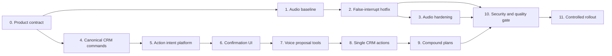

# CRM Voice Assistant Roadmap

Status: implementation in progress; Phase 0 product decisions pending

Owner: LeadDrive CRM

Last updated: 2026-09-19

Execution profile: `gpt-5.6-sol`, reasoning effort `high`

Scope: browser-based AI assistant inside CRM

Out of scope: PBX calls, SIP, telephony Voice Core, inbound/outbound call agents

## 1. Goal

Turn the existing in-CRM voice assistant into a noise-resistant operational
assistant that can safely:

1. Create tasks.
2. Create leads.
3. Fill and update lead cards.
4. Create deals.
5. Convert a lead into a deal.
6. Later execute reviewed multi-step plans such as "create a lead, a deal, and
   a follow-up task".

The user should be able to speak naturally, review an exact action receipt,
edit it if necessary, and explicitly confirm the write operation.

## 2. Non-negotiable product rules

- The scope is the microphone assistant inside CRM. PBX behavior is not part of
  this roadmap.
- The model may propose an action but must never receive a direct commit tool.
- Every write in the first release requires a button press. A spoken "yes" is
  not authorization because it can originate from background audio.
- Authentication, `organizationId`, `userId`, permissions, and trusted entity
  identifiers always come from the server session, never from model output.
- Permissions, record filters, tenant isolation, field rules, validation,
  workflows, notifications, webhooks, and audit are checked again at commit.
- Retries, reconnects, duplicate tool calls, and double clicks must still
  produce at most one CRM mutation.
- Raw microphone audio must not be stored. Diagnostic telemetry must not contain
  full sensitive transcripts.
- The assistant says that something was created or changed only after the
  canonical CRM command succeeds.
- All user-facing states and copy must support RU, AZ, and EN.

## 3. Verified current state

The following observations were verified against the current implementation:

- Browser microphone capture already requests `echoCancellation`,
  `noiseSuppression`, and `autoGainControl`.
- `public/gemini-live-capture.worklet.js` calculates an RMS level and emits an
  `activity` event when the value reaches a fixed threshold.
- The worklet describes that signal as a UI-only estimate, but
  `src/components/ai/voice-console.tsx` currently treats it as confirmed user
  speech and immediately interrupts playback.
- Music, a ringtone, television, keyboard noise, or another loud source can
  therefore stop the assistant before Gemini confirms that speech occurred.
- The client also handles Gemini's authoritative
  `serverContent.interrupted` event. This is the correct initial authority for
  provider-controlled barge-in.
- The current Gemini configuration uses automatic activity detection with
  `START_OF_ACTIVITY_INTERRUPTS`.
- The existing voice API is read-oriented. The current generic AI write
  executor is not a safe foundation for voice writes because it does not
  provide complete permission, validation, side-effect, and idempotency parity
  for every requested CRM action.

The immediate audio defect is therefore not simply "noise suppression is
missing." Browser noise processing is requested, while an unconfirmed local
loudness signal is wired to a functional interruption. The hotfix must remove
that coupling first. More advanced denoising or neural VAD is a later,
measurement-driven step.

## 4. Target user experience

### Feature summary

The assistant listens inside CRM, resolves the user's intent and referenced CRM
objects, asks only for missing or ambiguous information, and prepares a
server-validated draft. The user reviews an action receipt and presses a button
whose label states the exact outcome.

### Primary user action

Speak an instruction, review the resulting draft, and explicitly confirm it.

Example:

```text
User: Create a lead for Ali Mammadov, phone +994 50 123 45 67,
      and assign it to Aysel.

Assistant: I found Aysel M. in the Sales team. I prepared a new lead.

Receipt:
  Contact: Ali Mammadov
  Phone: +994 50 123 45 67
  Assignee: Aysel M.

  [Create lead] [Edit] [Cancel]
```

### Design direction

- Calm, operational, and transparent.
- The action receipt is visually connected to the existing assistant orb.
- CRM data remains visually primary; the assistant does not take over the
  entire screen.
- Warnings explain a concrete consequence, such as a duplicate or changed
  record, rather than presenting generic AI disclaimers.

### Layout strategy

- Desktop: compact anchored panel beside the assistant/orb.
- Mobile: bottom sheet that preserves enough page context to understand the
  selected lead, task, or deal.
- Avoid a full-screen modal for normal actions.
- Confirmation controls must have at least 44 px touch targets and visible
  keyboard focus.

### Required UI states

- `idle`
- `listening`
- `candidate_speech`
- `user_speaking`
- `processing`
- `responding`
- `noisy_environment`
- `collecting`
- `missing_information`
- `ambiguous_resolution`
- `duplicate_warning`
- `awaiting_confirmation`
- `editing`
- `executing`
- `succeeded`
- `failed`
- `forbidden`
- `expired`
- `stale`
- `offline`
- `reconnecting`

### Content requirements

- Buttons name the operation: `Create lead`, `Create task`, `Create deal`,
  `Save changes`, `Keep draft`, or `Cancel`.
- Updates show a before/after diff.
- Ambiguous matches show identifying details sufficient for the user to choose.
- Duplicate warnings explain which existing record matched and why.
- Success provides a link to the created or updated record.
- Errors explain whether the user can edit, retry, reopen, or request access.

## 5. Delivery sequence



Audio hardening and the CRM write foundation may be developed in parallel after
the false-interrupt hotfix. No user-facing write action may be enabled before
the command, intent, confirmation, and security layers are ready.

## 6. Phase 0 — Product contract and release boundaries

### Tasks

- [ ] P0.1 Confirm access rule: `voiceEnabled` plus the module-specific write
      permission.
- [ ] P0.2 Confirm pilot roles: internal administrators first, then a small
      manager/sales cohort.
- [ ] P0.3 Approve the action/field/permission/risk matrix.
- [x] P0.4 Approve the v1 rule that every write requires a button press.
      Confirmed by the product owner on 2026-09-19; background speech can
      never authorize a CRM mutation.
- [ ] P0.5 Define default task board, column, assignee behavior, and required
      custom fields.
- [ ] P0.6 Define the standard lead fields allowed in v1.
- [ ] P0.7 Confirm that "fill a lead card" includes two separate modes: update
      a saved lead and populate the currently open unsaved lead form.
- [x] P0.8 Keep conversion, score, system fields, deletion and bulk updates out
      of the lead-update allow-list. **Amended 2026-09-20 by the owner**, who
      asked to change a lead's status by voice: `status` is now inside the
      allow-list, but `converted` is not reachable through it. That word
      promises a deal, and only `convertLeadToDealCommand` creates one — the
      shortcut would leave converted leads with nothing behind them. Score,
      deletion and bulk updates remain out.
- [ ] P0.9 Define supported browser/device matrix.
- [ ] P0.10 Define privacy and retention rules for telemetry, drafts, and audit.
- [x] P0.11 Define the kill switch for voice writes, separate from the one for
      voice itself: `VOICE_WRITE_ENABLED=false`. Reading the CRM aloud and
      preparing a change to it are different features with different risk, and
      they shared one switch — so turning off the writes meant turning off the
      assistant, which is the kind of cost that stops a switch from being
      pulled. **Operate it through a deploy, never by hand on the live
      process** — see the 2026-09-21 incident in the session log. Per-tenant
      flags remain open as P0.11a.
- [ ] P0.11a Per-tenant and per-action flags, needed once more than one
      organization has the writes.
- [ ] P0.12 Define success metrics and rollout stop conditions.

### Exit gate

An approved matrix exists for every planned action:

```text
action -> allowed fields -> required permission -> resolvers
       -> duplicate policy -> warnings -> confirmation -> audit result
```

## 7. Phase 1 — Browser audio baseline and observability

### Tasks

- [x] A1.1 Add a deterministic AudioWorklet/session test harness.
- [ ] A1.2 Build fixtures for silence, clean RU/AZ/EN speech, instrumental
      music, vocal music, ringtone, television, keyboard, cough, office noise,
      and real speech over assistant playback.
- [x] A1.3 Capture requested and applied microphone settings with
      `getCapabilities()` and `getSettings()`.
- [x] A1.4 Record technical session events without raw audio or full transcript
      storage.
- [x] A1.5 Distinguish local level activity, provider speech activity, provider
      interruption, playback stop, and state transition telemetry.
- [ ] A1.6 Establish a false-interruption baseline for each supported browser,
      device type, microphone, speakers, and headphones.
- [ ] A1.7 Add a reproducible manual QA script.

The deterministic harness currently covers synthetic silence, instrumental
tone, ringtone, keyboard impulses, and seeded office noise. These fixtures
prove that the local capture path cannot emit an interruption. A1.2 remains
open until consented real RU/AZ/EN speech and mixed-background recordings are
available; generated test signals are not presented as real-language evidence.

### Exit gate

- A baseline report identifies where and how often false interruptions occur.
- Applied browser media settings are observable without collecting user audio.
- The same fixture set can be rerun after every audio change.

## 8. Phase 2 — P0 false-interruption hotfix

### Tasks

- [x] A2.1 Rename the worklet event from generic `activity` to a name that
      clearly describes an unconfirmed signal level.
- [x] A2.2 Keep local RMS activity for the microphone visualization only.
- [x] A2.3 Remove playback interruption from the local RMS event handler.
- [x] A2.4 Remove speaking-state changes, watchdog clearing, and new-turn state
      transitions from the local RMS event handler.
- [x] A2.5 Make Gemini `serverContent.interrupted` the only initial authority for
      provider-controlled barge-in.
- [x] A2.6 Separate `signal_detected`, `candidate_speech`, confirmed speech, and
      confirmed interruption in the client state machine.
- [x] A2.7 Verify reconnect and watchdog behavior after removing the local
      functional interruption.
- [x] A2.8 Add unit tests for AudioWorklet events and session transitions.
- [ ] A2.9 Run the fixture matrix and manual browser checks.

### Exit gate

- A local RMS event cannot send an `interrupt` command.
- The fixture report contains zero interruptions caused by the removed local
  RMS control path. Provider-side false interruptions are measured separately
  and become Phase 3 inputs rather than being hidden by this hotfix gate.
- Real user speech still interrupts the assistant after confirmed barge-in.
- The first phoneme is not clipped.
- The session never remains stuck in `speaking` or `processing`.

## 9. Phase 3 — Robust browser audio front end

This phase is driven by measurements from Phases 1 and 2. Do not add a large DSP
or neural dependency before the hotfix has been evaluated.

### Tasks

- [x] A3.1 Centralize audio thresholds and provider activity settings in a
      typed configuration module (`src/lib/ai/voice/audio-policy.ts`).
- [ ] A3.2 Add an adaptive noise floor instead of relying on one fixed RMS
      threshold.
- [ ] A3.3 Add a candidate/confirmed/rejected speech state machine.
- [ ] A3.4 Add a short pre-roll ring buffer to preserve the start of speech.
- [ ] A3.5 Select one authoritative interruption path from measured canaries:
      provider automatic VAD when it meets the SLO; a client-confirmed speech
      gate with pre-roll/manual activity control; or explicit push-to-talk.
- [ ] A3.6 Do not run provider and client interruption controllers as two
      independent authorities.
- [ ] A3.7 If client confirmation is required, evaluate a neural VAD in a Web
      Worker/WASM runtime.
- [ ] A3.8 If denoising is required for provider recognition, process the PCM
      before it is transmitted; a local-only meter cannot improve server VAD.
- [ ] A3.9 Keep heavy inference outside the AudioWorklet callback.
- [ ] A3.10 Measure whether denoising such as RNNoise is still required after
      VAD and browser processing are correct.
- [x] A3.11 Add a noisy-room mode. One field: `activityHandling` becomes
      `NO_INTERRUPTION`, so nothing the microphone hears can cut the assistant
      off. Detection is deliberately NOT loosened with it — the detector is
      what tells the assistant the user has finished speaking, and relaxing it
      would trade interruptions for half-heard questions.
- [x] A3.12 Provide a fallback that disables automatic barge-in in very noisy
      conditions. Chosen over push-to-talk because it keeps the conversation
      hands-free; the cost is that the user cannot interrupt by voice either,
      and the UI says so.
- [x] A3.13 Add a UI indicator for unapplied browser noise processing. Only a
      reported `off` warns; `unknown` is the common answer from browsers that
      do not report the setting back, and warning on it would cry wolf.
- [ ] A3.14 Verify CPU, memory, battery, and latency on real desktop and mobile
      devices.
- [ ] A3.15 Evaluate any Gemini Live model change behind a separate canary flag;
      never use a model change as the P0 audio fix.

### Exit gate

- False interruptions and real-speech latency meet the agreed SLO on the full
  browser/device matrix.
- Music, ringtone, television, keyboard, and office background do not stop the
  assistant in at least 95% of agreed fixture runs.
- Confirmed real-speech interruption latency is p95 <= 750 ms, with a stretch
  target of <= 500 ms.
- Audio processing does not cause worklet underruns, UI jank, or unacceptable
  mobile battery use.
- Users have a safe fallback in a noisy environment.

## 10. Phase 4 — Canonical CRM command layer

No voice write tools are enabled in this phase.

### Tasks

- [x] C1.1 Inventory validation, permissions, field rules, workflows,
      notifications, webhooks, audit, and custom-field handling in current REST
      routes. See `docs/crm-voice-command-layer-audit.md`.
- [x] C1.2 Extract shared strict schemas for task, lead, and deal operations.
- [x] C1.3 Implement `createTaskCommand`. The REST adapter now uses the shared
      command; the assistant still has no commit tool.
- [x] C1.4 Implement `createLeadCommand`. The REST adapter now shares the
      strict command, forbidden fields fail closed, and direct callers receive
      non-blocking duplicate and assignment-state metadata.
- [x] C1.5 Implement `updateLeadCommand`. REST updates now share the command;
      voice callers have an explicit safe-field allow-list and must supply
      `expectedUpdatedAt`, enforced atomically to reject stale commits.
- [x] C1.6 Implement `createDealCommand`. The REST adapter now uses the shared
      strict command; pipeline stages and tenant references are validated,
      accepted tags are persisted, and direct callers receive non-blocking
      duplicate warnings.
- [x] C1.7 Implement `convertLeadToDealCommand` separately from ordinary deal
      creation. Lead claim, company/contact resolution, deal creation, and lead
      status update now share one transaction; voice commits require
      `expectedUpdatedAt`, and concurrent conversion cannot create two deals.
- [x] C1.8 Define trusted `actorContext` containing organization, user, role,
      and source.
- [x] C1.9 Make field permissions fail closed. `getFieldPermissions` answered
      an unreadable table with an empty map — which every caller correctly
      reads as "nothing is restricted" — and cached that emptiness for a
      minute. On a read path that is a tolerable default; on a write it made a
      database blip open every restricted field for sixty seconds. Writes now
      use `requireFieldPermissions`, which raises instead, and neither loader
      caches a failure any more.
- [x] C1.10 Reject cross-tenant users, entities, pipelines, stages and related
      records. Verified rather than added: all five commands already scope the
      assignee, pipeline, company, contact and project by `organizationId`, and
      `resolveRelated` scopes a task's related record the same way. Pinned by
      `crm-command-parity.test.ts` so it cannot be dropped silently.
- [ ] C1.11 Preserve all canonical workflows, notifications, webhooks, CDP
      updates, Slack actions, and audit events.
- [ ] C1.12 Introduce a transactional outbox where external side effects cannot
      safely share the record transaction.
- [ ] C1.13 Route current REST operations through the same command services.
- [x] C1.14 Add REST-versus-command parity tests. They cover the guarantees
      rather than re-testing each command: permissions fail closed on a write,
      every command loads them the strict way, the assignee is tenant-scoped,
      and the voice allow-list stays a subset of what the command schema
      accepts. C1.11-C1.13 remain open.

### Exit gate

- Existing REST behavior remains unchanged.
- REST and voice callers execute the same domain commands.
- Tenant, permission, field, validation, and side-effect parity is covered by
  tests.

## 11. Phase 5 — Safe action-intent platform

### Data model

Add `AiActionIntent` with at least:

- `organizationId`
- `userId`
- `voiceSessionId`
- `actionType`
- raw and normalized payloads
- preview or diff
- warnings
- state and revision
- `payloadHash`
- `idempotencyKey`
- provider tool-call ID
- target entity ID and expected version/`updatedAt`
- result entity and result payload
- error code and safe error detail
- expiry and timestamps

State model:

```text
collecting -> awaiting_confirmation -> executing -> succeeded | failed
                                  \-> cancelled | expired | stale
```

### Tasks

- [x] I1.1 Add the Prisma schema, migration, tenant indexes, and uniqueness
      constraints.
- [x] I1.2 Add an action registry mapping action type to schema, permission,
      risk level, command, dedupe policy, and preview renderer.
- [x] I1.3 Add `POST /api/v1/ai/voice/actions/draft`.
- [x] I1.4 Add `PATCH /api/v1/ai/voice/actions/:id`.
- [x] I1.5 Add `POST /api/v1/ai/voice/actions/:id/commit`.
- [x] I1.6 Add `POST /api/v1/ai/voice/actions/:id/cancel`.
- [x] I1.7 Add `GET /api/v1/ai/voice/actions/active`.
- [x] I1.8 Enforce one active root action context per voice session. A later
      compound plan is the root aggregate; its ordered child intents do not
      compete with that root uniqueness constraint.
- [x] I1.9 Add a default ten-minute TTL, configurable by action risk.
- [x] I1.10 Add compare-and-swap transition from confirmation to execution.
- [x] I1.11 Recheck tenant, module permission, field permission, and record
      filter during commit.
- [x] I1.12 Return the stored result for idempotent commit retries.
- [x] I1.13 Add lease/recovery handling for interrupted execution.
- [x] I1.14 Add an immutable intent event/audit ledger.
- [x] I1.15 Add per-user, per-tenant, and per-action rate limits.

Foundation note (2026-09-19): `AiActionIntent` now has tenant-safe composite
foreign keys, forced RLS using the canonical `app.org_id` context, lifecycle
checks, caller/provider idempotency keys, and a partial unique index for one
active root per user voice session. Shared primitives define the state graph,
canonical SHA-256 payload hash, and ten-minute default TTL. The initially empty
lease fields are now used by the later execution-claim and commit slices. See
`docs/crm-voice-action-intent-foundation.md`.

Draft API note (2026-09-19): the server now has a runtime-frozen registry for
the five planned v1 actions and a same-origin, browser-session-only draft
endpoint. The endpoint rechecks the voice pilot gate, role permission, tenant
module, field permission, voice-session ownership, target visibility and target
revision before persisting an unconfirmed receipt. Standard create actions use
the ten-minute TTL; sensitive update/conversion drafts use five minutes.
Idempotent retries replay the same receipt, conflicting key reuse is rejected,
and the database remains the final concurrency guard for one active root.
Possible lead/deal duplicates are returned as receipt warnings. The later
session-only commit route exists, while the model still has no write tool. See
`docs/crm-voice-action-draft-api.md`.

Draft lifecycle note (2026-09-19): a session-authenticated user can now restore
their one active root receipt, replace the payload of an unconfirmed receipt,
or cancel it. Edits use the receipt revision as a compare-and-swap token,
rehash the normalized payload, regenerate warnings/preview, recheck current
permissions and target visibility/version, and safely replay an identical
network retry. All reads and transitions are bound to organization, user and
voice session. None of these routes can execute a CRM command. See
`docs/crm-voice-action-draft-lifecycle-api.md`.

Confirmation-proof foundation note (2026-09-19): an append-only, tenant-RLS
event table and a session-only confirmation endpoint now provide a short-lived
one-time proof bound to the reviewed intent ID, revision and payload hash. The
raw proof token is returned once, never stored, and the endpoint repeats the
permission, active-session, target-visibility, target-version and stored-hash
checks. The endpoint cannot execute a CRM command. See
`docs/crm-voice-action-confirmation-proof.md`.

Draft-ledger note (2026-09-20): `drafted`, `draft_updated`, `cancelled` and
`expired` are appended in the same database transaction as their corresponding
intent create/update. Compare-and-swap losers do not append false evidence,
and automatic TTL expiry no longer performs an unaudited bulk update. The later
claim/execution slices completed I1.14 for confirmation consumption, recovery
and terminal transitions.

Execution-boundary note (2026-09-20): all five canonical commands can now join
an existing transaction and defer external effects. The internal executor
atomically commits the CRM mutation, minimal receipt result and immutable
`succeeded` event, while a committed-result retry replays without invoking the
command again. External-effect durability remains tracked by C1.12. See
`docs/crm-voice-action-execution-boundary.md`.

Execution-claim note (2026-09-20): internal orchestration now validates and
single-consumes the exact confirmation proof, repeats mutable permissions and
target checks, atomically claims `executing`, issues a 60-second UUID lease,
recovers only the exact expired lease, and records bounded terminal failures.
Every mutation shares a transaction with its immutable event. Same-proof
retries replay the existing claim even after proof expiry; competing proofs,
active leases and stale workers fail closed. I1.10-I1.14 are complete at the
internal boundary and the later I1.5/I1.15 slice connects it only to the
session-authenticated HTTP adapter. See
`docs/crm-voice-action-execution-claim.md`.

Commit-adapter note (2026-09-20): a strict same-origin, browser-session-only
endpoint now composes proof claim, lease recovery, canonical execution and
bounded terminal failure. It applies user, tenant and individual-intent rate
limits, returns stored success/failure on repeat, leaves infrastructure errors
recoverable and never exposes the proof or lease in responses. Bearer callers
are rejected and the Gemini Live contract still contains no commit/write tool.
The receipt UI and action-specific rollout flags/canaries remain later phases.
See `docs/crm-voice-action-commit-api.md`.

### Exit gate

- Double click and repeated model tool calls produce exactly one CRM mutation.
- Another user or tenant cannot read, edit, or execute an intent.
- Expired and stale intents cannot execute.
- A network loss between draft and commit is safe and recoverable.
- No operation can commit without an explicit UI confirmation event.

## 12. Phase 6 — Action receipt and confirmation UI

Start this phase in shadow mode with commit disabled.

### Tasks

- [x] U1.1 Add a client intent store scoped to the authenticated voice session.
      `src/lib/ai/voice/receipt-store.ts` takes the voice session id as a
      constructor argument and rejects any server payload carrying a different
      one, so a receipt cannot survive a reconnect into the wrong session. It
      accepts a payload whole or not at all, holds only non-terminal receipts,
      prunes a receipt whose server TTL has passed, and has no commit, confirm
      or execute method — `assertNoVoiceReceiptWriteApi` makes that a test.
- [x] U1.2 Build the desktop anchored receipt panel.
      `src/components/ai/voice-receipt-surface.tsx` positions itself from the
      orb's measured rect and portals into the shell's voice status layer, so
      it follows the launcher between the header slot and the floating corner
      instead of assuming one of them.
- [x] U1.3 Build the responsive mobile bottom sheet.
      The same component becomes an edge-pinned sheet below 768 px, with safe
      area padding, no backdrop and no focus trap: the CRM record behind the
      receipt has to stay readable while the draft is checked against it.
- [x] U1.4 Render normalized fields, warnings, related records, and defaults.
      Values come from the server's normalized payload, never from what the
      assistant said. `expectedUpdatedAt` is hidden: it is the optimistic lock
      the client echoes back, not a field the user is deciding about.
- [x] U1.5 Render before/after diffs for updates. Unchanged fields are listed
      but not dressed up as edits.
- [x] U1.6 Implement missing-information and ambiguous-candidate flows.
      Resolution happens server-side and returns a clarification the assistant
      asks about; zero or several matches never become a silent choice.
- [x] U1.7 Implement duplicate-warning flow. The warning names the matching
      record and links to it.
- [x] U1.8 Add explicit outcome buttons. The button names the operation
      ("Create lead", "Save changes"), because "Confirm" tells the reader
      nothing about what they are confirming.
- [x] U1.9 Add retry, open-result and safe recovery actions. Editing the
      receipt's fields in place is NOT done: correcting by voice re-drafts, and
      an in-panel form is a separate design. Tracked as U1.9a below.
- [x] U1.9a Edit a prepared receipt in place, without re-dictating it. The
      form rebuilds the whole payload, because `PATCH /actions/:id` replaces
      rather than merges, and sends the revision that was on screen as the
      compare-and-swap token. A cleared field is omitted rather than sent as
      null: omission means "do not set this" on a create — several create
      schemas reject null outright — and "do not change this" on an update.
      Clearing a saved value stays a separate gesture rather than a
      half-implemented one.
- [x] U1.10 Restore an active draft after reload or reconnect, via
      `GET /actions/active` bound to the authenticated voice session.
- [x] U1.11 Add all terminal and error states. Failures are classified by what
      the user can do next — retry, start over, ask for access, wait — rather
      than by status code. A 5xx during commit is never shown as a failed
      action: the mutation may have run.
- [x] U1.12 Add RU/AZ/EN copy, including localized values for closed
      vocabularies such as lead status.
- [x] U1.13 Verify keyboard navigation, screen-reader labels, focus movement
      and 44 px touch targets. Contrast on real devices remains a manual check.

### Exit gate

- The model has no commit capability.
- A write is impossible without the receipt and explicit button press.
- Updates show an exact diff.
- The assistant announces success only after the server returns success.
- Desktop, mobile, keyboard, and all supported languages are verified.

## 13. Phase 7 — Gemini proposal-tool integration

### Allowed model tools

- `propose_create_task`
- `propose_create_lead`
- `propose_update_lead`
- `propose_create_deal`
- `propose_convert_lead_to_deal`

There is deliberately no `commit_*` tool.

### Tasks

- [x] V1.1 Define strict tool schemas and reject unknown fields.
- [x] V1.2 Add server-side resolvers for users and leads, plus the record the
      browser has on screen. Contacts, companies, pipelines, stages and boards
      are not resolved yet — no shipped action needs them; see V1.2a.
- [x] V1.2a Resolvers for companies, contacts and the organization's own entry
      stage, added with `propose_create_deal`. Stage is read from the default
      pipeline's configured stages, never hardcoded: `createDealCommand` falls
      back to the literal name "LEAD" and then validates it against that
      pipeline, so an organization whose first stage is called something else
      could not create a deal at all.
- [ ] V1.2b Resolvers for campaigns, boards and deal tags, when a spoken
      sentence needs them.
- [x] V1.3 Accept human-readable names from the model and never trust a
      model-supplied identifier. A test walks every proposal tool's published
      parameters and fails on an id-shaped one.
- [x] V1.4 Require clarification when zero or multiple candidates remain. The
      clarification carries labels only, never the candidate ids.
- [x] V1.5 Send the validated draft to the shared action-receipt store, keyed
      on the provider tool-call id so a retried call replays one receipt.
- [x] V1.6 Treat all CRM record text as untrusted content and harden prompts
      against instruction injection. Tool results are declared data, not
      instructions; only the person speaking may ask for an action; values for
      a proposal may not be taken from record text the user did not say. The
      stale "all CRM tools are read-only" claim is gone from both the system
      instruction and the page copy — an instruction the model can see is
      false invites it to pick which rule to believe, and copy that promises
      the assistant cannot act is how a user stops reading the receipt.
      Contract-level, pinned by `voice-prompt-injection-contract.test.ts`;
      behavioural evals against a live model remain open as V1.6a.
- [ ] V1.6a Adversarial evals against a live model, using records whose text
      contains injected instructions.
- [x] V1.7 Prevent the model from marking its own draft as confirmed. The
      propose endpoint cannot execute a command, and the confirmation proof is
      minted only by a button press.
- [ ] V1.8 Add tool-call ceilings, timeouts, retries, and idempotency.
- [ ] V1.9 Add structured audit metadata linking provider tool call, voice
      session, intent, actor, and final record.
- [ ] V1.10 Add contract tests proving the model cannot commit or fabricate a
      trusted entity selection.

### Exit gate

- Model output can create only an uncommitted, server-validated draft.
- Ambiguous entities are never selected automatically.
- Prompt injection inside CRM data cannot invoke or expand an action.

## 14. Phase 8 — Single CRM actions

Each action follows this release loop:

```text
schema -> command -> permissions -> entity resolution -> dedupe
       -> preview -> tests -> shadow cohort -> action security gate
       -> internal commit canary -> limited commit cohort
```

No action may enter a commit canary until its relevant authorization,
isolation, integrity, prompt-injection, audit, side-effect, and browser tests
from Phase 10 pass and their evidence is recorded.

### 8.1 Create a task

- [ ] T1.1 Support title, due date, priority, assignee, description, and an
      optional lead/deal relation.
- [ ] T1.2 Apply the approved default board and column.
- [ ] T1.3 Validate required board custom fields.
- [ ] T1.4 Resolve assignee and related record server-side.
- [ ] T1.5 Warn on the same title/assignee/relation/due-date combination.
- [ ] T1.6 Add draft, permission, dedupe, commit, workflow, notification, and
      browser end-to-end tests.
- [ ] T1.7 Run shadow mode, then a flagged internal commit canary.

### 8.2 Create a lead

- [ ] L1.1 Support contact name, phone, email, company, interest, source,
      priority, expected value, assignee, pipeline, and note.
- [ ] L1.2 Normalize phone and email before validation and matching.
- [ ] L1.3 Search for exact existing phone/email matches.
- [ ] L1.4 Offer to open or update a matching lead instead of silently creating
      a duplicate.
- [ ] L1.5 Resolve assignee, company, and pipeline server-side.
- [ ] L1.6 Add command, permission, duplicate, workflow, notification, and
      end-to-end tests.
- [ ] L1.7 Run shadow mode, then a flagged internal commit canary.

### 8.3 Update a saved lead card

- [ ] L2.1 Resolve the target by current page context, name, phone, or email.
- [ ] L2.2 Require user choice when multiple leads match.
- [ ] L2.3 Allow only the approved standard-field allow-list.
- [ ] L2.4 Store an expected version or `updatedAt` value.
- [ ] L2.5 Mark the intent stale and rebuild its diff when another user changes
      the record.
- [ ] L2.6 Exclude status, conversion, score, system fields, deletion, and bulk
      updates from the initial slice.
- [ ] L2.7 Add diff, stale-conflict, permission, audit, workflow, and end-to-end
      tests.
- [ ] L2.8 Run shadow mode, then a flagged internal commit canary.

### 8.4 Fill the currently open unsaved lead form

This is a client-side form-assistance mode, not an immediate server mutation.
The normal CRM save path remains authoritative.

- [ ] LF1.1 Detect whether the user is on a new or editable lead form and bind
      to that exact form instance.
- [ ] LF1.2 Populate only allow-listed form state; do not call a write API.
- [ ] LF1.3 Show proposed field changes before applying them to the form.
- [ ] LF1.4 Never overwrite an already dirty field without explicit user
      confirmation.
- [ ] LF1.5 Run normal client validation and surface invalid or missing values
      inline.
- [ ] LF1.6 Require the user to use the normal `Save` action, which executes the
      canonical CRM route and permissions.
- [ ] LF1.7 Clear the proposal when the route/form instance changes and prevent
      replay into another lead.
- [ ] LF1.8 Add current-page, dirty-form, navigation, validation, cancel, and
      save end-to-end tests.

### 8.5 Add custom lead fields

The current Lead model has no universal generic `customFields` contract, so
custom fields require a dedicated foundation.

- [ ] L3.1 Define field metadata, types, required state, localized labels, and
      role visibility.
- [ ] L3.2 Add validation for text, number, date, enum, multi-select, reference,
      and other supported types.
- [ ] L3.3 Add permission-aware read/write mapping.
- [ ] L3.4 Add receipt and diff renderers for every supported type.
- [ ] L3.5 Add migration/compatibility tests for existing lead records.
- [ ] L3.6 Add voice schemas only after the generic field contract is stable.

### 8.6 Create a deal

- [ ] D1.1 Support name, linked lead/contact/company, pipeline, stage, amount,
      currency, expected close date, assignee, and note.
- [ ] D1.2 Verify that pipeline, stage, and related records belong to the tenant.
- [ ] D1.3 Verify that the stage belongs to the selected pipeline.
- [ ] D1.4 Show amount and currency explicitly in the receipt.
- [ ] D1.5 Warn about a similar open deal.
- [ ] D1.6 Preserve deal workflows, notifications, webhooks, audit, and related
      record side effects.
- [ ] D1.7 Add command, permission, duplicate, side-effect, and end-to-end
      tests.
- [ ] D1.8 Run shadow mode, then a flagged internal commit canary.

### 8.7 Convert a lead to a deal

- [ ] D2.1 Use `convertLeadToDealCommand`; do not simulate conversion with
      ordinary `createDealCommand`.
- [ ] D2.2 Preview contact/company creation or reuse.
- [ ] D2.3 Preview the lead status change and new deal.
- [ ] D2.4 Recheck all linked entities and permissions at commit.
- [ ] D2.5 Preserve conversion workflows and notifications.
- [ ] D2.6 Add atomicity, idempotency, duplicate, stale-record, and end-to-end
      tests.
- [ ] D2.7 Run shadow mode, then a flagged internal commit canary.

## 15. Phase 9 — Compound action plans

Start only after every constituent single action is stable in production.

### Tasks

- [ ] M1.1 Add an `AiActionPlan` as the one active root aggregate for a voice
      session, containing ordered child action intents.
- [ ] M1.2 Support references to entities that will be created by an earlier
      plan step.
- [ ] M1.3 Show every operation and consequence before confirmation.
- [ ] M1.4 Allow the user to edit or remove one plan item.
- [ ] M1.5 Define whether the core record changes are one transaction or a
      compensating saga.
- [ ] M1.6 Use an outbox for retriable external side effects.
- [ ] M1.7 Explain and recover from partial failure.
- [ ] M1.8 Make plan replay and every step idempotent.
- [ ] M1.9 Add tests for lead -> deal -> task dependency chains.
- [ ] M1.10 Add a separate shadow and canary rollout.

## 16. Phase 10 — Security and quality gate

These checks are added throughout development. The relevant subset is a hard
gate before each action's commit canary, and the complete suite is rerun as the
final regression gate.

### Action-specific pre-canary gate

- Every applicable Q1-Q4 check for the action has passed in the current tree.
- Evidence is linked from the action's rollout record.
- A failure blocks that action's commit flag without blocking unrelated
  shadow-mode work.
- The later final gate does not replace this pre-canary requirement.

### Authorization and isolation

- [ ] Q1.1 Module permission tests.
- [ ] Q1.2 Field permission tests, including fail-closed behavior.
- [ ] Q1.3 Record-filter tests.
- [ ] Q1.4 Cross-tenant user and entity tests.
- [ ] Q1.5 Revoked-permission-after-draft tests.
- [ ] Q1.6 Voice-session ownership and expiry tests.

### Integrity and concurrency

- [ ] Q2.1 Double-click and concurrent commit tests.
- [ ] Q2.2 Repeated provider tool-call tests.
- [ ] Q2.3 Reconnect, replay, and reload tests.
- [ ] Q2.4 Expired and stale intent tests.
- [ ] Q2.5 External side-effect retry and outbox tests.
- [ ] Q2.6 Failure between record commit and client response tests.

### AI abuse resistance

- [ ] Q3.1 Prompt injection in notes, names, and descriptions.
- [ ] Q3.2 Fabricated or cross-tenant IDs.
- [ ] Q3.3 Unknown and forbidden fields.
- [ ] Q3.4 Tool-call loops and oversized payloads.
- [ ] Q3.5 Background audio saying "yes" or reading UI text aloud.

### Product quality

- [ ] Q4.1 Full audio fixture matrix.
- [ ] Q4.2 Supported browser/device matrix.
- [ ] Q4.3 Desktop/mobile responsive checks.
- [ ] Q4.4 Keyboard and screen-reader checks.
- [ ] Q4.5 RU/AZ/EN copy and date/number/currency localization.
- [ ] Q4.6 Performance, memory, CPU, and long-session checks.
- [ ] Q4.7 REST/voice business-side-effect parity.
- [ ] Q4.8 Verify that logs and analytics contain no raw audio or unnecessary
      sensitive transcript content.

### Final release gate

- Zero writes without a button confirmation.
- Zero cross-tenant writes in the adversarial test suite.
- Exactly one mutation under duplicate/concurrent execution tests.
- Every write has an actor, source, intent, payload hash, result, and audit
  event.
- Audio false-interruption and true barge-in latency SLOs pass.
- Every failure state has a safe user recovery path.

## 17. Phase 11 — Controlled rollout

### Tasks

- [ ] R1.1 Add global, tenant, and per-action feature flags.
- [ ] R1.2 Add dashboards for audio and action metrics.
- [ ] R1.3 Run shadow mode without commit capability.
- [ ] R1.4 Pass the task-specific security gate and enable task commit for
      internal administrators.
- [ ] R1.5 Expand task commit to a small manager/sales cohort.
- [ ] R1.6 Repeat `shadow -> action gate -> admin canary -> limited cohort` for
      every subsequent action.
- [ ] R1.7 Enable lead creation through that sequence.
- [ ] R1.8 Enable saved lead updates and open-form assistance through that
      sequence and separate flags.
- [ ] R1.9 Enable deal creation through that sequence.
- [ ] R1.10 Enable lead conversion through that sequence.
- [ ] R1.11 Enable custom fields after their separate gate.
- [ ] R1.12 Enable compound plans after their separate gate.
- [ ] R1.13 Document kill-switch and rollback procedures.
- [ ] R1.14 Publish concise user guidance and administrator controls.
- [ ] R1.15 Expand only while rollout metrics remain within limits.

### Metrics

- false-interruption rate
- true barge-in p50/p95 latency
- microphone processing capability rate by browser/device
- draft validation failure rate
- ambiguity rate
- duplicate warnings and prevented duplicates
- draft-to-confirm conversion
- edit and cancellation rate
- commit failure rate
- duplicate execution count
- p50/p95 commit latency
- stale-intent rate
- authorization and isolation failures
- audio/session reconnect failures

## 18. Rollback rules

- The audio hotfix has its own flag. Its safe fallback disables automatic
  barge-in or switches to push-to-talk/`NO_INTERRUPTION`; rollback must never
  restore the defective local RMS-to-interrupt coupling.
- Every action type can be disabled independently.
- Commit can be globally disabled while draft/shadow mode remains available.
- A tenant kill switch overrides user and action flags.
- A provider/model canary can be reverted independently of the audio front end.
- Disabling a feature must never delete pending intents; they expire or are
  cancelled with an auditable reason.

## 19. Implementation order summary

The exact execution order is:

1. Approve product/permission/field rules.
2. Add audio fixtures, applied-setting diagnostics, and baseline telemetry.
3. Remove functional interruption from local RMS activity.
4. Verify the P0 audio hotfix across the browser/device matrix.
5. Add measured audio hardening where needed.
6. Extract canonical CRM command services.
7. Add `AiActionIntent`, idempotency, audit, and commit-time authorization.
8. Build the receipt UI in shadow mode.
9. Add proposal-only Gemini tools and entity resolution.
10. Pass the task-specific security gate, then release its admin canary and
    limited cohort.
11. Pass the lead-create gate, then release lead creation.
12. Pass separate gates for saved lead updates and open-form assistance, then
    release them behind separate flags.
13. Add generic custom-field support, pass its gate, then expose it to voice.
14. Pass the deal-create gate, then release deal creation.
15. Pass the conversion gate, then release lead conversion.
16. Add compound plans and pass their dedicated gate.
17. Run the complete final security/quality regression gate.
18. Expand rollout progressively with independent kill switches.

## 20. Progress log

Use this section as the durable task checkpoint. Update it in every
implementation branch that advances the roadmap.

| Date | Phase | Status | Evidence / commit | Notes |
| --- | --- | --- | --- | --- |
| 2026-09-19 | Discovery | Complete | Roadmap audit | CRM browser assistant scope confirmed; PBX excluded. |
| 2026-09-19 | Audio diagnosis | Complete | Roadmap audit | Local RMS `activity` is incorrectly coupled to playback interruption. |
| 2026-09-19 | Roadmap | Complete | This document | Ordered implementation plan and release gates recorded. |
| 2026-09-19 | P0 audio hotfix | Code complete | Targeted Vitest 32/32; targeted ESLint | Local RMS is UI-only; Gemini interruption/transcription owns turn state. Manual browser/noise matrix remains open. |
| 2026-09-20 | Execution boundary | Production deployed | PR #245; merge `a7f6c2654`; deploy `35479290362` | Internal-only atomic CRM mutation/result/`succeeded` event; commit remains disabled. |
| 2026-09-20 | Commit adapter | Production deployed | PR #249; merge `ffcbaa3a4`; active artifact `a9891d6cb`; deploy `35499744499` | Session-only endpoint and three rate-limit scopes are live; receipt UI remains open and no model write-tool is exposed. |
| 2026-09-20 | Receipt UI shell (U1.1-U1.3) | Production deployed | PR #257; merge `1bbc59e1e`; active artifact `6cca1a5a8`; deploy `35512069725` | Shadow mode: session-scoped store, anchored desktop panel, mobile bottom sheet. No confirm control, no write request, no model commit tool. |
| 2026-09-21 | Command parity (C1.9, C1.10, C1.14) | Code complete | Targeted Vitest: 647 files / 10446 green, 8 known-baseline reds; targeted ESLint; i18n parity; pii-columns | Field permissions fail closed on writes; tenant scoping verified and pinned. |
| 2026-09-20 | Write kill switch (P0.11) | Production deployed | PR #296; merge `8765421d0`; shipped in artifact `c572906bd13a0711ea54e289565062a9f3043935` | `VOICE_WRITE_ENABLED=false` removes the proposal tools, their prompt lines and the five mutating routes, leaving reads untouched. |
| 2026-09-20 | Noisy-room mode (A3.1, A3.11-A3.13) | Production deployed | PR #290; merge `d16e6a830`; active artifact `d16e6a830a867d75db154116cb3180bf76642111`; deploy `35531765494` | Barge-in policy minted into the token per session. Music can no longer interrupt; measurement (A1.6, A2.9) still open. |
| 2026-09-20 | Edit a receipt in place (U1.9a) | Production deployed | PR #284; merge `77f020788`; active artifact `77f020788d87b42a070e621cc5146a5fb51a7e4c`; deploy `35526045273` | Fields become inputs, the save replaces the payload under the on-screen revision, and no confirm button exists while the form is open. |
| 2026-09-20 | Untrusted record text (V1.6) | Production deployed | PR #281; merge `90f09ae4e`; shipped in artifact `77f020788` | Record text declared data, not instructions. The stale read-only claim removed from the prompt and from the user-facing copy it had also made false. |
| 2026-09-20 | Deal creation by voice (V1.2a) | Production deployed | PR #279; merge `6dc2ad2c7`; shipped in artifact `77f020788` | `propose_create_deal` resolves company and contact by name and reads the org's own entry stage. No stage, pipeline, probability or id from the model. |
| 2026-09-20 | Lead conversion by voice | Production deployed | PR #274; merge `685b21857`; active artifact `68f4d358773adef3f123d504d49016268aab707b`; deploy `35520924701` | `propose_convert_lead_to_deal` runs the transactional conversion command, so the deal the word promises is actually created. No stage or pipeline from the model. |
| 2026-09-20 | Voice actions end to end (U1.4-U1.13, V1.1-V1.5, V1.7) | Production deployed | PR #268; merge `32483389c`; active artifact `32483389c776e01ff5e444b8c69f72f61c9be6ef`; deploy `35517342493` | Speech now prepares a receipt for create_task, create_lead and update_lead; an explicit button executes it. Lead status is inside the voice allow-list, `converted` is not. U1.9a, V1.2a, V1.6 and V1.8-V1.10 remain open. |

## 21. References

Repository anchors:

- `public/gemini-live-capture.worklet.js`
- `src/components/ai/voice-console.tsx`
- `src/lib/ai/voice/gemini-live.ts`
- `src/app/api/v1/ai/voice/read/route.ts`
- `src/lib/ai/tool-executor.ts`
- `docs/ARCHITECTURE.md`

Provider references:

- [Gemini Live API capabilities](https://ai.google.dev/gemini-api/docs/live-api/capabilities)
- [Gemini API reference](https://ai.google.dev/api/generate-content)
- [Gemini Live model documentation](https://ai.google.dev/gemini-api/docs/models/gemini-3.1-flash-live-preview)

## 22. Execution model decision

Use one Codex execution profile for this roadmap:

```text
model: gpt-5.6-sol
reasoning effort: high
```

This is sufficient for the cross-cutting audio, frontend, backend, Prisma,
security, concurrency, testing, and rollout work. `high` gives enough depth for
architecture and safety-critical implementation while avoiding the slower and
more expensive maximum reasoning modes as the default. Raise effort only for a
separately scoped incident or unusually difficult production failure, not for
normal roadmap execution.
