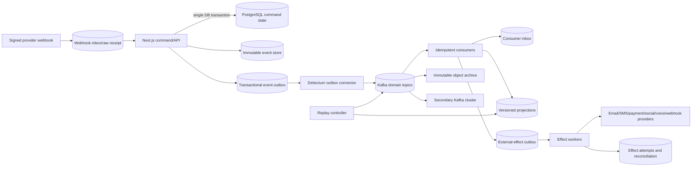

# LeadDrive Kafka and event-sourcing architecture

Status: **PARTIALLY IMPLEMENTED IN THE REPOSITORY — PostgreSQL foundation and
Fund pilot are merged but await the new-host recovery-gated production cutover;
backup hardening is a machine-ready foundation, not yet enterprise PITR/3-2-1;
Kafka transport, archive, consumers, and replay control plane are not
activated**
Decision owner: LeadDrive platform owner
Scope: every LeadDrive tenant, product module, integration, worker, projection,
and externally visible side effect
Companion documents:

- [Module event catalog and migration matrix](./MODULE_EVENT_CATALOG.md)
- [Projection recovery and event replay runbook](./PROJECTION_RECOVERY_RUNBOOK.md)
- [Canonical event envelope schema](./event-envelope-v1.schema.json)
- [ADR-001: Kafka event backbone](./ADR-001-KAFKA-EVENT-BACKBONE.md)
- [Kafka/CDC/Schema Registry activation assets](../../ops/event-platform/README.md)

## 1. Executive decision

LeadDrive will adopt a **hybrid event-sourced architecture**:

1. PostgreSQL remains the transactional command store during migration.
2. Every committed business change writes a canonical event and transactional
   outbox row in the **same PostgreSQL transaction**.
3. Debezium reads only the outbox publication and delivers events to Kafka.
4. Kafka is the ordered, replayable distribution log. It is not treated as a
   substitute for PostgreSQL PITR, immutable event-store retention, or backups.
5. Financial ledgers, loyalty points, stock movements, entitlements,
   approvals, external-send requests, and other irreversible aggregates move
   to true event sourcing first. Ordinary CRUD modules initially keep current
   state as their source of truth and publish explicit domain events.
6. Every consumer is at-least-once and idempotent. Kafka exactly-once
   transactions are used only where both input and output are Kafka records;
   they are never claimed to make a PostgreSQL or provider side effect
   exactly-once.
7. Every replayable projection is versioned and rebuilds into shadow storage.
   A replay never mutates the active projection in place and never invokes an
   external side effect.
8. External effects use a durable effect outbox, a stable business idempotency
   key, provider reconciliation, and an explicit `UNKNOWN` outcome.
9. A source fact is corrected by a new correction or compensating event. A
   committed event is never edited to make history look clean.
10. A projection bug is recovered by rebuilding that projection, not by
    restoring the whole multi-tenant production database.

This is intentionally not a big-bang rewrite of the 500+ existing Prisma
models. The migration order is risk-based and keeps current APIs operational.

## 2. The failure this architecture prevents

A code rollback restores old code but cannot undo data already written by a
bad consumer. A whole-database restore may remove valid writes made by every
other tenant after the backup timestamp. The recovery unit therefore must be
smaller than the database:

| Failure | Recovery source | Recovery action |
|---|---|---|
| Projection/calculation bug | Canonical immutable events | Build projection version `N+1`, validate, atomically switch reads |
| Consumer missed events | Kafka/event archive | Resume or replay only the affected consumer group |
| Duplicate delivery | Stable event/effect key | Inbox/outbox uniqueness makes the duplicate a no-op |
| Incorrect source fact | Original fact plus correction | Append correction/compensating event and rebuild affected projections |
| External outcome unknown | Provider read-back/evidence | Reconcile; never blindly resend |
| Primary database loss | PITR plus event/outbox reconciliation | Restore in isolation, prove watermark consistency, then promote |
| Kafka-cluster loss | Secondary cluster plus immutable event archive | Controlled failover and consumer checkpoint reconciliation |

Backups, event history, and reconciliation solve different problems. All three
are required.

## 3. Current LeadDrive baseline and delivered foundation

LeadDrive already has useful pieces, but they are fragmented:

- `PaymentWebhookEvent`, `IngestEnvelope`, `MtmSyncOperation`, social outbound
  records, call events, subscription events, ledger-like tables, and several
  MTM outboxes provide local idempotency or audit history.
- `PlatformEventLog` writes durable rows but dispatches through an in-process
  event bus. A process crash can lose fan-out after the database commit.
- `EventStream*` models define streams, sequences, delivery attempts, and dead
  letters, but the migration explicitly says that real-time dispatch is not
  implemented.
- BullMQ/Redis foundations exist for selected jobs; they do not provide the
  project-wide immutable domain history or projection rebuild contract.
- Several external sends still originate inside request handlers or cron jobs.
- Outside the implemented Fund pilot, some derived values are still stored
  beside transaction rows without a universal idempotency key, atomic event
  write, or rebuild command.

The first delivered slice adds `event_command_receipts`,
`event_aggregate_heads`, `domain_events`, `event_outbox`, `consumer_inbox`,
`projection_builds`, `projection_checkpoints`, `effect_outbox`, and
`effect_attempts`, plus immutable `effect_reconciliations`. These relations use
a separate migration owner, FORCE RLS, tenant policies that ignore the
spoofable legacy `app.rls_bypass` convention, append/state-machine triggers,
stable hashes, and deferred stream/head/outbox coherence checks.

The next repository slice adds `projection_activations` as the single
tenant/projection read pointer and append-only `projection_promotion_events`.
PostgreSQL requires an effect-fenced promoted target, exact pointer-version
advance, monotonic partition checkpoints, and different requester/approver
identifiers. Promotion or rollback therefore changes the pointer and appends
its evidence in one transaction; it never renames projection tables or
rewrites source events. The operator API must still derive both identifiers
from separate authenticated sessions/admissions—arbitrary caller strings do
not constitute two-person control. This slice is not deployed and does not
start Kafka workers.

Finance Fund is the first Profile-A pilot. Existing Fund/FundTransaction state
is converted to exact `NUMERIC(18,4)`, bootstrapped into a contiguous canonical
stream without changing stored balances, and checked against an active
`fund_balance_projections` row. New create/transaction commands commit their
receipt, source state, event, outbox, head, and projection atomically. Database
compatibility triggers keep the immediately previous artifact rollback-safe.

Kafka remains outside this repository/production slice. The topic catalog, connector,
logical-decoding, CDC-role/publication, and JSON Schema Registry files under
`ops/event-platform/` are validated templates only. They do not create a
cluster, slot, topic, consumer offset, or archive watermark.

The backup slice binds exact encrypted DB, recovery-set secrets and runtime
media object versions to signed offline restore evidence and an off-host Object
Lock recovery catalog. Its activation is deliberately two-phase: an
independently restored bootstrap candidate authorizes an operations-only
`recovery-bootstrap` deployment to create the first immutable log anchor; a
full candidate then restores that exact log archive offline and binds the
bootstrap certificate, root anchor and all four payload versions into catalog
v3. A normal application deployment may activate timers only after it repeats
that validation. The horizon is at least 400 days, not a nominal one-year 365
days. The slice captures a full roles/owners/ACL/RLS authority catalog and
proves data/RLS/PII recovery, but deliberately records
`FULL_AUTHORITY_RESTORE_STATUS=not_tested`. All backup objects/logs/catalog still
share one Hetzner account/region failure domain, runtime media is a live-tree
host-loss snapshot rather than a coordinated DB/object generation, and WAL/PITR
is not commissioned. Catalog v3 is deliberately not a clean-host hydration
capsule: it does not carry the complete local custody/marker chain, and a
committed log anchor cannot safely resume on a host without its durable cursor.
That requires a separately pinned outer hydration capsule and signed
discontinuity/reseed protocol. Therefore this slice cannot be presented as
enterprise 3-2-1, cross-region DR, host-loss log continuity, or sub-dump RPO.

## 4. Architecture principles

### 4.1 Events are facts, commands are requests

- Commands use imperative names: `RecordFundDeposit`, `ApproveContract`.
- Events use past tense: `finance.fund-deposit-recorded.v1`,
  `contracts.contract-approved.v1`.
- A rejected command does not emit a success event.
- A domain event describes a committed business fact, not a low-level row
  update such as `funds.row_updated`.
- A consumer must not infer tenant, aggregate, or schema version from payload
  text. Those values are mandatory envelope fields.

### 4.2 No dual writes

Application code must never independently commit PostgreSQL state and call a
Kafka producer. It writes state/event-store records and `event_outbox` in one
database transaction. Debezium publishes committed outbox inserts.

The connector is limited to the outbox publication. Generic CDC of all 500+
business tables is prohibited because row changes are not stable business
contracts and can leak sensitive columns.

### 4.3 At-least-once plus idempotency

Consumers assume duplicates, crashes, rebalances, and repeated replays.
Processing one event follows this order:

1. Begin a tenant-scoped database transaction.
2. Insert a `consumer_inbox` claim with a unique consumer-version/event key.
3. If the claim already exists with the same payload hash, return success.
4. If the same event ID has a different payload hash, quarantine and page an
   operator; this is corruption, not a duplicate.
5. Apply projection changes and create any derived event/effect-outbox rows.
6. Mark the inbox row processed and commit the database transaction.
7. Commit the Kafka offset only after the database commit.

A crash between steps 6 and 7 redelivers the event; the inbox makes it a no-op.

### 4.4 Replay is a first-class execution mode

Replay mode is selected by the controlled consumer deployment, not trusted
from an event payload. In replay mode:

- effect-outbox insertion is denied unless the effect is explicitly marked
  `replay_safe`;
- notifications, emails, payments, calls, provider fetches, webhooks, and AI
  billable calls are disabled;
- derived events stay inside a replay namespace until promotion;
- metrics, checksums, and invariants are recorded per tenant and partition;
- original event IDs, timestamps, correlation IDs, and causation IDs remain
  unchanged.

Idempotency for a projection is scoped to `projection_name:projection_version`,
so a new projection version may process every historical event. Idempotency for
an external effect is scoped to the stable business effect key, so a rebuild
cannot resend it.

## 5. Logical topology



### 5.1 Runtime components

| Component | Responsibility | Must not do |
|---|---|---|
| Domain command layer | Validate command, authorize tenant/user, append state/event/outbox atomically | Publish directly to Kafka or call external provider inside the transaction |
| Event store | Preserve true source events and aggregate sequence | Update/delete committed events |
| Debezium connector | Relay committed outbox rows to Kafka | Read arbitrary application tables or carry database credentials with write access |
| Schema registry | Enforce compatibility and ownership | Accept unreviewed breaking changes |
| Projection workers | Build versioned read models | Trigger external effects during replay |
| Effect workers | Execute approved external operations | Retry an unknown outcome without reconciliation |
| Replay controller | Create replay plan, fence effects, start shadow consumers, collect evidence, switch projection pointer | Reset live offsets as its default strategy |
| Archive sink | Persist immutable encrypted event segments and manifests | Store unencrypted sensitive payloads or allow early deletion |
| Observability stack | Lag, throughput, failures, invariants, tenant skew, DLTs, connector LSN | Log payload PII |

## 6. Sources of truth

LeadDrive uses three migration profiles.

### Profile A — true event-sourced aggregate

The immutable event stream is authoritative; current state is a projection or
snapshot. Required for money/points/stock/entitlements/approvals and other
high-consequence state.

Examples: fund ledger, payment intent lifecycle, loyalty wallet, pharmacy
points ledger, stock movements, subscription entitlement lifecycle, e-sign
status, critical approval state machines.

### Profile B — transactional state plus domain events

Current PostgreSQL tables remain authoritative. Every business mutation emits
an event atomically. This is the initial profile for most CRM CRUD aggregates.

Examples: contacts, companies, projects, tasks, knowledge-base content,
configuration definitions.

### Profile C — immutable ingress plus normalized projections

The signed/raw inbound receipt is retained according to its data class;
normalization emits canonical events. Provider redelivery dedupes by provider
event ID and payload hash.

Examples: payment webhooks, WhatsApp/Telegram/Chatwoot callbacks, social
provider results, telephony callbacks, email/SMS delivery receipts.

Profile selection for every module is in `MODULE_EVENT_CATALOG.md`.

## 7. Canonical event envelope

All Kafka domain events conform to `event-envelope-v1.schema.json` and the
CloudEvents 1.0 information model. The Kafka record key is separate from the
payload and uses:

```text
<organization_id>:<aggregate_type>:<aggregate_id>
```

This preserves order for one tenant aggregate without claiming a global order.
The initial Kafka record value uses CloudEvents structured JSON; the Kafka
content-type header identifies that encoding. Business attributes are not
duplicated into unrestricted headers. Each concrete event schema composes the
envelope with a strict schema for its `data` object. The envelope requires:

| Field | Meaning |
|---|---|
| `specversion` | CloudEvents version, initially `1.0` |
| `id` | Globally stable UUID; unchanged on replay |
| `source` | Owning LeadDrive producer/domain |
| `type` | Versioned domain event name |
| `time` | Business occurrence time |
| `datacontenttype` | Payload serialization media type |
| `dataschema` | Immutable registry subject/version reference |
| `organizationid` | Mandatory tenant boundary |
| `aggregateid` / `aggregatetype` | Ordered stream identity |
| `aggregateversion` | Optimistic concurrency sequence for Profile A |
| `correlationid` | End-to-end business operation |
| `causationid` | Event or command that caused this event |
| `traceparent` | Distributed trace context |
| `producer` / `producerversion` | Service and immutable build SHA |
| `classification` | `public`, `internal`, `confidential`, or `restricted` |
| `subjectref` | Non-PII reference for affected subject/entity |
| `data` | Schema-validated, minimized domain payload |

Rules:

- Event IDs are generated once at command commit; the connector and replay
  controller reuse them.
- Event time is not used as an ordering guarantee. Aggregate version and Kafka
  partition offset provide order within their defined scope.
- PII, secrets, access tokens, message bodies, health details, and recordings
  are not placed in headers or record keys.
- Large/binary content is stored in encrypted object storage; events carry a
  stable object reference, content hash, encryption-key reference, and policy.
- Money uses decimal strings plus ISO currency, never IEEE-754 numbers.
- Every schema has an owner, classification, compatibility policy, retention
  class, and example fixtures.

## 8. Persistence primitives and implementation mapping

The logical contracts below now map to the first concrete PostgreSQL names.
Only the Fund aggregate consumes all of them end to end; other modules remain
on their catalog migration paths.

### 8.1 `command_receipts` → `event_command_receipts`

- unique `(organization_id, command_type, idempotency_key)` supplied or derived
  at the trust boundary;
- canonical request hash, authenticated actor/client, state, result event IDs,
  and safe response reference;
- same key and same hash returns the recorded result; same key and different
  hash is an idempotency conflict;
- command receipt, domain mutation/events, and outbox commit in one transaction;
- timeout/retry never generates a second business operation merely because a
  new event UUID would otherwise be available.

### 8.2 `event_store_events` → `domain_events` + `event_aggregate_heads`

- immutable `event_id` primary key;
- `organization_id`, `aggregate_type`, `aggregate_id`, `aggregate_version`;
- canonical envelope and payload hash;
- unique `(organization_id, aggregate_type, aggregate_id, aggregate_version)`;
- append requires the caller's expected aggregate version; sequence allocation
  is serialized/optimistic inside the transaction and never implemented as an
  unlocked `MAX(version) + 1`;
- append-only trigger; no application `UPDATE` or `DELETE` grant;
- tenant RLS for ordinary reads; separately audited maintenance role;
- optional cryptographic chain per aggregate/archive segment for tamper
  evidence.

### 8.3 `event_outbox`

- one row per committed canonical event;
- same `event_id`, routing topic, partition key, envelope, payload hash;
- insert-only application access;
- Debezium publication contains only this table;
- outbox cleanup occurs only after Kafka and archive watermarks are proven;
- connector offsets and PostgreSQL WAL retention are monitored together.

### 8.4 `consumer_inbox`

- unique `(consumer_name, consumer_version, organization_id, event_id)`;
- payload hash, topic, partition, offset, processing status/timestamps;
- one transaction with the consumer's projection writes;
- bounded retention only after the source history and projection checkpoint
  make duplicate detection safe.

### 8.5 `projection_builds`, `projection_checkpoints`, and domain projections

- projection name/version, code SHA, schema versions, input topics;
- source start/end offsets for every partition;
- build state, per-tenant counts, checksums, invariants, reviewer, incident ID;
- `projection_activations` holds exactly one versioned read pointer per tenant
  and projection; `projection_promotion_events` is its immutable two-person
  promotion/rollback journal;
- active physical table/view and previous pointer;
- no switch without a completed evidence bundle.

### 8.6 `effect_outbox`, `effect_attempts`, and `effect_reconciliations`

- stable unique `(organization_id, effect_type, effect_key)`;
- event/correlation/causation references;
- approval/policy/content hashes where applicable;
- states `PENDING`, `CLAIMED`, `SENT`, `DEFINITE_FAILURE`,
  `RECONCILIATION_REQUIRED`, `CANCELED`;
- lease token and fencing generation;
- append-only attempt records and provider request/response evidence;
- an ambiguous attempt can leave `RECONCILIATION_REQUIRED` only when the
  dedicated NOLOGIN operator capability appends one immutable decision with
  non-empty provider/ticket evidence, evidence hash, `session_user`, reason,
  and matching attempt number in the same transaction;
- web/worker roles cannot append reconciliation evidence or authorize the
  transition; a retry clears the old provider request/result before leasing a
  new attempt, while succeeded/dead decisions require terminal evidence;
- provider idempotency key whenever the provider supports one.

### 8.7 `aggregate_snapshots`

- optional optimization for large Profile A streams, never source truth;
- unique tenant/aggregate/version, last event ID, schema/upcaster version,
  state hash, creation code SHA, and archive watermark;
- accepted only after recomputing its hash and proving the referenced event;
- disposable and rebuildable from earlier snapshot plus immutable events;
- snapshot corruption or absence falls back to event replay rather than
  changing history.

## 9. Topic and consumer-group strategy

### 9.1 Topic naming

```text
ld.<environment>.<domain>.events.v1
ld.<environment>.<domain>.replay.v1
ld.<environment>.<domain>.quarantine.v1
ld.<environment>.effects.requests.v1
ld.<environment>.effects.results.v1
ld.<environment>.security.audit.v1
```

There is no topic per tenant. That pattern creates operational topic/partition
explosion and weakens governance. Enterprise tenants requiring physical
isolation receive a dedicated cluster/namespace by contract, not an ad-hoc
topic naming exception.

Automatic topic creation is disabled. Topics, partitions, retention,
replication, ACLs, schemas, and owners are infrastructure-as-code.

### 9.2 Partitioning

- Domain events: aggregate key shown in section 7.
- Tenant lifecycle/security events: `organization_id:<aggregate>`.
- High-volume telemetry may use a device/session key but still carries the
  tenant ID and enforces tenant-aware processing.
- Partition counts are increased only through a reviewed scaling plan because
  Kafka cannot reduce a topic's partition count and a change affects key
  distribution.
- Workflows spanning aggregates use an idempotent saga/process manager; they do
  not depend on a nonexistent global event order.

### 9.3 Consumer naming

```text
ld.<environment>.<domain>.<purpose>.v<projection-or-consumer-version>
```

Examples:

```text
ld.prod.finance.fund-balance.v2
ld.prod.loyalty.wallet-balance.v1
ld.prod.omnichannel.conversation-timeline.v3
```

A projection rebuild uses a new group and new physical projection. Resetting
the active group's offset is an exception for missed-delivery repair, not the
normal projection rebuild mechanism.

For a tenant-scoped historical rebuild on shared domain topics, the replay
controller either consumes the source range with a fail-closed tenant allowlist
or materializes the selected, hash-verified events from the event store/archive
into an incident-scoped replay topic. It never resets the active group. Skipped
tenant events and selected offsets are accounted for in the build manifest.

## 10. Schema evolution

- Schema registration is required before producer deployment.
- Default compatibility is backward-transitive for event payloads.
- Existing field meaning never changes; optional fields may be added with safe
  defaults.
- Fields are deprecated before removal. A breaking semantic change gets a new
  event type/version.
- Consumers declare supported event versions and use deterministic upcasters.
- Upcasters are pure: no network, current database lookup, wall-clock time, or
  random values.
- CI verifies schema compatibility, example fixtures, PII classification,
  topic ownership, and that every registered module has an event policy.
- Unknown schema/type goes to quarantine; the offset is not silently skipped.

The initial transport format may be JSON for migration speed, but registry
governance is mandatory from day one. High-volume stable contracts may move to
Avro or Protobuf without changing the CloudEvents envelope semantics.

## 11. Multi-tenant isolation

Kafka ACLs isolate services, while `organizationid` isolates tenant data inside
shared domain topics. Both layers are required.

1. Producers derive tenant identity from the authenticated/RLS transaction;
   clients cannot override it in an arbitrary event body.
2. The outbox row has a foreign-key/coherence check against the transaction's
   tenant context.
3. Every consumer opens `runWithTenant(organizationid)` before touching tenant
   tables. Cross-tenant consumers use a dedicated reviewed bypass role and
   still process one tenant scope at a time.
4. Projection/inbox uniqueness always includes `organization_id` unless the
   event ID is globally unique and an additional tenant-coherence constraint
   is present.
5. Metrics label tenant only by a non-sensitive internal identifier; payloads
   never enter logs.
6. Replay plans have an explicit tenant scope. `all tenants` requires a second
   approver and batched canary promotion.
7. Dedicated-enterprise deployments can map one organization to a dedicated
   Kafka cluster and encryption domain while preserving the same contracts.

## 12. Security, privacy, and retention

- TLS is mandatory in transit; service identity uses mTLS or centrally managed
  SASL credentials with least-privilege ACLs.
- Brokers, event store, archive, and schema registry are encrypted at rest.
- Secrets/tokens/password hashes/private keys are forbidden in events.
- Restricted PII is referenced or field-encrypted with tenant-scoped keys.
- Erasure uses `subject-erasure-requested`/`subject-erasure-completed` events,
  projection deletion, and cryptographic erasure for encrypted historical
  fields. Kafka tombstones alone are not considered immediate physical erasure.
- Raw provider payload retention is short and policy-specific. Canonical
  business events retain only the minimum facts needed for audit/rebuild.
- Legal hold overrides automated expiration through an auditable policy event.
- Audit/security events are write-once and copied to a separate security
  account/cluster so application administrators cannot rewrite evidence.

Retention is assigned by data class and customer contract, not one global
number. Kafka hot retention, PostgreSQL event retention, PITR, and immutable
object archive are tracked as separate controls.

## 13. Kafka production baseline

The target production cluster must not be colocated with the current single
Next.js/PM2 host or PostgreSQL primary.

- Prefer a managed Kafka service with multi-zone SLA and supported upgrades;
  self-managed Kafka requires a separate approved operations capability.
- For self-managed critical environments, KRaft controllers and brokers use
  separate roles, with at least three controllers and three brokers across
  failure domains. A managed provider must expose equivalent resilience and
  maintenance guarantees in its SLA/evidence.
- Domain topics normally use replication factor `3`, `min.insync.replicas=2`,
  producers with `acks=all` and idempotence enabled.
- Unclean leader election is disabled for authoritative topics.
- Transactional consumers use `read_committed`; normal DB sinks still implement
  inbox idempotency.
- Development may use a single-node disposable cluster, but no development
  setting is promoted to production by default.
- Production and non-production clusters, credentials, schemas, and topics are
  separate. Production payloads never seed lower environments without an
  approved anonymization pipeline.

### 13.1 Cross-region continuity

- A second Kafka cluster receives domain topics, schemas, consumer checkpoints,
  and configuration manifests through a supported mirroring mechanism.
- Applications talk only to their local active cluster; a split-brain producer
  fence prevents both regions from accepting authoritative commands.
- Every canonical event is also archived in encrypted immutable object storage
  with segment manifests, hashes, topic/partition/offset ranges, and schema IDs.
- Kafka is not the only copy of authoritative history.
- DR drills prove producer fencing, connector LSN continuity, mirrored offsets,
  archive rehydration, and tenant-scoped projection rebuilds.
- Cross-cluster partition offsets are not assumed to be numerically identical.
  Checkpoints also carry stable event IDs, aggregate versions, source-cluster
  identity, and manifest hashes so failover can reconcile semantically.

The same failure-domain rule applies to backups: database, secrets, runtime
media, logs, event archive and recovery catalog need an independently
administered second provider/account/region. Object Lock versions in one bucket
are ransomware protection, not cross-region continuity. PostgreSQL WAL/PITR and
the Kafka/archive watermark must be restored and reconciled in the same DR
exercise; a logical dump or Kafka alone is insufficient.

## 14. Observability and SLO gates

Required signals:

- outbox oldest-unpublished age and row count;
- Debezium connector state, restart count, PostgreSQL LSN lag, and WAL disk
  pressure;
- producer error/timeout rate;
- under-replicated/offline partitions and ISR size;
- consumer lag and oldest-event age per domain/group;
- inbox duplicate rate and payload-hash mismatch count;
- quarantine/DLT count and oldest age;
- effect states, especially `RECONCILIATION_REQUIRED`;
- projection invariant failures, tenant skew, build duration, and checksum
  mismatches;
- archive watermark versus Kafka high watermark;
- secondary-cluster replication and checkpoint lag.

Initial go-live objectives, to be calibrated by load tests and customer SLA:

| Signal | Initial gate |
|---|---|
| Committed outbox to Kafka P95 | under 5 seconds |
| Correctness-critical consumer oldest-event age | under 60 seconds |
| Outbox event loss | 0 accepted |
| Cross-tenant event/projection write | 0 accepted |
| Payload-hash mismatch for same event ID | immediate P0 |
| Unknown external outcome | never automatically retried |
| Archive watermark | continuously behind Kafka by less than agreed RPO |

Alerts must identify domain, consumer, deployment SHA, topic/partition, and
tenant scope without logging event payloads.

## 15. Existing-system convergence

### `PlatformEventLog`

Keep as a compatibility API during migration. Its publish route must eventually
call the canonical domain-event service inside a transaction. The in-memory bus
may remain for non-critical local UI hints, but it is never a correctness path.

### `EventStream*`

Reuse useful catalog, filter, attempt, and dead-letter concepts in the control
plane. Kafka offsets and canonical event IDs become transport truth. Do not
build a second competing dispatcher/cursor system in PostgreSQL.

### BullMQ

Keep for bounded operational jobs where replay history is not the source of
business truth. Correctness-critical jobs are initiated from canonical events,
persist their own state, and are idempotent even if BullMQ retries.

### Domain-specific logs/outboxes

Payment webhooks, social outbox, MTM sync/outboxes, voice queues, and other
existing hardened paths are wrapped by adapters first. Their provider IDs and
idempotency keys are preserved. They are not deleted until parity, replay, and
retention evidence is complete.

## 16. Delivery roadmap

No phase may be skipped because later phases depend on evidence produced by the
earlier ones.

### Phase 0 — governance and safety controls (partially complete)

- approve ADR, module catalog, naming, ownership, and data classes;
- implement per-domain write/effect fences;
- introduce incident/replay roles and two-person projection promotion;
- close current high-risk non-atomic/idempotency gaps before Kafka;
- **complete as backup foundation:** exact encrypted DB/secrets/runtime versions,
  offline data/RLS/PII restore, physical-media custody attestation, signed
  evidence and immutable recovery catalog;
- **open enterprise P1:** full roles/owners/ACL restore, WAL/PITR, second
  provider/region replica, application-consistent media/tombstone recovery and
  operational-state/credential rebootstrap drill.

### Phase 1 — platform foundation (database complete; external transport open)

- **complete:** canonical schema, event store, outbox, inbox,
  projection-build/checkpoint, effect-outbox primitives, SDK, PostgreSQL 16
  conformance tests, and deployment postconditions;
- **complete as passive templates:** all-domain topic registry, Finance Fund
  JSON schemas, Debezium outbox connector, and PostgreSQL CDC preparation;
- **open:** provision non-production Kafka, Registry, Connect, archive and
  monitoring; then build the replay-controller dry-run;
- dual-publish synthetic/non-critical events and prove zero-loss reconciliation.

### Legacy bootstrap rule

Migration never invents a detailed event history from mutable rows. At each
domain cutover, an approved deterministic import appends an explicit
`<domain>.<aggregate>-opening-state-imported.v1` event per aggregate, containing
the minimum opening facts plus a reference to the encrypted source snapshot,
query/version manifest, row hash, cutoff timestamp, and reviewer. Existing
ledger/audit rows may be imported as individual historical events only when
their completeness, order, tenant ownership, and payload hashes are proven.

The mutation fence, import high watermark, outbox publication, old/new state
reconciliation, and first live aggregate version are one cutover record. A
bootstrap event states honestly what was known at migration time; it does not
claim that incomplete historical logs are complete business truth.

### Phase 2 — irreversible/high-risk domains (Fund pilot implemented)

- finance/payment/fund ledgers;
- loyalty and MTM pharmacy points;
- inventory stock movement;
- subscriptions, entitlements, tenant provisioning, roles/permissions;
- social/omnichannel/voice/email/SMS/payment external effects.

### Phase 3 — operational domains

- CRM, Sales, Contracts, Marketing, Support;
- omnichannel/social/voice normalized ingress;
- workflows and sagas.

### Phase 4 — industry clouds and analytics

- MTM/workforce, Health, Insurance, Public Sector, Media, Energy;
- Commerce, Education, Financial Services, Nonprofit, TPM;
- CDP/analytics/search/report projections.

### Phase 5 — production cutover and deprecation

- per-domain shadow rebuild and checksum parity;
- canary tenants before batch promotion;
- retire direct side-effect paths and competing event buses;
- cross-region failover and archive-rehydration drill;
- customer-facing recovery/SLA evidence.

## 17. Mandatory go/no-go gates per domain

Do not make Kafka or an event-sourced projection authoritative until all are
true:

- [ ] Every command writes state/event/outbox atomically.
- [ ] Duplicate command and duplicate event tests pass at the database layer.
- [ ] Cross-tenant publish/consume attempts fail closed.
- [ ] Schema compatibility and PII lint pass.
- [ ] Consumer crash at every transaction boundary is tested.
- [ ] Replay into a shadow projection produces deterministic checksums.
- [ ] Replay produces zero non-replay-safe external effects.
- [ ] `UNKNOWN` provider outcomes enter reconciliation.
- [ ] Old and new projections reconcile for canary tenants and production-like
      volume.
- [ ] Connector/WAL failure and Kafka outage tests prove no committed event
      loss.
- [ ] Archive restore and secondary-cluster failover are drilled.
- [ ] Runbook is executed by an operator who did not write the implementation.
- [ ] Rollback switches only the projection/read pointer and preserves all
      source events/new writes.

## 18. Official references

- [Apache Kafka operations: consumer-group offset reset and topic operations](https://kafka.apache.org/43/operations/basic-kafka-operations/)
- [Apache Kafka design: delivery semantics and transactions](https://kafka.apache.org/43/design/design/)
- [Apache Kafka KRaft production considerations](https://kafka.apache.org/43/operations/kraft/)
- [Apache Kafka datacenter architecture](https://kafka.apache.org/43/operations/datacenters/)
- [Apache Kafka topic configuration](https://kafka.apache.org/43/generated/topic_config.html)
- [Apache Kafka producer configuration](https://kafka.apache.org/43/generated/producer_config.html)
- [Debezium outbox event router](https://debezium.io/documentation/reference/stable/transformations/outbox-event-router.html)
- [CloudEvents core specification](https://github.com/cloudevents/spec/tree/ce@stable/cloudevents)
- [CloudEvents Kafka protocol binding](https://github.com/cloudevents/spec/blob/ce@stable/cloudevents/bindings/kafka-protocol-binding.md)
