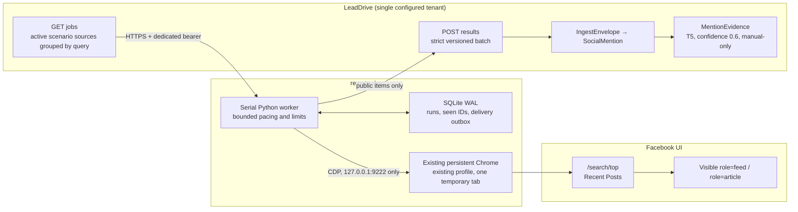

# Facebook native search worker: architecture and production runbook

## Status and scope

The Facebook native search worker is an **experimental, single-tenant T5
browser-capture gap-filler**. It reads explicitly public posts that are visible
in an already authenticated Facebook Chrome session and imports them into
Social Monitoring for review.

It is not a Meta API, licensed listening feed, completeness guarantee, or
supported reply channel. It must never be presented as complete Facebook
coverage. Every imported item remains `BROWSER_CAPTURE_READ_ONLY`, T5,
manual-only, and ineligible for automatic replies.

Until the live gates in [Stability assessment](#stability-assessment) are
completed, operate the worker only as a supervised canary.

## Architecture



The browser and worker have separate lifecycles. The worker attaches with
Playwright `connect_over_cdp`; it does not launch, stop, or own Chrome. A process
lock allows only one worker to use the profile and state database.

## End-to-end flow

1. The server reads active, scenario-managed Facebook global-search sources for
   one organization selected by environment configuration. Equal
   NFKC/case-normalized queries are grouped into one deterministic job with an
   exact, sorted list of `(scenarioId, subjectId, sourceId)` targets. A physical
   Facebook search is therefore performed once and its accepted results are
   fanned out to every bound monitoring.
2. The worker fetches jobs using a dedicated bearer credential. Remote limits
   may tighten local limits but cannot increase volume or reduce pacing.
3. Pending SQLite outbox deliveries are attempted before new Facebook work. A
   retryable delivery failure prevents further collection in that cycle.
   HTTP 410 is terminal for an obsolete exact target binding: the worker
   retires that outbox row, invalidates its local seen entries for safe future
   recollection, and continues with current jobs. HTTP 409 remains retryable
   because it represents the tenant collection fence.
4. The worker attaches to the existing loopback CDP endpoint, requires exactly
   one browser context, and opens one temporary tab.
5. For each query it opens `/search/top/?q=...`, finds the semantic Recent Posts
   switch, activates it when needed, and verifies both the checked switch and
   the resulting `filters` URL parameter.
6. It inspects only `[role="feed"] [role="article"]`, performs exactly 8 serial
   scrolls, and waits at least 3 seconds between scrolls.
7. An article is accepted only when it has:

   - an explicit public-audience accessibility label;
   - a strong Facebook post, reel, video, or photo ID;
   - non-empty visible article text;
   - a SHA-256 hash of the article HTML computed inside the page.

8. The worker deduplicates accepted items by `(jobId, externalId)`, commits the
   completed run and its outbox atomically to SQLite, and posts a strict
   `facebook-native-search-results-v2` batch. Capture time, scroll position,
   relative dates, and DOM-hash-only changes do not create a new semantic
   revision.
9. LeadDrive recomputes the current active grouped job and rejects stale or
   altered target bindings. It also revalidates the tenant, schema, public
   permalink, body size, and collection fence before routing one source-scoped
   observation per target through the existing ingest pipeline.
10. LeadDrive stores the acquisition as `browser_capture`,
    `BROWSER_CAPTURE_READ_ONLY`, `MANUAL_URL`, T5, `manualOnly=true`, and
    `noAutomation=true`. Target-specific `MentionEvidence` and a deterministic
    `CollectorRun` are upserted for every exact target. The run preserves
    `COMPLETE`, `PARTIAL`, or `BLOCKED` coverage even when the batch has zero
    items. No `SocialProviderRun`, Apify run, send, or reply capability is
    created.
11. Comments are a separate, explicit paid pass. An administrator starts
    **Collect comments** after discovery; LeadDrive sends only recent,
    source-scoped post permalinks to the configured Apify comments actor. That
    pass never reruns Facebook discovery and cannot be initiated with the
    browser-worker bearer.

A `COMPLETE` result means only that the configured bounded search run finished.
It does **not** mean that all matching Facebook content was found.

## Trust and safety boundaries

- The CDP endpoint must be exactly `http://127.0.0.1:9222`; never expose it
  through a reverse proxy, public listener, or SSH tunnel shared with untrusted
  users.
- The persistent browser profile is a high-value credential boundary. Run the
  worker under the same dedicated service user and do not copy or archive the
  profile.
- The worker may read only what the authenticated account can visibly access.
  It rejects an article unless a supported accessibility label explicitly
  proves public audience. Ambiguous, friends-only, group-only, and private
  content must fail closed.
- Do not add GraphQL interception, hidden API calls, CAPTCHA solving, proxy
  rotation, fingerprint spoofing, or other anti-bot bypasses.
- Do not add likes, follows, comments, shares, messages, or replies. AI may
  prepare a draft elsewhere, but the native worker never publishes it.
- The dedicated API bearer is stored in a `0600` file on the worker. LeadDrive
  stores only its lowercase SHA-256 digest and compares digests in constant-size
  form.
- Only the exact jobs and results paths bypass session middleware; both still
  require route-level bearer validation, tenant resolution, rate limiting, and
  the Social Monitoring collection fence.
- Result input is strict JSON, uncompressed, and at most 256 KiB. Undeclared
  fields, HTML documents, base64 data, non-Facebook permalinks, and credentialed
  URLs are rejected.
- The worker assembles requests under a stricter 240 KiB local UTF-8 budget.
  Items omitted because of that budget are not marked seen, and coverage is
  reported as partial so they remain eligible for a later delivery.
- Logs contain event names, counts, run/job IDs, one-way query references, and
  classified error codes only. They must not contain queries, post text,
  cookies, tokens, DOM, screenshots, or API response bodies.

## Configuration

LeadDrive environment:

| Variable | Meaning |
| --- | --- |
| `SOCIAL_FACEBOOK_NATIVE_WORKER_ENABLED` | Must be exactly `1`; otherwise both endpoints return 404. |
| `SOCIAL_FACEBOOK_NATIVE_WORKER_TOKEN_SHA256` | Lowercase SHA-256 of the dedicated raw bearer. |
| `SOCIAL_FACEBOOK_NATIVE_WORKER_ORG_SLUG` | The single active organization allowed to supply jobs and receive results. |

Worker configuration is documented in
[`services/facebook-native-search-worker/config.example.json`](../services/facebook-native-search-worker/config.example.json).
Production API URLs must use HTTPS. Plain HTTP is accepted only for an explicit
localhost test configuration.

Default local bounds:

| Control | Default / hard rule |
| --- | --- |
| Scrolls | exactly 8 |
| Query pacing | at least 1,800 seconds, plus 0–120 seconds configured jitter |
| Query volume | 1/cycle, at most 2/hour and 8/day for the whole Facebook account |
| Items | at most 25/query |
| Jobs returned | at most 50 normalized queries |
| Group targets | at most 25 exact scenario/source targets per normalized query |
| Cycle | every 900 seconds, never below 300 |
| Navigation timeout | 60 seconds |
| Delivery retry | exponential from 30 seconds, capped at 1 hour |

The fixed 8-scroll bound is a safety/recall compromise. The same
`Klinik.Media` candidate appeared around scroll 7 in one observation and scroll
10 in another; the worker may therefore miss it in some ranked sessions. This
is one reason the channel cannot promise complete coverage.

Capacity excess fails closed. A valid 26th subject, 51st normalized query, 26th
target for one grouped query, or more than 1,250 source bindings causes the jobs
endpoint to return an explicit capacity error. It never silently truncates the
tail of the queue.

## Installation and routine operations

Follow the service-specific
[README](../services/facebook-native-search-worker/README.md). The minimal
production sequence is:

```bash
curl --fail http://127.0.0.1:9222/json/version

/home/codex-alt/services/leaddrive-facebook-browser/venv/bin/python \
  /home/codex-alt/services/leaddrive-facebook-native-search-worker/main.py \
  --config /home/codex-alt/services/leaddrive-facebook-native-search-worker/config.json \
  --validate-config

/home/codex-alt/services/leaddrive-facebook-browser/venv/bin/python \
  /home/codex-alt/services/leaddrive-facebook-native-search-worker/main.py \
  --config /home/codex-alt/services/leaddrive-facebook-native-search-worker/config.json \
  --once

sudo systemctl enable --now facebook-native-search-worker
sudo systemctl status facebook-native-search-worker
journalctl -u facebook-native-search-worker -f
```

Do not enable the daemon until:

1. the Chrome profile is authenticated by an authorized operator;
2. CDP is loopback-only;
3. the token file is `0600`;
4. the LeadDrive feature flag, bearer digest, and tenant slug agree with the
   worker configuration;
5. one `--once` canary has been reviewed manually.

Operational rules:

- Preserve `state/worker.sqlite3` and its WAL files. Do not delete them to clear
  an error or force redelivery.
- Treat the database as sensitive: it contains raw search queries and normalized
  accepted post payloads needed by the outbox. The current candidate has no
  automated local retention purge.
- An interrupted `running` record is marked `abandoned` at startup. The current
  worker does not resume from an exact scroll checkpoint; the next run starts a
  fresh bounded search.
- Completed runs and deliveries are durable. Failed POSTs remain in the SQLite
  outbox and are retried without repeating the Facebook search.
- After a manual auth/filter stop, repair the persistent browser session first,
  verify it visually, and explicitly restart the unit.
- Rotate the worker bearer by updating the `0600` token file and the matching
  server-side digest together, then restart the worker. Never print the raw
  bearer in shell history or logs.

## Health and failure states

There is no dedicated worker health HTTP endpoint in the current candidate.
Health is derived from systemd, CDP, structured events, the SQLite outbox, and
server result reports.

| State or signal | Meaning | Operator action |
| --- | --- | --- |
| Unit active; CDP probe succeeds; `cycle_idle`, `collection_completed`, or `delivery_succeeded` appears | Healthy or idle | Continue normal observation. |
| `FACEBOOK_AUTH_REQUIRED` | Login, checkpoint, recovery, two-step, or password UI was detected | Do not auto-retry. Repair the session manually, then restart. |
| `FACEBOOK_TEMPORARILY_BLOCKED` | Meta displayed a temporary-block or checkpoint signal | Stop immediately; do not retry, rotate accounts, or change proxies. Resume only after manual review. |
| `RECENT_POSTS_FILTER_UNAVAILABLE`, `RECENT_POSTS_FILTER_NOT_ACTIVE`, `RECENT_POSTS_FILTER_URL_MISSING` | Recent Posts cannot be proved | Treat as UI drift; inspect manually before any code change. |
| `SEARCH_ROUTE_CHANGED` or `SEARCH_QUERY_MISMATCH` | Facebook navigated somewhere outside the allowed query route | Keep stopped; inspect redirect, auth, and DOM changes. |
| `CDP_UNAVAILABLE`, `CDP_CONTEXT_INVALID`, `CDP_PAGE_UNAVAILABLE` | Chrome/CDP is down or has an unexpected context shape | Check the persistent Chrome service; never launch a second browser as a fallback. |
| `BROWSER_OPERATION_FAILED` or `SESSION_CHECK_FAILED` | Playwright/UI operation could not be classified safely | Preserve run ID and inspect manually; repeated failures indicate schema drift. |
| `jobs_unavailable` | Jobs endpoint, bearer, tenant, or collection fence is unavailable | Fix the server/configuration issue; no Facebook work should start. |
| `delivery_deferred` | A completed result is retained in the local outbox | Restore the results endpoint; do not rescan or delete SQLite state. |
| `delivery_obsolete` / `HTTP_410` | The exact scenario/subject/source binding changed before delivery | The stale outbox row is retired automatically; confirm that the current job list contains the intended replacement binding. |
| `worker_stopped_for_manual_action` | The daemon exited cleanly to avoid repeated auth/filter hits | Complete the documented manual repair and explicitly restart. |
| `WORKER_ALREADY_RUNNING` | The process lock prevented a second worker | Find the existing unit/process; do not remove the lock while it is live. |
| `WORKER_INTERRUPTED` / `abandoned` | A run ended before transactional finalization | No partial results are deliverable; allow a later fresh run. |
| Result `BLOCKED` | A classified browser/auth/filter failure was reported with zero items | Investigate the reason; never reinterpret it as zero coverage. |
| Result `PARTIAL` | The local item/payload cap was reached | Treat the items as a bounded sample. |
| `SEARCH_RESULTS_EMPTY_ANOMALY` | Recent Posts was verified but no articles appeared after all 8 scrolls | Stop for manual review; do not interpret this as zero mentions. |

## Stability assessment

The candid assessment is **functional candidate, not production-proven
collector**.

| Evidence | Current assessment |
| --- | --- |
| Persistent Chrome and loopback CDP | Observed working on one authenticated `remote-dev` session. Long-term session survival is not yet measured. |
| `/search/top` and Recent Posts | Observed in the current Facebook UI. The implementation verifies semantic roles/labels and the filter URL, but Facebook can change either without notice. |
| `Klinik.Media` result | On 2026-07-29 a live supervised search observed 16 articles, accepted 11 explicitly public articles, and found the exact external `Klinik.Media` reel at scroll 10. A prior observation surfaced it around scroll 7. This is one canary, not a recall benchmark. |
| Public marker and permalink parser | Deterministic tests exist for the observed marker and supported strong URL shapes. Locale/DOM coverage outside the fixtures is not established. |
| SQLite WAL, dedupe, and delivery outbox | Deterministic tests exist. Crash behavior deliberately abandons an in-progress run rather than resuming its scroll. |
| LeadDrive auth/schema/tenant ingestion | Focused mocked tests exist. A live production worker-to-database round trip is not yet evidenced here. |
| Repeated scheduled collection | **NOT PROVEN:** the required 7-day low-rate soak, challenge rate, recall trend, and DOM-drift observation have not completed. |
| Screenshot evidence | **NOT IMPLEMENTED:** `screenshotSha256` is currently nullable and emitted as `null`; `MentionEvidence.screenshotUrl` remains `null`. |
| HTML evidence | Only SHA-256 of the live article `outerHTML` is retained. Raw HTML is not stored. The hash is integrity evidence, not a stable semantic fingerprint; harmless DOM/class changes may change it. |

Required promotion gates beyond supervised canary:

1. successful live `--once` job → result endpoint → `IngestEnvelope` →
   `MentionEvidence` proof;
2. manual review of accepted and rejected articles for public-audience accuracy;
3. 7-day soak with query counts, blocks, empty-result anomalies, delivery
   backlog, duplicate rate,
   and resource usage;
4. documented session recovery and token rotation exercise;
5. explicit owner approval for the account, tenant, queries, and retention.

## When to use

Use this worker only when all of the following are true:

- official or licensed coverage has a known discovery gap;
- the account owner has authorized this browser session and query set;
- only public post discovery is required;
- partial, best-effort coverage is acceptable;
- a human will review evidence and handle any response manually;
- the collection volume fits the fixed low-rate bounds.

Do not use it for:

- contractual completeness, legal discovery, historical backfills, or high
  volume;
- private profiles, friends-only posts, closed groups, DMs, or access-control
  bypass;
- comments/replies, engagement metrics, verified author identity, or media
  archival inside the browser worker (comments use the separate explicit Apify
  pass);
- auto-replies, moderation, publishing, or any other write action;
- replacing a working official API or approved licensed provider.

## Known limitations

- Facebook search ranking, localization, personalization, and visibility make
  recall non-deterministic.
- One authenticated account and one configured tenant are supported.
- The canary budget is account-wide. With 8 different queries the best-case
  cadence is about daily; 20 queries take about 2.5 days and 50 take more than
  6 days. Higher-volume or near-real-time monitoring requires an official or
  licensed provider.
- The worker collects posts/reels/videos/photos only; it does not traverse
  comments or threads.
- `dateRaw` and a coarse precision are retained, but the worker does not produce
  a trusted `publishedAt`; LeadDrive currently stores it as null.
- Text is cleaned visible article `innerText`, not a guaranteed message-only
  field, so UI labels can appear in edge cases.
- Media evidence is limited to kind hints (`IMAGE`, `VIDEO`, `REEL`, `LINK`);
  media files, thumbnails, and transcripts are not downloaded.
- Dedupe is by `(jobId, externalId)`. A meaningful text, author, link, media-kind,
  or audience change is delivered once as a new semantic revision; capture-only
  changes are ignored.
- Article-level DOM drift can currently surface as many rejected items or a
  zero-item completed run; there is no rejection-ratio circuit breaker yet.
- No per-scroll checkpoint, screenshot capture, operator dashboard, alert
  integration, local retention purge, or automated session renewal exists.
- DOM accessibility labels reduce reliance on volatile CSS classes but do not
  eliminate schema drift.

## Meta policy and operational risk

There is no verified fixed threshold of “10 searches”. Meta says feature limits
depend on the speed and quantity of actions and does not publish their exact
values. Meta also documents feature/data rate limits and automated-pattern
detection. Empty search results can therefore be a throttle signal, but can
also be ranking or UI drift; the worker treats a verified empty result as an
anomaly, not as proof of absence.

More importantly, Meta's current Terms and Automated Data Collection Terms
prohibit automated collection without permission and allow Meta to restrict
access. The low-rate canary reduces operational pressure but does not remove
that contractual risk. Production use requires the owner's legal/policy
decision and, where required, Meta's express written permission.

Official references:

- <https://www.facebook.com/help/101389386674555>
- <https://about.fb.com/news/2021/04/how-we-combat-scraping/>
- <https://about.fb.com/news/2021/05/scraping-by-the-numbers/>
- <https://www.facebook.com/terms>
- <https://www.facebook.com/legal/automated_data_collection_terms>

## Portability

The transport, configuration validation, SQLite outbox, pacing, and service
hardening are reusable patterns. The Facebook collector and parser are not.

| Platform | Reusable pieces | Must be platform-specific | Preferred acquisition path | Current status |
| --- | --- | --- | --- | --- |
| Instagram | Job/outbox transport and grouped-query concepts only | Search routes, post IDs, challenge detection, parser, and policy review | Connected professional API or approved provider first; separate Apify discovery/comment actors where explicitly configured | Facebook browser collector is not reused |
| TikTok | Grouped-query and source-scoped evidence concepts | Actor input/output, video IDs, comment pagination, checkpoints, and platform policy | Existing configured Apify search actor followed by the TikTok comments actor | Independent provider route; no Chrome dependency |
| YouTube | Grouped-query and source-scoped evidence concepts | API quota, video/comment pagination, OAuth, and reply permissions | YouTube Data API | Independent official API route; no Chrome dependency |

Any new platform requires a separate capability, legal/policy, data-retention,
selector, identity, and live-canary review. It must not inherit Facebook's T5
approval automatically.
