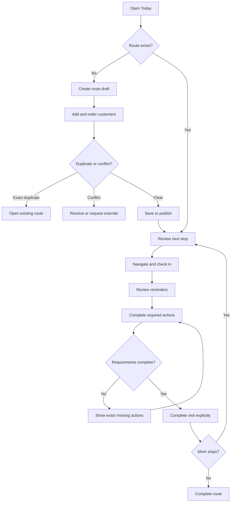

# MTM Routes Phase 1 - UX Contract

> **Status:** accepted baseline for implementation
> **Related plan:** [`mtm-routes-phase-1-product-plan.md`](./mtm-routes-phase-1-product-plan.md)
> **Design voice:** calm, field-focused, operational

## Design context

### Users

- Field agents use the product repeatedly during a working day, usually on a
  phone, while moving between customers. They need one obvious next action and
  must be able to resume an interrupted visit.
- Managers and supervisors plan work by week and manage exceptions. They need
  route conflicts, pending approvals, open visits, and missed stops without
  having to inspect every normal visit.
- Administrators configure policies and data exchange. They need predictable
  tables, previews, audit history, and explicit validation.

### Jobs to be done

- Agent: understand where to go next, complete the correct customer-specific
  work, and close the visit without missing a required action.
- Manager: see whether the team plan is executable, resolve exceptions, and
  approve route/customer changes with context.
- Administrator: express business rules per team and exchange data safely by
  Excel without knowing internal IDs.

### Emotional goal

The interface should feel fast, calm, and accountable. It must not feel like a
long CRM form, a gamified dashboard, or a monitoring tool watching every tap.

### Aesthetic direction

- Operational light-first interface because agents work outdoors and managers
  scan dense schedules during the day; existing dark mode remains supported.
- Compact hierarchy, strong state labels, restrained color, and persistent
  action placement.
- Maps and route progress are working surfaces, not decorative hero content.
- No nested cards, marketing composition, decorative gradients, or modal-heavy
  workflows.

## Navigation contract

### Agent

1. **Today** - current route, current/next stop, visit resume, route progress.
2. **My routes** - drafts, upcoming routes, history, approval/conflict state.
3. **New customer request** - available from route planning and active route.

### Manager

1. **Week plan** - agents by day, route status, conflicts, assignments.
2. **Approvals** - route changes, customer requests, conflict overrides.
3. **Exceptions** - long-open visits, missed stops, incomplete requirements.
4. **History** - searchable completed/cancelled routes and visits.

### Administrator

1. **Visit policies** - team/visit-type requirement matrix.
2. **Excel exchange** - templates, import flow, exports, history.
3. **Reference data** - teams, agents, customers, materials, products/topics.

## Agent flow

## Key screens

### Today

The first viewport contains:

- Date and route state.
- Progress as `visited / total`.
- Current or next customer name, address, planned time, and distance when known.
- One primary action selected by state: **Start route**, **Navigate**,
  **Check in**, **Continue visit**, or **Complete route**.
- Compact exception status when a route conflict or approval is pending.

Secondary information, route notes, all stops, and map controls follow below.
The primary action remains stable in size and position as state changes.

### Route builder

The builder is a full page on narrow screens and a wide sheet/page on desktop.
It is not a small dialog.

- Date and route name.
- Primary agent and participants.
- Searchable customer picker.
- Ordered stop list with drag handle plus accessible move up/down actions.
- Per-stop planned time.
- Inline duplicate and schedule-conflict feedback.
- Sticky **Save draft** and **Publish** actions according to permission.

An exact duplicate cannot be saved. The existing route is linked from the error.
A schedule conflict can be submitted for manager override when permission does
not allow direct resolution.

### Visit workspace

The visit header contains customer identity, check-in time, timer, location
status, and participants. It does not contain editable agent/customer selectors.

Content order:

1. Previous promise/task reminders.
2. Required actions and `completed / required` progress.
3. Visit result.
4. Optional actions, collapsed by default.
5. Explicit **Complete visit** action.

When completion is blocked, focus moves to a summary that lists the exact missing
requirements and links to each block. A visit remains open until the server
accepts explicit completion.

### Manager week plan

- Sticky agent column and seven date columns.
- Route cell: state, route name, stops, primary/participant markers, conflict.
- Region/team/date filters remain visible while scrolling.
- Selecting a cell opens route details without replacing the planning context.
- Empty cells have a compact add action; they are not decorative cards.

### Approvals

The queue defaults to pending items and displays request age, requester, route or
customer, reason, and change summary. Decision view shows before/after state.
Reject and needs-info require a comment. Approval is idempotent and the UI must
handle an item already decided by another manager.

### Visit policy matrix

- Rows are action types; columns are teams or visit types.
- Each cell has three states: Required, Optional, Hidden.
- Advanced conditions open in a focused editor only for the selected cell.
- Preview answers: "What will agent X see for customer Y?"
- Policy changes state their effective time and never rewrite active visits.

### Excel exchange

The five steps are visible as progress, but only the current step is expanded:

1. Data type and template.
2. Upload.
3. Preview and mapping.
4. Validation summary.
5. Apply and result.

Validation summary must separate create, update, unchanged, duplicate, conflict,
and error counts. **Apply** states the exact mutation count. A failed row links
to sheet, row, column, and a readable correction.

## State contract

Every major screen implements these states explicitly:

| State | Required behavior |
|---|---|
| Initial loading | Stable skeleton matching final layout; no layout jump |
| Empty | One relevant next action based on role |
| Partial data | Preserve valid rows and label unavailable sections |
| Offline | Show last sync and queued changes; keep drafts editable |
| Syncing | Non-blocking status; disable only duplicate submit actions |
| Validation error | Field/action-specific correction and focus target |
| Permission denied | Explain unavailable operation without exposing hidden data |
| Conflict | Show competing route/change and available resolution |
| Pending approval | Keep current route executable until decision |
| Success | Update local state immediately and reconcile with server result |

## Content contract

- User-facing labels never expose raw enums such as `CHECKED_OUT` or
  `IN_PROGRESS`.
- Required actions use verbs: **Take photo**, **Show presentation**,
  **Check stock**, **Record result**.
- Disabled completion explains the missing evidence; it does not say only
  "Validation failed".
- Destructive or approval-triggering actions state the consequence before submit.
- Dates and times use organization timezone; exports state that timezone.
- AZ, RU, and EN strings are added together for every shipped surface.

## Accessibility and responsive contract

- WCAG AA contrast and visible focus states.
- Minimum 44px touch targets for mobile primary and reorder controls.
- All drag operations have keyboard/button alternatives.
- Status is never communicated by color alone.
- Sticky actions do not cover the last form field or mobile browser controls.
- Tables adapt into ordered list rows on narrow screens; critical actions are not
  hidden on mobile.
- Motion is limited to state transitions and respects reduced motion.

## Acceptance walkthroughs

### Agent walkthrough

An agent with a required presentation and optional photo can create a draft,
publish when authorized, check in, see a previous promise, record the
presentation, add a next action, and explicitly complete the visit. Completion
is blocked before the presentation and succeeds after it.

### Manager walkthrough

A manager sees two agents assigned to one route, reviews a stop-removal request,
compares before/after route state, approves it, and sees route totals update
without losing the week-plan context.

### Administrator walkthrough

An administrator changes the merchandiser photo policy, previews the resulting
visit for a selected agent/customer, uploads a route workbook, reviews conflicts,
and applies only after the mutation summary is clear.
