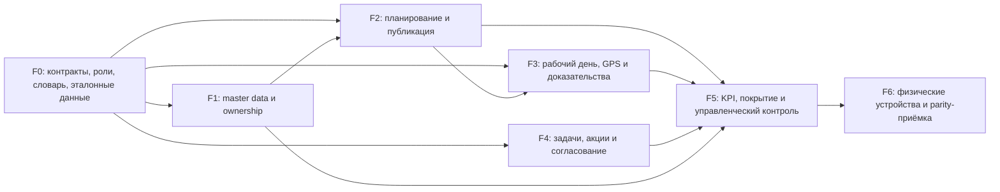

# SwissMed → LeadDrive MTM: исполнимый backlog модернизации

Дата: 2026-07-28
Статус: рабочий backlog после визуального разбора 18 референсов
Связанный разбор: [swissmed-visual-forensic-analysis-2026-07-28.md](./swissmed-visual-forensic-analysis-2026-07-28.md)

## 1. Цель и принятый продуктовый курс

Цель — перенести в LeadDrive MTM доказанные фотографиями SwissMed рабочие
сценарии, сохранив бизнес-функции, взаимосвязи данных и контроль, но не
копируя устаревший интерфейс QuadraSoft пиксель в пиксель.

Рабочее направление:

- функциональная parity по всем SWM-01…18;
- единая модель данных вместо 18 изолированных экранов;
- современный desktop/tablet UX для диспетчерской работы;
- отдельная phone-проекция для полевого сотрудника;
- offline-first для действий в поле;
- объяснимые KPI и GPS, а не только итоговые проценты;
- tenant scope, роли, аудит и история изменений во всех мутациях;
- RU/AZ/EN и доступность как часть готовности, а не последующая доработка.

Если позже будет принято решение воспроизводить визуальный стиль SwissMed
буквально, это будет отдельная дизайн-задача. Текущий backlog закрепляет
поведение и данные, которые нельзя потерять при редизайне.

## 2. Что уже существует и как читать статусы

По текущему дереву LeadDrive уже подтверждены технические основы:

- master data организаций и назначения;
- master data контактов, места работы и заявки на изменение;
- preview/apply массовой передачи контактов;
- versioned scoring врача и workflow потенциала брендов;
- маршруты, публикация и change-request;
- work calendar, workday, GPS locations;
- manager read models для planning, approvals, locations и team;
- mobile week и KPI read models;
- task API: edit, progress, duplicate, return, documents, bulk reassignment;
- mobile sync/outbox и разрешение конфликтов для части полевых операций.

Это не означает, что соответствующие SWM-задачи завершены. Наличие таблицы или
API без полного пользовательского сценария, адаптивного UI, прав, аудита и
приёмки по референсу считается только основой.

Статусы:

| Статус | Значение |
|---|---|
| `AUDIT` | Основа есть; сначала проверить пять слоёв: data, API, UI, mobile/offline, acceptance |
| `FINISH` | Существенная часть есть; довести недостающий сценарий |
| `BUILD` | В текущем дереве не найдена достаточная предметная реализация |
| `GATE` | Сквозной блокирующий контракт или проверка |

Размеры `S/M/L/XL` нужны только для порядка и декомпозиции. Это не календарная
оценка.

## 3. Зависимости и порядок поставки

Параллельная работа допустима внутри фазы, но тяжёлые сборки и полные тесты на
сервере выполняются последовательно по правилам репозитория.

## 4. Phase 0 — зафиксировать продуктовые контракты

### SWM-FND-01 — Реестр parity и пятислойный аудит

Статус: `IN PROGRESS` — governed lifecycle для contact dictionaries внедрён;
содержимое tenant-словарей и остальные формулы требуют product-owner approval
Размер: M
Покрывает: SWM-01…18

Результат: по каждому SWM существует карточка реализации со статусом пяти
слоёв: `data`, `API`, `desktop/tablet`, `phone/offline`, `acceptance`.

Работа:

- завести реестр со ссылками на модели, endpoint, компоненты и тесты;
- отметить `done/partial/missing/blocked` отдельно для каждого слоя;
- не засчитывать backend foundation как готовый экран;
- закрепить владельца и зависимость каждой незавершённой карточки;
- добавить ссылку на конкретный раздел визуального разбора.

Приёмка:

- присутствуют все SWM-01…18;
- нет статуса «готово» без теста сценария;
- существующие основы не планируются повторно.

### SWM-FND-02 — Словарь терминов, статусов и формул

Статус: `GATE`
Размер: M
Покрывает: SWM-03, 04, 08, 09, 13, 15, 16, 17, 18

Результат: согласованный tenant-aware словарь для терминов SwissMed:
категория врача, категория бренда, потенциал, раскрытие, MOI, Target, K.O.,
Lic., покрытие, факт визита, GPS %, отмена, задача, акция и баллы.

Работа:

- определить значения и допустимые состояния;
- указать источник и владельца каждого показателя;
- определить, какие справочники глобальные, tenant-specific и versioned;
- для формул закрепить версию, период действия, округление и timezone;
- подготовить RU/AZ/EN названия без смешения языков в одной локали.
- [x] создать tenant-scoped неизменяемые версии для `PSYCHOTYPE`,
  `PRODUCT_CATEGORY` и `BRAND_CATEGORY`: source evidence, SHA-256, approval
  reference, RLS, audit и ровно одна активная версия на каждый вид;
- [x] публиковать в mobile config только подписанные активные версии, не
  подменяя ими два других вида словаря и не раскрывая черновики;
- [ ] загрузить и подписать реальные SwissMed values после product-owner
  approval; значения со скриншотов не использовать как seed.

Приёмка:

- KPI можно воспроизвести из исходных фактов;
- прошлый период сохраняет использованную версию формулы;
- неоднозначные сокращения не попадают в UI без расшифровки.

### SWM-FND-03 — Эталонный набор данных

Статус: `GATE`
Размер: M
Покрывает: SWM-01…18

Результат: безопасный, обезличенный dataset с ожидаемыми результатами.

Набор должен включать:

- tenant, отдел, менеджера и двух полевых сотрудников;
- врача с несколькими местами работы и brand potentials;
- аптеку и медицинскую организацию;
- draft/published route на неделю;
- визиты: выполненный, отменённый, перенесённый и offline-conflict;
- полный и неполный GPS-день, остановку, устаревшую последнюю координату;
- активную, возвращённую, завершённую и циклическую задачу;
- аптечную акцию с L1/L2 решением и баллами;
- KPI-ожидания с ручным расчётом.

Приёмка:

- dataset не содержит ФИО и адреса с фотографий;
- тест ожидаемых totals подписан продуктовым владельцем;
- один и тот же dataset используется в API, UI и E2E-приёмке.

### SWM-FND-04 — Роли, scope и неизменяемый аудит

Статус: `AUDIT`
Размер: L
Покрывает: все мутации SWM-01…18

Результат: матрица прав `admin/manager/field employee/reviewer/read-only` и
серверное принуждение tenant/team/ownership scope.

Обязательно:

- UI не является границей безопасности;
- bulk preview и apply используют одинаковый scope;
- исторические факты не переписываются после смены владельца;
- аудит хранит actor, timestamp, reason, before/after и correlation id;
- экспорт подчиняется тем же ограничениям, что экран;
- PII и GPS имеют политику хранения, доступа и выгрузки.

Приёмка:

- негативные API-тесты покрывают cross-tenant и out-of-team доступ;
- менеджер видит прямых подчинённых по согласованной иерархии;
- изменение ownership влияет на будущую видимость, но не меняет автора
  исторического визита.

### SWM-FND-05 — Общий контракт фильтров, selection и saved views

Статус: `FINISH`
Размер: L
Покрывает: SWM-01, 05, 07, 08, 09, 16, 18

Результат: единая серверная схема facet/filter/sort/pagination.

Обязательно:

- зависимые географические фильтры;
- сохранённые представления и восстановление URL;
- явная семантика выбора: текущая страница или все строки по фильтру;
- preview количества и конфликтов перед массовой операцией;
- фильтры сохраняются при переходе в карточку и возврате;
- экспорт использует тот же filter contract;
- видимое состояние loading/empty/error/stale.

Приёмка:

- один и тот же фильтр возвращает согласованные данные в списке, export и
  planning;
- массовое действие никогда молча не применяется к невидимым строкам;
- возврат из detail не сбрасывает страницу, сортировку и выделение.

### SWM-FND-06 — Адаптивная оболочка плотных рабочих экранов

Статус: `PARTIAL` — governed foundation, importer, totals UI и uncovered
drill-down находятся в production; tenant-signed formula/dataset отсутствуют
Размер: L
Покрывает: SWM-01, 05, 07, 08, 09, 16, 17, 18

Результат: не одна «резиновая таблица», а три осознанные проекции:

- desktop: фильтры + плотная таблица/матрица;
- tablet landscape: collapsible filters + sticky key columns;
- phone: карточки, очередь действий и progressive disclosure.

Приёмка:

- ни одна обязательная операция не требует горизонтальной прокрутки телефона;
- touch target не менее 44×44 CSS px;
- таблицы поддерживают клавиатуру, focus, заголовки и 200% zoom;
- важный статус не кодируется только цветом;
- плотность выбирается пользователем и не уничтожает доступность.

### SWM-FND-07 — Offline, freshness и конфликты

Статус: `FINISH`
Размер: L
Покрывает: SWM-02, 10, 11, 12, 14, 17, 18

Результат: единый outbox и понятные состояния синхронизации.

Работа:

- расширить очередь за пределы только визитов на разрешённые полевые мутации;
- idempotency key, retry, backoff и conflict payload;
- `pending/synced/conflict/error` в UI;
- показать время последней синхронизации и свежесть GPS;
- безопасный manual retry и разрешение конфликтов;
- маршрут дня доступен без загрузки новых map tiles.

Приёмка:

- повторная отправка не создаёт дубль;
- устаревшая координата не маркируется как «сейчас»;
- пользователь не теряет введённые данные после закрытия приложения.

## 5. Epic A — Master data, назначение и ownership

### SWM-01A — Общий каталог организаций и фильтры

Статус: `IMPLEMENTED / ACCEPTANCE PENDING` — каталог, dependent facets,
assignment preview/apply и responsive UI развёрнуты; реальные tenant-источники
и authenticated/device evidence остаются внешними gates
Размер: L
Референс: SWM-01

Результат: администратор/менеджер видит общий tenant-каталог организаций,
фильтрует по географии, типу, категории, специализации, назначению и строке
`название/адрес/код`.

Работа:

- связать существующие organization endpoints/facets с полноценной страницей;
- реализовать весь доказанный filter set: область, административный район,
  населённый пункт, район города, категория/специализация/тип/вид организации,
  статус сотрудника, статус в базе, менеджер, сотрудник, территория, полигон;
- отдельно поддержать `искать свободные организации`;
- отобразить organization type, address, code, assignee, assignment status;
- добавить безопасное редактирование и переход в detail;
- обеспечить server pagination/sort и saved views;
- проверить импорт/экспорт без расхождения filter contract.

Приёмка:

- сценарий SWM-01 выполняется на desktop и tablet;
- фильтр и totals совпадают с API/export;
- cross-tenant организация не раскрывается ни через id, ни через search.

### SWM-01B — Массовое назначение организаций

Статус: `DEPLOYED / ACCEPTANCE PENDING` — commit `6d051e2a9`
Размер: M
Референс: SWM-01

Работа:

- использовать существующий preview/apply assignment flow;
- показать scope выбора, будущего сотрудника, конфликты и затронутые маршруты;
- потребовать reason для замены активного назначения;
- дать итоговый отчёт applied/skipped/failed;
- определить и показать разрешённый rollback или компенсирующую операцию;
- обновить связанные списки без полного reload.

Приёмка:

- preview и apply дают одинаковый состав;
- операция атомарна в оговорённых границах;
- аудит содержит старого и нового владельца.

### SWM-06 — Карточка организации

Статус: `IMPLEMENTED / ACCEPTANCE PENDING` — технические источники и семь
вкладок реализованы; нужны реальные SwissMed-данные и device evidence
Размер: L
Референс: SWM-06

Результат: единая карточка с адресом, координатами, юридическими/коммерческими
полями, назначениями и вкладками контактов, визитов, подразделений, персонала,
акций и файлов.

Работа:

- [x] проверить полноту существующего organization detail API;
- [x] сделать summary header и вкладки с независимой lazy-загрузкой;
- [x] добавить историю назначения и честное состояние источника координат;
- [x] хранить коммерческие показатели с source timestamp/freshness;
- [x] сохранить возврат к исходному списку и фильтрам;
- [x] подключить authoritative модели отделений и файлов организации;
- [x] хранить неизменяемое подтверждение точной пары координат с источником,
  оператором и временем;
- [x] добавить offline core-detail projection с web-equivalent
  assignment-or-route scope, server freshness и tombstone после потери
  последнего пути доступа.

Приёмка:

- все поля из SWM-06 имеют явный mapping либо оформленный продуктовый отказ;
- координаты можно проверить на карте;
- вкладки не раскрывают данные вне роли/scope.

### SWM-07 — «Мои организации»

Статус: `IMPLEMENTED / ACCEPTANCE PENDING` — web/offline `MINE` и механизм
подписанных атрибутов реализованы; нужен реальный SwissMed-пакет и device evidence
Размер: M
Референс: SWM-07

Результат: персональное представление организаций, назначенных текущему
сотруднику, без подмены общего каталога.

Работа:

- [x] добавить быстрые фильтры сотрудника и сохранённые views;
- [x] добавить server-default `MINE` для агента и точный current-actor
  effective-assignment scope без копирования общего каталога;
- [x] сохранить доказанные geo/territory/type/kind/category/specialization
  фильтры и поиск по Etalon ID;
- [x] показать последний и следующий визит, категорию и type с переходом к
  исходному визиту/маршруту;
- [x] добавить быстрый переход в карточку, навигацию при наличии координат и
  планирование с prefill организации;
- [x] добавить polygon filter, связанный только с активным подписанным
  tenant-пакетом, без вывода геометрии/кода из старых полей;
- [x] раскрыть `Лиц.` и `Категория МО` через версионированный пакет с Etalon ID,
  SHA-256, source metadata, exact-hash activation, RLS и аудитом;
- [x] добавить offline list projection/freshness и проверить снятие назначения
  после sync;
- [x] доставлять активные подписанные атрибуты в `organization-core-v3` и
  включать изменённые строки в delta-sync после активации пакета;
- [ ] записать authenticated manager/agent и physical-phone evidence.

Приёмка:

- `Мои организации` и общий каталог используют одну сущность;
- снятое назначение исчезает после sync;
- исторический визит остаётся доступен в допустимом scope.

### SWM-08 — Плотный операционный реестр организаций

Статус: `DEPLOYED / ACCEPTANCE PENDING` — commit `2da056988`
Размер: L
Референс: SWM-08

Результат: конфигурируемая data-grid проекция для массовой офисной работы.

Работа:

- [x] columns: geo, organization, address, classification, assignee, last visit;
- [x] sticky primary columns, resize/reorder/show-hide;
- [x] bounded server paging/sort/filter и browser rendering только текущей
  страницы (до 200 строк, без загрузки 10k записей);
- [x] многострочный длинный адрес без разрушения scanability строки;
- [x] compact/comfortable density;
- [x] keyboard navigation и доступное чтение заголовков;
- [x] экспорт видимых/отфильтрованных данных с явным лимитом 500;
- [x] phone card projection с 44px actions и последним завершённым визитом;
- [x] подключить fail-closed подписанный источник поля `Лиц.` к фильтрам,
  колонкам, CSV и mobile projection; без активного пакета значение остаётся
  явно пустым;
- [ ] записать authenticated browser evidence при 200% zoom, 1,000+ строках и
  на физическом телефоне.

Приёмка:

- 10k строк не загружаются целиком в браузер;
- при 200% zoom сохраняются ключевые действия;
- скрытие колонок не меняет данные и server scope.

### SWM-03 — Master-карточка контакта

Статус: `IMPLEMENTED / PRODUCT DATA AND ACCEPTANCE PENDING` — code parity,
governed dictionary assignments и mobile projection развёрнуты; остаются
tenant-approved values, signed merge policy и authenticated/device evidence
Размер: L
Референс: SWM-03

Результат: контакт не привязан навечно к одной организации и имеет
персональные, профессиональные, контактные и адресные данные.

Работа:

- [x] завершить canonical read UI поверх существующих contact API;
- [x] места работы с периодами активности и primary workplace;
- [x] manager UI для create/edit/end места работы с audit/concurrency и agent
  approval requests `WORKPLACE_UPSERT`/`WORKPLACE_END`; завершённая связь
  остаётся в истории, а организация выбирается через scoped server search;
- [x] специализация, категория врача, должность и профиль;
- [x] подключить подписанный tenant-словарь психотипа через version-bound
  assignment, не подменяя master data snapshot-полем assessment;
- [x] product categories и brand categories реализовать как разные versioned
  связи с независимыми entry codes и историей;
- [x] раздельно отобразить телефоны и каналы связи;
- [x] история изменений и review для защищённых полей;
- [x] primary actions: позвонить, написать, запланировать визит, открыть задачи;
- [x] добавить manager edit и agent change-request формы в карточку;
- [x] добавить безопасное сообщение о дубле из карточки: scoped поиск основной
  записи, обязательная причина, idempotent Agent request и Manager/Admin
  approve/reject с обязательным комментарием;
- [x] добавить offline core-detail projection: contact delta содержит
  профессиональные/контактные поля, собственное effective assignment,
  workplaces, governed dictionary assignments, assessment и field potential;
  визиты приходят отдельной связанной projection по `contactId`;
- [x] добавить tenant-политику обязательных полей: Admin настраивает поля по
  группам, имя и фамилия остаются baseline, а create, прямой edit, Agent
  proposal и approval проверяются одним server-side контрактом;
- [x] реализовать lifecycle отдельных tenant-словарей психотипов, продуктовых
  и брендовых категорий без guessed seed; активная версия подписывается по
  hash и approval reference и публикуется мобильному клиенту;
- объединение дубликатов вынести в отдельную безопасную процедуру.

Implementation checkpoint (2026-08-08, deployed; acceptance pending):

- [x] implementation `6bccb472f` подключает существующие workplace и
  change-request API к master-карточке на desktop и phone с 44px actions;
- [x] TypeScript compile, 21 field-master-data API тест, шесть approval-flow
  тестов и UI-contract прошли в PR checks `31260814146`; secret scan
  `31260814139` и blocking suite `31260814144` зелёные;
- [x] production workflow `31261182352` прошёл MTM/auth/i18n gates,
  standalone build, atomic deploy и smoke; независимый ping вернул `200` и
  `db: ok`, workplace/approval API без сессии вернули `401`, карточка — `307`;
- [x] implementation `ef2f69305` выводит `DUPLICATE_REPORT` в master-карточку,
  повторно валидирует tenant/scope и запрещает использовать `DUPLICATE`/`MERGED`
  как основную запись; подтверждение только помечает и связывает карточку, не
  переносит скрыто визиты, места работы или историю;
- [x] PR #728: TypeScript и Gitleaks зелёные, API 7/7 и duplicate UI contract
  1/1; production workflow `31262974682` прошёл MTM/auth/i18n, standalone,
  immutable staging, atomic deploy и smoke. Независимый ping вернул `200` и
  `db: ok`, contact search/report/decision без сессии вернули `401`, карточка —
  `307` на login;
- [x] implementation `0d7c4c9c1` и PR #729 подключают policy к MTM settings и
  responsive contact edit: поддержано 20 canonical полей, locked baseline,
  EN/RU/AZ labels/errors и 44px controls; неизвестные/повторные ключи
  нормализуются на settings API;
- [x] policy повторно применяется на contact create, Manager/Admin edit, Agent
  proposal и approval по текущей версии настроек; transactional approval при
  ошибке полностью откатывает claim и не меняет contact;
- [x] focused API suite 11/11 и policy unit suite 3/3 зелёные; production
  workflow `31265054984` прошёл security/MTM/auth/i18n, standalone build,
  immutable staging, atomic deploy и все smoke. Независимый ping вернул `200`
  и `db: ok`, защищённые contact/settings API — `401`, MTM pages — `307` на
  login;
- [x] implementation `c792608ff` и PR #730 добавляют RLS-backed immutable
  dictionary drafts, отдельные kinds `PSYCHOTYPE`/`PRODUCT_CATEGORY`/
  `BRAND_CATEGORY`, source provenance, SHA-256/CAS activation, audit и
  one-active-per-kind DB constraint; responsive settings UI имеет RU/AZ/EN и
  44px phone actions;
- [x] dictionary API 3/3, contract 4/4, mobile config 3/3 и migration 3/3
  прошли; production workflow `31266687807` применил миграцию
  `20260808160000_mtm_contact_dictionaries`, выполнил atomic deploy и все
  smoke. Независимый ping вернул `200`/`db: ok`, защищённые dictionary/mobile
  API — `401`, settings page — `307` на login;
- [x] добавить versioned assignments контакта к точным dictionary entry codes,
  manager direct edit, Agent approval request, conflict hash, RLS/DB guards и
  responsive history UI; старое текстовое поле не используется как скрытая
  brand-category relation;
- [ ] после получения утверждённых SwissMed значений создать tenant active
  versions и провести controlled data entry/import без guessed seed;
- [ ] authenticated manager/agent browser и physical-phone evidence остаются
  обязательными до перевода Acceptance в `DONE`.

Приёмка:

- два места работы не создают два человека;
- закрытое место работы остаётся в истории;
- обязательность полей настраивается tenant-политикой.

### SWM-04 — Scoring врача и потенциал брендов

Статус: `IMPLEMENTED / PRODUCT DATA AND ACCEPTANCE PENDING` — web/offline
lifecycle и механизм подписанного glossary развёрнуты; остаются утверждённые
SwissMed values и authenticated/device evidence
Размер: L
Референс: SWM-04

Результат: менеджер видит общий score и versioned потенциал по брендам, может
предложить изменение, а reviewer — принять или отклонить.

Работа:

- [x] связать существующие scoring formula, assessment и field potential read/review endpoints;
- [x] отобразить кабинет, пациентов в месяц, койко-места, признак лидера, профиль,
  квалификационную категорию и объяснимый баланс;
- [x] показать формулу, версию, подпись, дату действия и факторы результата;
- [x] добавить admin UI для создания неизменяемого draft, просмотра определения
  и явной подписи/активации одной версии с архивированием предыдущей;
- [x] подключить assessment/potential create и end-of-validity формы;
- [x] ограничить assessment активной подписанной формулой и сохранять
  append-only provenance;
- [x] ограничить доказательства потенциала завершёнными визитами выбранного
  сотрудника в доступном scope;
- [x] поддержать review decision с обязательной причиной;
- [x] исключить перезапись исторического score при смене формулы;
- [x] показывать свежесть, provenance и источник внешних коммерческих данных.
- [x] закрепить шесть профессиональных понятий (`balance`, `potential`,
  `coverage/disclosure`, категория врача, KOL и профиль) в multilingual
  RU/AZ/EN glossary внутри неизменяемой scoring definition;
- [x] сохранять SHA-256, schema version, authoritative source, дату источника
  и approval reference; при активации сверять hash и точное основание
  утверждения с optimistic concurrency fence;
- [x] автоматически прикреплять snapshot подписанного glossary к новым web и
  offline brand-potential/assessment записям; клиент больше не назначает
  formula version сам, а legacy записи остаются видимыми с явным warning;
- [ ] выполнить authenticated manager/agent browser и physical-phone
  acceptance на production после появления утверждённого SwissMed glossary.

Приёмка:

- текущая и историческая оценка воспроизводимы;
- field employee не может сам утвердить защищённое изменение;
- принятая категория доступна планированию без дублирования справочника.

### SWM-05 — «Мои контакты»

Статус: `IMPLEMENTED / PRODUCT DATA AND ACCEPTANCE PENDING` — dedicated
responsive list, URL context, ownership, workplace search, scoped facets,
saved views, governed add/remove assignment, signed-snapshot coverage и
assignment-aware offline sync projection развёрнуты; остаются tenant evidence
и authenticated/device acceptance
Размер: L
Референс: SWM-05

Результат: персональный список контактов с фильтрами, workplace context и
переходом в карточку/планирование.

Работа:

- [x] сделать страницу поверх существующего contact list API;
- [x] geo, organization type/kind, specialty, profile и category facets;
- [ ] добавить psychotype только после подписания authoritative master-data
  источника; не использовать unsigned scoring snapshot как фильтр контакта;
- [x] расширить поиск с ФИО/телефона/email/кода до organization/address/code;
- [x] показывать организацию и primary workplace без потери других мест работы;
- [x] показать last/next visit в строке/phone-card;
- [x] добавить coverage state только из подписанной policy и полного
  замороженного snapshot выбранного календарного месяца: показывать точные
  actual/required/uncovered, версию и approval reference; при отсутствии или
  повреждении доказательств закрываться честным unavailable-state, не
  угадывать статус по цветовой полосе reference UI;
- [x] добавить governed add/remove assignment action для существующего
  контакта; не превращать legacy «Добавить/Убрать» в create/delete master;
- [x] явно различать изменение назначения и удаление master-контакта;
- [x] поддержать selection contract для SWM-02;
- [x] добавить persisted personal/default saved views;
- [x] добавить offline list projection: initial/delta pull учитывает
  direct effective-dated assignment и доступ через workplace organization /
  route, а после потери полного scope отдаёт tombstone для очистки кэша.

Implementation checkpoint (2026-08-09):

- [x] `/api/v1/mtm/contacts` связывает врача с его текущим PRIMARY-owner и
  читает только `ACTIVE/RETIRED` подписанную coverage policy плюс полный
  `FROZEN` snapshot за точный месяц;
- [x] subject row принимается только с валидным multilingual explanation;
  `COVERED/GAP` выводится из сохранённого `uncoveredMoi`, а отсутствие owner,
  policy, snapshot или строки остаётся отдельным диагностическим состоянием;
- [x] выбранный месяц входит в URL и saved-view contract; desktop-таблица и
  phone-card показывают факт/норму/разрыв, группу, версию policy и основание
  утверждения.

Приёмка:

- ownership и scope совпадают с SWM-02;
- filters доступны по URL и восстанавливаются;
- phone показывает полезные карточки, а не сжатую desktop-таблицу.

### SWM-02 — Массовая передача контактов

Статус: `DEPLOYED`; `PARTIAL` по device-приёмке — web preview/apply,
plan/task impact, offline result UI и reconciliation реализованы и находятся в
production; реальная device acceptance остаётся обязательной
Размер: M
Референс: SWM-02

Результат: менеджер безопасно передаёт выбранные контакты другому сотруднику.

Работа:

- [x] подключить существующий preview/apply transfer API к SWM-05;
- [x] различать выбор страницы и всех результатов фильтра;
- [x] показать затронутые планы, открытые задачи и конфликты; задачи,
  связанные через визит, остаются у текущего исполнителя и не переназначаются
  молча;
- [x] reason, effective date и возможность отмены до apply;
- [x] итоговый reconciliation report.
- [x] scope-bound offline-квитанция последней операции, честные состояния
  сохранения/расхождения и автоматическая серверная сверка после возврата сети;

Приёмка:

- после sync списки обоих сотрудников согласованы;
- исторические визиты сохраняют фактического исполнителя;
- повтор запроса с тем же idempotency key не повторяет перенос.

Implementation checkpoint (2026-08-08):

- [x] implementation `b6f6ec6e8` сохраняет итог операции в IndexedDB только в
  непрозрачном контуре текущего tenant/principal и не ставит опасную передачу
  ownership в offline-очередь без актуального preview;
- [x] `GET /api/v1/mtm/contact-transfers?operationId=…` повторно проверяет
  завершённую строку старого назначения и созданную строку нового назначения,
  показывая `VERIFIED` или `MISMATCH`, а не предполагаемый успех;
- [x] desktop/phone UI показывает источник, получателя, дату действия,
  transferred/excluded, offline/storage-unavailable и manual/automatic verify;
- [x] PR checks `31255504294`, secret scan `31255504296`, blocking social suite
  `31255504290` прошли; 34 целевых теста SWM-02 зелёные, новых TypeScript-ошибок
  в изменённых файлах нет;
- [x] `b6f6ec6e8` и type fix `2e2429a6f` находятся в deployed `main` SHA
  `9fba23bbf`; workflow `31259763860` прошёл security/MTM/auth/i18n gates,
  standalone build, immutable staging, atomic deploy и post-deploy browser
  smoke;
- [x] независимый production smoke вернул `200` и `db: ok`; reconciliation и
  contact list без сессии вернули `401`, подтверждая auth boundary;
- [ ] authenticated browser/offline/real-phone evidence для обоих сотрудников
  ещё нужно записать после deploy.

## 6. Epic B — Планирование и недельная операционная работа

### SWM-16A — Candidate search для планирования

Статус: `DONE` по реализации; `PARTIAL/BLOCKED` по SwissMed-приёмке
Размер: L
Референс: SWM-16

Результат: planner находит врачей/аптеки через master-data facets, а не только
через простой customer search.

Работа:

- направление визита: врачи/аптеки;
- период плана: 5/7 дней/месяц;
- неделя и сотрудник;
- geo cascade, organization type/kind, specialty, psychotype;
- ФИО и organization/address/code;
- сортировки: ФИО, приоритет, last visit, coverage gap;
- live preview coverage и дневной capacity при изменении фильтров;
- исключение leave/non-working days и предупреждение о capacity conflict;
- collapsible advanced filters.

Приёмка:

- кандидаты используют SWM-01/03/04/05/06 данные;
- недоступный сотруднику контакт не появляется в результате;
- смена периода не теряет draft без явного решения пользователя.

Implementation checkpoint (2026-08-08):

- [x] scoped candidate API и route builder поддерживают doctor/pharmacy,
  5/7/month, master-data facets, ФИО/organization/address/code и сортировки;
- [x] checkpoint `24acf5f99` подключает проверенный frozen SWM-15 snapshot,
  localized row explanation и coverage-gap sort; отсутствие подписанной policy
  или целостной строки остаётся fail-closed;
- [x] Secret scan `31251970946`, PR checks `31251970970` и production deploy
  `31251970896` прошли; TypeScript, full unit suite, MTM/auth/i18n gates,
  standalone build, atomic release и smoke зелёные. Внешний ping вернул
  `200`/`db: ok`, а новые planning/coverage reads без сессии — `401`;
- [x] при ограничении 500 строк интерфейс явно говорит, что coverage-gap sort
  применён только к показанному окну;
- [x] checkpoint `7904b5b56` восстановил подтверждённый референсом отдельный
  organization selector, sticky summary сотрудника/даты/направления/периода и
  всех активных ограничений, точечное снятие фильтров, сброс поиска и bounded
  50-row rendering с честным shown/total; doctor-only filters больше не остаются
  скрыто активными при переходе к аптекам;
- [x] PR `#742` слит как `47bbcce65`; четыре PR checks прошли, production
  workflow `31305694977` завершил MTM/auth/i18n, standalone build, immutable
  artifact, atomic deploy и smoke. Независимый ping вернул `db: ok`/`3 ms`,
  `/mtm` без сессии — login redirect, candidates API — `401`;
- [ ] дневной capacity limit и what-if coverage после изменения плана не
  вычисляются до подписания tenant policy; authenticated browser/zoom/device
  evidence также остаётся обязательным.

### SWM-16B — Версионируемый draft и публикация плана

Статус: `DONE` по реализации; `PARTIAL` по browser/offline-приёмке
Размер: L
Референс: SWM-16

Результат: существующий route builder становится единым versioned planning
workflow.

Работа:

- draft → validation → preview → publish;
- optimistic concurrency/version;
- предупреждение о дубликате контакта, нерабочем дне и конфликте времени;
- route/change-request права;
- reason и diff для изменения опубликованного плана;
- публикация создаёт уведомление и offline snapshot.

Приёмка:

- опубликованный план неизменяем без change workflow;
- два менеджера не затирают изменения друг друга;
- publish version читают SWM-17 и SWM-18.

### SWM-18 — Матрица «контакт × дата»

Статус: `DONE` по реализации; `PARTIAL/BLOCKED` по SwissMed-приёмке
Размер: XL
Референс: SWM-18

Результат: альтернативное представление того же planning draft, оптимальное
для массового недельного назначения.

Работа:

- строки: контакт + organization/address + specialty/category + last visit;
- столбцы: рабочие даты выбранного периода;
- keyboard и touch selection;
- дневные и недельные totals;
- отдельный месячный visit count с source drill-down;
- состояние вне плана, draft, published, conflict;
- два доказанных control/state под каждой датой сначала расшифровать в словаре,
  а затем сохранить как разные доступные состояния, если бизнес это подтвердит;
- live coverage/capacity preview при изменении клетки;
- sticky contact column и virtualized rows/columns;
- массовые действия только через явный scope и preview.

Приёмка:

- матрица и route builder читают/пишут один draft/version;
- изменение в матрице сразу видно в builder;
- клетки имеют доступное текстовое состояние, не только checkbox/цвет;
- телефон получает очередь незапланированных контактов, а не всю матрицу.

Implementation checkpoint (2026-08-08):

- [x] checkpoint `8365b3fed` создал virtualized contact × date matrix как
  второе представление того же versioned route draft из `84f8b5287`;
- [x] desktop/tablet используют bounded rows/date window, телефон — очередь
  незапланированных контактов; состояния клетки имеют текст и не зависят только
  от цвета;
- [x] checkpoint `24acf5f99` показывает тот же governed SWM-15 snapshot и
  subject-level uncovered explanation, что route builder и operational week;
- [x] checkpoint `d307204d6` восстанавливает доказанную identity-плотность
  референса: последний визит виден вместе с контактом, организацией, адресом,
  специальностью/категорией и месячным счётчиком; даты и источники визитов
  форматируются по языку приложения;
- [x] cell/row/date/all scopes получили явные `aria-pressed` состояния,
  виртуализированная grid — переход стрелками и Home/End, review — полный
  список затронутых контактов и дат, а phone queue сохраняет staged-выбор до
  save, поэтому его можно отменить;
- [x] PR `#741`: static/typecheck/unit run `31303806884`, secret scan
  `31303806903` и общеплатформенный blocking/browser regression run
  `31303806890` завершились успешно. Последний подтверждает отсутствие общей
  регрессии, но не заменяет feature-specific authenticated SWM-18 evidence;
- [ ] preview пока описывает frozen period, а не симулирует изменение coverage
  и capacity после каждой клетки: для этого нужны подписанные transition/
  capacity rules SwissMed;
- [ ] остаются authenticated keyboard/200% zoom/browser screenshots и
  physical-device offline/conflict evidence.

### SWM-17 — Недельная операционная главная

Статус: `IMPLEMENTED / PRODUCT SEMANTICS AND ACCEPTANCE PENDING`
Размер: XL
Референс: SWM-17

Результат: сотрудник и менеджер видят 1/5/7-дневную неделю, план/факт,
контакты, время начала дня, ключевое сообщение, покрытие и задачи.

Работа:

- довести существующий mobile week read model до web/tablet/phone проекций;
- day cards со статусом визита, organization, contact, planned/actual time;
- дневные агрегаты и действия `M`/`K`/печать после продуктовой расшифровки;
- start/end workday и GPS freshness;
- role-aware summary для менеджера;
- быстрый drill-down в визит, контакт, маршрут и задачу;
- offline snapshot и last sync.

Приёмка:

- данные происходят из published plan, а не отдельной копии;
- фактические визиты и отмены отражаются без ручного пересчёта;
- контекст недели сохраняется после drill-down;
- маршрут дня остаётся читаемым offline.

Implementation checkpoint (2026-08-01, deployed; parity PARTIAL and acceptance
evidence pending):

- [x] `GET /api/v1/mtm/week` enforces authenticated MTM access plus fresh
  server-resolved tenant/current manager/team/employee scope; AGENT principals
  remain self-only, and negative API coverage rejects an out-of-scope employee
  before week facts are read;
- [x] the bounded 1/5/7-day contract reads published route versions, reconciles
  actual visits and cancellations, exposes independent workday/GPS state, and
  declares source completeness/truncation;
- [x] `/mtm` combines the operational announcement/support block with a
  role-adaptive week home, manager filters, employee day agenda, coverage,
  plan-change and active-task queues; visit, contact, organization, route and
  GPS-history drill-downs preserve the selected week context;
- [x] `POST /api/v1/mtm/week/workday` is AGENT-self-only, server-time bounded,
  transactionally fenced, idempotent and audited; managers receive read-only
  employee workday state;
- [x] offline snapshots are fenced by tenant, viewer, employee, range and
  filters, bounded by size/retention, purged after authorization failures and
  covered together with timeout, stale-GPS and malformed-response behavior;
  RU/AZ/EN copy and responsive desktop/tablet/phone compositions are
  implemented;
- [x] implementation commit `4a338c7f8`, CI parsing fix `9f2621d46` and hardened
  fixture checkpoint `b3d1de599` are contained in deployed `main` SHA
  `60d6a60a2`; Secret Scan (`30700552740`), full PR checks including TypeScript
  and unit tests (`30700552793`), deploy MTM/auth/i18n gates, production build
  and deployment (`30700552751`) passed;
- [x] production `/api/v1/ping` returned `200` with `ok: true` / `db: ok`;
  unauthenticated week, workday, locations, route and visit reads returned
  `401`, `/mtm` redirected to login, and a read-only authenticated Mars-tenant
  smoke passed the SWM-17 week and SWM-12 locations contracts;
- [x] lifecycle checkpoint `02296f78a` gates mobile GPS by the real workday:
  live points require a `STARTED`/`PAUSED` workday, queued offline points must
  carry an owned `workdayId` with `recordedAt` inside the completed interval,
  the transaction rechecks the boundary, and an already accepted
  `clientLocationId` remains replay-safe. Focused CI passed
  `api-mtm-detail` 43/43 and `api-mtm-notifications` 16/16; production workflow
  `31269715002` passed mandatory MTM/auth/i18n, standalone build, atomic deploy
  and post-deploy smoke. Independent production probes returned ping `200` /
  `db: ok`, mobile location `401` without auth and `/mtm` `307` to login;
- [x] checkpoint `7cb734ec9` adds localized current-day recovery guidance for
  GPS permission denial and missing coordinates, a scoped GPS-history action
  and a guarded refresh. PR `#744` merged as `cfeaa41d3`; all PR checks and
  production workflow `31306921609` passed. Independent production probes
  returned ping `200` / `db: ok`, week API `401` without a session and `/mtm`
  `307` to login;
- [ ] the server-scoped full task card and cancellation approval are delivered
  in SWM-14/SWM-15; only `M` / `K` / print semantics and device-level
  permission/background telemetry still require product/external evidence;
- [ ] local lifecycle-checkpoint Vitest/typecheck/build were `NOT RUN` because
  `user.slice` was at 7.81 GB against its 8.59 GB high-water mark; successful
  external CI is the executable evidence. Feature-specific browser evidence at
  desktop/tablet/phone viewports and physical Android evidence remain missing,
  so SWM-17 stays PARTIAL.

## 7. Epic C — Рабочий день, GPS и доказательства

### SWM-10 — История GPS сотрудника

Статус: `FINISH` → `DONE`
Размер: L
Референс: SWM-10

Результат: менеджер выбирает сотрудника, дату и интервал, видит track,
дистанцию, рабочий день, визиты и раскрывает остановку.

Работа:

- API истории с time range, downsampling и timezone;
- polyline, точки, визиты, start/end workday;
- accuracy filter и отдельный слой/показатель auto tracking, если источник
  действительно существует;
- stop detection с tenant-aware threshold;
- карточка остановки: интервал, длительность, accuracy, online/offline;
- таблица корреляции `organization / time / confirmed`;
- причины gap и уровень точности;
- audit доступа к GPS.

Приёмка:

- расстояние воспроизводимо одной формулой;
- остановка не утверждается как визит без соответствующего факта;
- менеджер не видит сотрудника вне team scope;
- запрос длинного периода имеет безопасный лимит/агрегацию.

Реализовано:

- scoped history API с tenant timezone, интервалом, accuracy filter,
  детерминированным downsampling и безопасным raw limit;
- одна версия Haversine-формулы для distance, явная маркировка усечённого ряда;
- tenant-aware stop policy, telemetry gaps и online/offline качество остановки;
- workday start/end, GPS track, подтверждённые visit facts и correlation table;
- отдельный режим `История` в существующей живой карте, адаптивный для узкого
  экрана;
- аудит каждого чтения истории GPS; отсутствие отдельного auto-tracking source
  показывается честно и не симулируется.
- presentation checkpoint `e73b55e93` переводит все моменты в закреплённый
  timezone тенанта, локализует внутренние статусы и делает compact controls
  пригодными для touch; i18n hotfix `f95e50eba` разделяет заголовок статуса и
  словарь lifecycle. PR `#747` слит как `abe2b8eef`, production workflow
  `31310378651` полностью прошёл gate, standalone build, atomic deploy и все
  smoke-проверки; независимый ping вернул `db: ok`, `/mtm` — `307` на login,
  history API без сессии — `401`.

### SWM-11 — Полный фактический маршрут дня

Статус: `FINISH` → `DONE`
Размер: L
Референс: SWM-11

Результат: последовательное воспроизведение дня: track, остановки, визиты,
отклонения от плана и временная шкала.

Работа:

- единый workday id связывает plan, location и visit evidence;
- timeline planned vs actual;
- gap, impossible jump, low accuracy и missing segment;
- battery и online/offline telemetry как необязательные evidence fields;
- независимо включаемые слои planned/actual/stops/visits/gaps;
- переход из остановки в визит/организацию;
- экспорт отчёта в пределах роли и retention.

Приёмка:

- порядок событий детерминирован;
- смена timezone не меняет факты дня;
- offline locations после sync встраиваются без дублей;
- исторический маршрут не меняется после reassignment.

Реализовано:

- единый evidence pack связывает workday, immutable route/version, location
  workday ids и фактические visit ids;
- детерминированная UTC timeline объединяет начало/конец дня, planned stops,
  visits, GPS stops, gaps и quality anomalies;
- missing segment, impossible jump и low accuracy показаны как evidence
  warnings, а не как визиты;
- слои `plan / actual / stops / visits / gaps` включаются независимо;
- stop и visit ведут к фактическим MTM-сущностям;
- scoped CSV export проходит тот же team/tenant guard и отдельный audit action;
- tenant timezone фиксирован сервером: смена параметра запроса не меняет состав
  исторического дня;
- offline point identity остаётся `clientLocationId`, поэтому повторный sync не
  создаёт дубль и фактическое `recordedAt` сохраняется.
- добавлены реальные play/pause/restart/scrub controls: фактический polyline,
  GPS-точки, stops, visits, gaps и workday markers раскрываются в каноническом
  порядке записи; активная точка выделена, а fit карты остаётся стабильным по
  полному дню;
- stop drill-down сохраняет исходные timestamps и показывает duration,
  accuracy, начальную/конечную battery, connectivity и подтверждённую
  организацию только при наличии visit fact.
- реализация `266fbe853` и документационный checkpoint `d0c74681d` вошли в
  production merge `8d706bc9d`; workflow `31312656786` полностью прошёл
  quality/security, build/stage и deploy/smoke, после чего production ping
  вернул `db: ok`, `/mtm/map` перенаправил анонимного пользователя на login, а
  history API отклонил анонимный запрос с `401`.

### SWM-12 — Живая карта команды

Статус: `IMPLEMENTED / ACCEPTANCE PENDING`
Размер: L
Референс: SWM-12

Результат: менеджер видит последнюю допустимую позицию команды и быстро
переходит к сотруднику/дню.

Работа:

- cluster/viewport loading;
- status: online, delayed, stale, no permission, workday closed;
- timestamp и accuracy в marker details;
- фильтр отдела/сотрудника;
- ручное обновление/опрос с rate limit и показом времени результата;
- переход к SWM-10;
- явное различие «последняя координата» и «находится сейчас».

Приёмка:

- stale threshold тестируется;
- marker вне scope отсутствует на серверном ответе;
- карта остаётся управляемой при большой команде;
- отсутствие координаты имеет объяснимое состояние.

Implementation checkpoint (deployed baseline plus 2026-08-09 clustering
follow-up; device evidence pending):

- [x] web API resolves the authenticated MTM actor and enforces tenant plus
  manager/team/region scope before roster, events, markers, or history are read;
- [x] GPS freshness (`online / delayed / stale / no location`) is independent
  from workday (`active / paused / closed / not started`) and has boundary tests;
- [x] employees without coordinates remain in the scoped roster with an
  explicit reason and never create a marker;
- [x] team/employee filters, timestamp, accuracy, battery, bounded 500-person
  roster contract, non-overlapping polling, manual cooldown/rate limit, and
  last-success timestamp are implemented;
- [x] country-scale viewport rendering clusters nearby employees by projected
  screen cell, preserves every cluster's freshness counts and expands it on
  click; the selected employee stays separate while the Leaflet DOM remains
  bounded to 120 markers;
- [x] History links preserve `agentId` and date; responsive desktop/tablet/phone
  composition and RU/AZ/EN copy are implemented;
- [x] CI security gates, MTM/auth/i18n suite and production build passed; commit
  `9ff8660c6` is contained in deployed `main` SHA `546b4163c` (workflow
  `30688142715`);
- [x] production ping returned `200` with `db: ok`; unauthenticated locations
  returned `401`, and `/mtm/map` redirected to login; the deployment workflow's
  authenticated browser smoke also passed;
- [ ] local Vitest/typecheck/i18n/build: `NOT RUN` because Node is absent on the
  host; feature-specific authenticated browser checks at desktop/tablet/phone
  sizes and Android physical-device evidence remain required before DONE.

## 8. Epic D — Задачи, акции и согласования

### SWM-14A — Полная карточка задачи

Статус: `IMPLEMENTED / PRODUCT DATA AND ACCEPTANCE PENDING`
Размер: L
Референс: SWM-14

Результат: единый UI использует существующие task endpoints и поддерживает
название, группу, статус, priority, responsible, event, description, progress,
files, place и organization.

Работа:

- выровнять статусы и priority со словарём;
- optimistic locking и audit diff;
- документы, offline draft и error recovery;
- единая timeline для progress, comments, files, review и status changes;
- print, `save`, `save and exit` как разные понятные действия там, где они
  действительно нужны пользователю;
- manager return/review и bulk reassignment;
- переход из SWM-17/15 с сохранением контекста.

Приёмка:

- API-возможности доступны в реальном UI;
- обязательные поля валидируются одинаково online/offline;
- потерянный upload можно безопасно повторить;
- завершённая задача не изменяется без разрешённого reopen workflow.

### SWM-14B — Цикличность и дублирование

Статус: `IMPLEMENTED / PRODUCT POLICY AND ACCEPTANCE PENDING`
Размер: M
Референс: SWM-14

Работа:

- recurrence rule вместо неограниченного создания будущих копий;
- preview следующих дат;
- timezone/DST и end condition;
- edit this/edit future;
- duplicate-to-date с idempotency.

Приёмка:

- повторная синхронизация не создаёт дубли;
- изменение будущих экземпляров не переписывает завершённые;
- пользователь понимает, что именно будет создано.

Implementation checkpoint (2026-08-01, deployed; parity PARTIAL and acceptance
evidence pending):

- [x] task list, detail and mutations resolve the current tenant, manager/team
  and assignee scope on the server; negative API tests cover out-of-scope reads,
  replay and reassignment;
- [x] `/mtm/tasks` and `/mtm/tasks/[id]` expose role/status-aware view and edit,
  timeline, comments, files, progress, review/return, duplicate-to-date, bulk
  reassignment, print and context-preserving navigation;
- [x] version CAS, terminal-state immutability, append-only event/audit evidence
  and idempotent, tombstone-aware comment/upload/duplicate retries are aligned
  across web, manager routes and mobile sync;
- [x] recurrence pins timezone/DST and immutable occurrence/monthly anchors,
  previews future dates, supports `THIS` / `THIS_AND_FUTURE`, and creates each
  occurrence exactly once without turning a manual duplicate into recurrence;
- [x] durable execution/document outboxes, explicit retry/conflict states,
  responsive desktop/tablet/phone compositions and RU/AZ/EN copy have focused
  current-tree coverage;
- [x] implementation commit `3cb5df392` and fixture checkpoint `a2f3a094b` are
  deployed as `main` SHA `a2f3a094b`; Secret scan `30707495380`, PR checks
  `30707495399`, deploy MTM/auth/i18n gates, Prisma generation, production build
  and atomic deployment workflow `30707495385` passed;
- [x] production `/api/v1/ping` returned `200`; unauthenticated task list,
  detail, bulk reassignment and mobile task reads returned `401`, while
  `/mtm/tasks` redirected to login. A read-only authenticated Mars-tenant smoke
  returned `200` for the task page, scoped list and detail contracts;
- [x] the 2026-08-09 fifth-reference re-audit confirms the current UI covers
  schedule, status workflow, priority, responsible employee, event,
  description, place/organization, recurrence, duplication, progress, files
  and distinct save/exit actions;
- [x] checkpoint `a5a66efa7` implements the remaining `Group` selector as an
  immutable, signed and version-pinned `TASK_GROUP` dictionary. Create/edit,
  `THIS_AND_FUTURE`, recurrence, web/mobile copy and mobile config/pull preserve
  the exact code; historical retired labels remain readable and no value is
  guessed when the tenant has not activated an approved catalog;
- [ ] the tenant still needs to upload and activate the real approved SwissMed
  task-group entries and provide authenticated visual evidence for the field;
- [ ] local Vitest/typecheck/i18n/build were `NOT RUN` because Node/npm/npx are
  absent on the host. Task-specific visual browser evidence at
  desktop/tablet/phone viewports and physical Android restart evidence for
  offline progress/file recovery remain missing, so SWM-14 stays PARTIAL.

### SWM-09A — Модель аптечной акции

Статус: `IMPLEMENTED / PRODUCT POLICY AND ACCEPTANCE PENDING`
Размер: XL
Референс: SWM-09

Результат: tenant-aware сущности promotion, target pharmacy, execution,
evidence, quantity, points и reward.

Работа:

- справочники типов акций и статусов;
- план/факт количества;
- период и eligibility;
- attachments/evidence;
- versioned правила начисления;
- источник данных и freshness.

Приёмка:

- правила прошлого периода не меняются задним числом;
- акция связана с организацией, сотрудником и фактом визита;
- повторный evidence не удваивает баллы.

### SWM-09B — Двухуровневое согласование и журнал решений

Статус: `IMPLEMENTED / PRODUCT POLICY AND ACCEPTANCE PENDING`
Размер: L
Референс: SWM-09

Результат: L1/L2 queue с `ready/approved/rejected/returned`, reason и audit.

Работа:

- server-enforced reviewer scope;
- preview calculation до решения;
- reject/return reason;
- bulk review с явным selection scope;
- уведомления исполнителю;
- пересчёт только через versioned adjustment, не тихое редактирование.

Приёмка:

- автор не утверждает собственный результат, если политика запрещает;
- решение атомарно меняет статус и ledger;
- повторное решение невозможно без reopen/adjustment.

### SWM-09C — Операционный экран акций

Статус: `IMPLEMENTED / PRODUCT POLICY AND ACCEPTANCE PENDING`
Размер: L
Референс: SWM-09

Результат: фильтруемый реестр аптечных акций с колонками plan/fact/points,
review statuses, manager и user group.

Приёмка:

- экран использует общий filter/selection contract;
- totals совпадают с ledger;
- phone показывает review/action queue, а не всю широкую таблицу.

Implementation checkpoint (2026-08-01, deployed; parity PARTIAL and product
rules/device evidence pending):

- [x] dedicated tenant-owned, RLS-protected and cross-tenant-safe promotion
  types, versioned formulas/policies/campaigns, targets, executions, evidence,
  immutable reviews/events, idempotent operations, reward claims and append-only
  points ledger are deployed by migration
  `20260801170000_mtm_pharmacy_promotion_workflow`;
- [x] planning, eligibility override, fact/evidence capture, submit, L1/L2
  preview/decision, exact-ID bulk review, snapshot-bound export and personal
  saved-view APIs enforce the current actor's tenant/team/manager scope. Focused
  negative coverage proves an out-of-scope employee/execution is not disclosed;
- [x] signed definition hashes, immutable historical versions, version CAS,
  self-approval policy, stable idempotency keys, compensating ledger entries and
  repeatable/serializable transaction boundaries keep calculation and decision
  history reproducible without silent rewrites;
- [x] `/mtm/promotions` supplies the photographed filter density, plan/fact and
  ledger totals, current/next review responsibility, detail audit history,
  explicit partial/stale/error/empty states, responsive table/card projections
  and RU/AZ/EN copy. The field capture path has an identity-scoped IndexedDB
  outbox with stable client IDs and non-overlapping sync;
- [x] implementation commits `abe350dbf`, `9809273fb` and `b71f7c08f` passed
  Secret scan `30717776649`, PR checks `30717776652` with no SWM-09 TypeScript
  diagnostics and all 12 pharmacy suites green, plus deploy workflow
  `30717776646` (Prisma generation, 967 MTM/auth/i18n tests, production build,
  migration, atomic deploy and smoke);
- [x] production `/api/v1/ping` returned `200` with `db: ok`; unauthenticated
  execution, campaign and saved-view APIs returned `401`, and the page returned
  a login redirect. A read-only authenticated Mars-tenant smoke returned `200`
  with successful page, execution registry, campaign and saved-view contracts;
- [x] checkpoint `819f1ab99` extends the identity-scoped IndexedDB outbox to
  persist binary evidence with canonical metadata, stable client identifiers
  and checksum, replay it as multipart after reconnect and fail closed when the
  binary is missing or inconsistent. PR checks `31271128432` passed the focused
  outbox (`20/20`) and UI-contract (`6/6`) suites; both mandatory Social
  Monitoring gates and Secret Scan passed. Production workflow `31271526327`
  passed quality, build, atomic deployment and smoke; independent probes
  returned ping `200`, unauthenticated evidence `401` and page redirect `307`;
- [x] checkpoint `f7eb81f25` adds a responsive administrator-only catalog for
  promotion types, points formulas and L1/L2 policies. It creates sourced
  drafts, shows the immutable server hash and activates formula/policy
  definitions only with the expected hash plus approval reference; no
  commercial values or roles are prefilled. PR checks `31272682579` passed the
  focused UI contract (`7/7`), mandatory gates and Secret Scan. After the
  unrelated voice-route RLS correction `5da300ff8`, scanner returned zero gaps
  and production workflow `31273357580` passed quality, build, atomic deploy
  and smoke;
- [x] checkpoint `265fdf580` adds responsive administrator campaign-root and
  immutable-revision authoring, constrained to active signed definitions. It
  requires localized names, explicit IANA timezone, eligibility JSON, source
  provenance and approval references, then binds publish/retire operations to
  the immutable server hash without guessed defaults. PR checks `31275575315`
  passed the focused UI contract (`8/8`), mandatory gates, Secret Scan and
  Social E2E. Production workflow `31275945498` passed quality/security,
  standalone build, atomic deploy and smoke; independent probes returned ping
  `200`, unauthenticated create/publish `401` and page redirect `307`;
- [ ] exact SwissMed formula, eligibility, rewards and L1/L2 policy still need
  signed product-owner definitions; production posting remains fail-closed by
  tenant setting. Task-specific authenticated desktop/tablet/phone browser
  captures and physical Android kill/restart/reconnect evidence are still
  missing. Local Node checks for the catalog checkpoint were `NOT RUN` because
  `user.slice`
  was at 8.10 GB against its 8.59 GB high-water mark; external CI is the
  executable evidence, so SWM-09 is not marked DONE.

## 9. Epic E — KPI, покрытие и управленческий контроль

### SWM-13A — Версионируемые KPI plan/fact/GPS

Статус: `IMPLEMENTED / PRODUCT POLICY AND ACCEPTANCE PENDING`
Размер: XL
Референс: SWM-13

Результат: dashboard показывает выполнение плана визитов и GPS с
расшифровкой numerator/denominator, периода и источника.

Работа:

- сверить существующий mobile KPI с эталонными формулами;
- period/team/employee/visit type/brand filters;
- visit type включает как минимум all/double/independent после проверки
  tenant-словаря;
- KPI cards + динамика по периодам;
- drill-down до визитов и GPS-дней;
- exclude/adjustment с reason и audit;
- freshness timestamp и formula version.

Приёмка:

- каждый процент раскрывается до списка фактов;
- totals повторяют эталонный dataset;
- фильтры меняют numerator и denominator согласованно;
- экспорт и UI совпадают.

Implementation checkpoint (2026-08-01, deployed; acceptance evidence pending):

- [x] manager-grade web API `GET/POST /api/v1/mtm/kpi` and snapshot-bound CSV
  export enforce module permission, tenant and current manager/team/employee
  scope on the server; negative tests prove an out-of-scope employee produces
  no fact reads or response facts;
- [x] formula `SWM_PLAN_GPS_V1` exposes numerator, denominator, baseline
  exclusions, append-only reasoned adjustments, source facts, GPS evidence,
  source freshness, completeness and a stable snapshot id;
- [x] period, team, employee, visit type and brand filters apply to plan and GPS
  cohorts together; timezone, joint assignment, potential revision/validity and
  invalid-coordinate boundaries have API/unit regressions;
- [x] web shows searchable/collapsible filters, compact plan/GPS attainment,
  count bars plus plan/GPS rate lines, fact/GPS-day drill-down, audit history,
  partial/late/recalculating/error/empty states and responsive RU/AZ/EN copy;
- [x] screenshot-parity follow-up adds explicit day/week/month/quarter trend
  detail; every aggregate is recalculated from summed numerator/denominator
  facts instead of averaging daily percentages, and its chart summary exposes
  plan, fact, visit-attainment and GPS numerator/denominator together;
- [x] trend-detail commits `57f46bd2b` and `d8f21383d` are contained in
  production merge `2aa6e8ca3`; workflow `31314137688` passed quality/security,
  build/stage and deploy/smoke, production ping returned `db: ok`, the analytics
  page redirected to login, and KPI plus KPI-export APIs returned anonymous
  `401` boundaries;
- [x] existing mobile KPI semantics were aligned to the same plan/GPS evidence
  rules, while the older web analytics API/export were hardened to current
  primary-owner manager scope and scope-keyed cache isolation;
- [x] commit `331fe4ead` passed Secret Scan (`30692421762`), full PR checks
  including `tsc --noEmit` and the full unit suite (`30692421745`), and is
  contained in deployed `main` SHA `2172932b3` (workflow `30692766772`);
- [x] production `/api/v1/ping` returned `200` with `db: ok`; unauthenticated
  KPI, KPI export and legacy analytics returned `401`, and `/mtm/analytics`
  redirected to login;
- [x] current branch adds a tenant-scoped, versioned and signed KPI policy:
  admin upload validates the exact implemented formula contract and every
  embedded reference case, activation signs the reviewed SHA-256 and approval
  document under a tenant lock, and all mutations are audited;
- [x] complete live results are no longer called authoritative merely because
  they are untruncated: one coherent signed policy must cover the whole period.
  UI and direct CSV export fail closed without it; an approved CSV records the
  policy code, version, hash, approval reference and effective dates;
- [x] the settings workflow supports JSON file/paste preview, explicit human
  confirmation, draft history and exact-hash activation with RU/AZ/EN copy;
- [ ] the real product-owner-approved package has not been supplied. The
  checked-in fixture remains engineering evidence only; authorization/team
  selection still uses the current roster even though fact attribution uses
  route-date/visit-time assignments;
- [ ] the legacy tooltip's `Tasks` value is not reproduced: the screenshot
  does not define its task cohort, numerator/denominator or behavior under the
  visit-type and brand filters. It remains blocked pending a signed SwissMed
  task-KPI contract rather than presenting an invented percentage;
- [ ] local Node checks were `NOT RUN` because Node/npm/npx are absent on the
  host; CI is the executable evidence. Feature-specific authenticated smoke was
  `NOT RUN` because the documented Mars demo principals returned
  `CredentialsSignin`; desktop/tablet/phone browser evidence and physical
  Android evidence remain required before DONE.

### SWM-15A — Покрытие базы

Статус: `IMPLEMENTED / PRODUCT DATA AND ACCEPTANCE PENDING`
Размер: L
Референс: SWM-15

Результат: required coverage, actual MOI/Target, actual coverage и uncovered
MOI по группам специальностей.

Работа:

- определить population snapshot на период;
- закрепить category/ownership на дату расчёта;
- drill-down uncovered → contact → planning;
- различать врачи/аптеки и tenant-specific группы;
- согласовать totals с SWM-13.

Приёмка:

- изменение текущего ownership не переписывает закрытый период;
- uncovered список объясняет каждую строку;
- планирование из drill-down сохраняет исходный контекст.

Analysis checkpoint (2026-08-08):

- текущий `coverage` в operational-week — это процент выполненных допустимых
  точек опубликованного плана (`actualStops / eligibleStops`), а не покрытие
  базы из SWM-15; переименовывать или переиспользовать его как SWM-15A нельзя;
- reference values `50 / 44 / 44 / 30` для аптек и `119 / 82 / 82 / 31` для
  врачей доказывают, что `uncovered MOI` не является простой разностью required
  и actual coverage; формулу нельзя восстановить по изображению;
- `MtmFieldPotential` уже хранит period-aware doctor/customer × brand potential
  и coverage evidence, а effective-dated contact/customer assignments позволяют
  закрепить ownership; отсутствуют подписанная coverage policy, population
  snapshot и immutable subject-level строки закрытого периода;
- route candidates намеренно возвращает
  `UNSIGNED_COVERAGE_POLICY`, поэтому drill-down/planning нельзя включать до
  tenant-approved определения: групп doctors/pharmacies, denominator,
  MOI/Target semantics, uncovered predicate, rounding/timezone и источников;
- безопасная реализация после подписи: versioned policy → subject-level period
  snapshot с category/ownership evidence → aggregate rows → uncovered
  drill-down с `returnTo` в planner → reconciliation с тем же SWM-13 fact set.

Implementation checkpoint (2026-08-08):

- [x] добавлены tenant-scoped versioned coverage policy, immutable period
  snapshot, subject rows и group/overall totals; RLS, admin-only policy
  activation и audit не позволяют подписывать формулу обычному сотруднику;
- [x] policy definition требует явные doctors/pharmacies или tenant-specific
  группы, population source/filter, пять независимых metric rules, timezone,
  rounding и reconciliation tolerance; hash/signature проверяются перед чтением
  и импортом, поэтому screenshot-формула не угадывается в коде;
- [x] безопасный importer принимает только полный subject-level batch с source
  evidence, localized explanation и planning context, проверяет population,
  category/subject type, tenant references и totals, а затем атомарно переводит
  snapshot `BUILDING → FROZEN`; одинаковый replay идемпотентен, отличающийся
  replay закрытого периода отклоняется;
- [x] DB guards запрещают менять frozen/failed snapshot и строки вне BUILDING;
  чтение закрытого периода допускает coherent `RETIRED` policy, поэтому новая
  версия формулы не переписывает исторический результат;
- [x] operational-week запрашивает выбранного сотрудника и календарный месяц,
  показывает только подписанные frozen totals, локализованные labels RU/AZ/EN,
  loading/offline/error/unsigned/no-snapshot/invalid/incomplete states и не
  подменяет отсутствие данных browser-расчётом;
- [x] group drill-down отдаёт bounded uncovered rows только в server manager
  scope, скрывает source evidence/hash, валидирует localized explanation и
  строит только внутренние ссылки contact/customer → planner с сохранённым
  `returnTo`; пагинация и retry доступны без загрузки всей базы;
- [x] foundation/importer/UI checkpoints `ad6c27d14`, `de22634f8`, `d63163fed`
  и drill-down `b1f819d37` находятся в production. Для последнего Secret scan
  `31250736116`, PR checks `31250736123` и deploy workflow `31250736110`
  полностью прошли: TypeScript, unit suite, MTM/auth/i18n gates, standalone
  build, immutable artifact, atomic switch, DB/asset smoke и authenticated
  browser smoke;
- [x] post-deploy `/api/v1/ping` вернул `200`/`db: ok`; importer и row drill-down
  без сессии вернули `401`, подтверждая защиту новых production routes.
- [x] checkpoint `a6b22c9e0` закрывает API-only разрыв управления: в MTM
  settings появился доступный только web-администратору реестр версий,
  загрузка полного согласованного policy JSON, явная подпись точного SHA-256
  со ссылкой на согласование и импорт эталонного snapshot batch с локальным
  preview врачей/аптек/итогов; сервер повторно валидирует весь пакет и остаётся
  единственным источником решения о создании/активации/заморозке.

Осталось до `DONE`:

- продукт-владелец SwissMed должен подписать реальные population/metric rules,
  MOI/Target/uncovered semantics, timezone/rounding и source references;
- нужен production import обезличенного эталонного SwissMed batch и
  reconciliation с подписанными ожиданиями SWM-13; до этого UI честно показывает
  unsigned/no-snapshot state, а не демонстрационные числа со скриншота; рабочий
  admin UI для этой загрузки уже реализован, но сам продуктовый пакет не может
  быть создан разработчиком;
- нужны authenticated desktop/tablet/phone browser evidence раскрытия строки и
  перехода в planner, accessibility keyboard/200% zoom и физическое Android
  evidence; локальные Node checks `NOT RUN`, потому что Node/npm/npx отсутствуют,
  исполняемым доказательством является зелёный CI.

### SWM-15B — Очередь отмен на подтверждение

Статус: `IMPLEMENTED / ACCEPTANCE PENDING`
Размер: L
Референс: SWM-15

Результат: менеджер видит отменённые визиты, требующие решения.

Работа:

- reason taxonomy;
- confirm/reject/return/reschedule;
- effect preview;
- уведомление исполнителю;
- атомарное обновление visit, calendar/route, KPI и audit.

Приёмка:

- одно решение не оставляет route и KPI в разных состояниях;
- повторный запрос идемпотентен;
- у менеджера нет чужих отмен.

Реализовано:

- существующий approval source-of-truth опубликованного маршрута расширен без
  второй конкурирующей таблицы: `REMOVE_STOP` хранит нормализованный reason code,
  подробный комментарий, автора, время и решение;
- сотрудник отправляет отмену непосредственно из допустимой точки операционной
  недели; повторное открытое обращение возвращается идемпотентно, начатую или
  уже разрешённую точку отменить нельзя;
- менеджерская exception-first очередь показывает автора, время, taxonomy,
  комментарий и preview влияния на planned/eligible denominator; approve,
  reject и needs-info доступны только reviewer в актуальном server scope;
- approval атомарно soft-delete-ит исходную точку опубликованного маршрута,
  увеличивает route/published version, пересчитывает total points, создаёт
  уведомления и audit в одной Serializable-транзакции; KPI недели читает уже
  тот же route source-of-truth;
- решение `reschedule` требует новую дату, сохраняет исходное время и subject,
  удаляет исходную опубликованную точку и в той же Serializable-транзакции
  добавляет replacement point в существующий либо новый draft маршрута того же
  сотрудника; duplicate subject, неактивные ссылки, начатый визит, дата вне
  180-дневного окна и запрещённый рабочим календарём день отклоняются до записи;
- завершённая карточка хранит destination route/date, показывает результат
  переноса и открывает новый draft, не теряя контекст операционной недели;
- responsive UI и тексты RU/AZ/EN добавлены; route-approval и operational-week
  regressions фиксируют taxonomy, атомарный audit, effect projection и запрет
  review чужого requester;
- код `fb79b6819` с test-fix `e5f975afa` находится в production. Secret Scan
  `31244536209` и PR checks `31244536181` прошли; deploy workflow
  `31244536198` успешно выполнил MTM/auth/i18n gates, standalone build,
  immutable artifact, atomic switch, DB ping и asset smoke;
- общий workflow завершился красным только после выкладки на несвязанном
  Social Monitoring browser smoke: timeout `#profile-name`. Повторный MTM smoke:
  `/api/v1/ping` — `200`/`db: ok`, week без сессии — `401`, `/mtm` — login
  redirect.
- перенос реализован коммитами `fe27a7728` и `438219ca3`; Secret Scan
  `31245674744`, PR checks `31245674754` и production workflow `31245674757`
  полностью прошли, включая MTM/auth/i18n tests, TypeScript compile-check,
  standalone build, immutable artifact, atomic switch, DB/asset и authenticated
  Social Monitoring smoke. Повторный MTM smoke также вернул `200`/`db: ok`,
  `401` без сессии и login redirect.
- checkpoint `e1cdd016b` показывает первые пять обращений без потери остальных:
  точный счётчик `показано/всего` и явное раскрытие/сворачивание доступны на
  обеих responsive-проекциях; compact/desktop поля комментария и переноса
  имеют уникальные label/control ID. PR `#745` смержен как `d38ea510b` и
  атомарно выложен в составе `main` `76f1d59e6` workflow `31308172116`.
  MTM/auth/i18n, build, staging, switch, scheduler, DB ping и asset smoke
  прошли; общий workflow стал красным уже после выкладки только из-за
  detached-DOM locator в несвязанном Social Monitoring wizard. Независимые
  MTM probes: ping `200`/`db: ok`, week `401` без сессии, `/mtm` login redirect.

Осталось:

- нет authenticated browser evidence очереди на desktop/tablet/phone и
  physical Android evidence;
- локальные Node checks `NOT RUN`: Node/npm/npx отсутствуют, а `user.slice`
  находился около 8 GiB high-water; исполняемое доказательство — CI.

### SWM-15C — Активные задачи на главной

Статус: `IMPLEMENTED / ACCEPTANCE PENDING`
Размер: M
Референс: SWM-15

Результат: role-aware список активных/просроченных/возвращённых задач с
priority, start/end и быстрым переходом в SWM-14.

Приёмка:

- список использует task source of truth;
- статус после offline sync обновляется без дубля;
- возврат из задачи сохраняет dashboard context.

Реализовано:

- отдельная bounded-выборка текущих задач сотрудника не зависит от выбранного
  периода и не позволяет завершённым строкам вытеснить активные исключения;
- tenant/agent/status scope применяется в БД, queue детерминированно сортирует
  `overdue → returned → active`, затем срок, priority и ID;
- rail показывает ID/версию, статус, priority, начало, срок и причину возврата,
  ведёт в полную карточку SWM-14 с `returnTo` и в отфильтрованный список задач;
- desktop/tablet/phone используют одинаковые факты, но rail расположен до
  agenda на компактных экранах и закреплён справа на широком;
- offline snapshot не меняет identity при переходе срока, но presentation
  становится overdue на строгой границе и обновляется при возврате приложения;
- все успешные task mutations очищают bounded week cache; RU/AZ/EN ключи и
  targeted API/cache/client/UI tests добавлены;
- checkpoint `6a92ff68f` задеплоен через Secret scan `31243182452`, PR checks
  `31243182229` и production workflow `31243182222`. Blocking gate: 75 test
  files / 975 tests, включая 40 `api-mtm-week`; standalone build, atomic
  deploy, public DB ping и asset smoke прошли;
- production boundary-smoke: `/api/v1/ping` — `200`/`db: ok`, week API без
  сессии — `401`, `/mtm` — redirect на login.

Осталось до `DONE`:

- authenticated browser evidence на desktop/tablet/phone и физический Android
  сценарий offline task mutation → sync → обновлённая очередь без дубля.

### SWM-17B — Ключевое сообщение и support block

Статус: `BUILD` → `DONE`
Размер: S
Референс: SWM-17

Результат: tenant-aware operational announcement с периодом действия,
аудиторией и локализациями.

Приёмка:

- просроченное сообщение не показывается;
- при обязательном сообщении сохраняется acknowledgement;
- support contact берётся из tenant settings;
- контент безопасно санитизируется.

## 10. Сквозные задачи поставки

### SWM-X-01 — Единые состояния интерфейса

Статус: `GATE`
Размер: M

Для каждого списка, detail, карты, dashboard и mutation:

- loading/skeleton;
- empty с объяснением активных фильтров;
- partial/stale;
- permission denied;
- recoverable error;
- validation error;
- conflict;
- saved/pending sync/synced.

Приёмка: ни один экран не использует бесконечный spinner или пустую белую
область как единственный feedback.

### SWM-X-02 — Локализация RU/AZ/EN

Статус: `GATE`
Размер: L

Работа:

- все новые ключи во всех трёх локалях;
- timezone/date/number/plural rules;
- запрет смешения локалей в одной таблице;
- fallback наблюдаем и логируется;
- `npm run i18n:check`.

### SWM-X-03 — Accessibility

Статус: `GATE`
Размер: L

Приёмка:

- WCAG 2.2 AA для основного сценария;
- keyboard-only для data grid/matrix/filter/dialog;
- screen reader labels для icon-only actions и картографических альтернатив;
- 200% zoom;
- reduced motion;
- status не только цветом.

### SWM-X-04 — Производительность и объёмы

Статус: `GATE`
Размер: L

Зафиксировать budgets:

- p95 API для обычного filtered list;
- first usable render desktop/tablet/phone;
- server pagination и virtualized dense grids;
- map viewport/cluster limits;
- GPS downsampling;
- export async для больших наборов;
- запрет N+1 на facets и KPI drill-down.

Точные численные budgets утверждаются после замера реальных tenant volumes.

### SWM-X-05 — Privacy, retention и эксплуатационный аудит

Статус: `GATE`
Размер: L

Работа:

- классифицировать contact PII, GPS и attachments;
- согласовать retention и legal hold;
- аудит просмотра/экспорта GPS;
- маскирование в support logs;
- не коммитить исходные фотографии с реальными ФИО и адресами;
- observability без утечки payload.

### SWM-X-06 — Документация и помощь

Статус: `GATE`
Размер: M

Работа:

- role-based help для planning, transfer, GPS, tasks, promotions и KPI;
- определения формул рядом с метрикой;
- recovery steps для offline conflict;
- release notes и migration notes;
- silent tutorial допустим; озвучка только по правилам репозитория.

## 11. Первый пакет, с которого можно начинать

Пакет специально не начинает с самой заметной матрицы SWM-18: без контрактов
master data, selection и versioned draft она почти гарантированно станет
вторым несовместимым планировщиком.

### Batch 1 — фундамент и проверка уже сделанного

1. `SWM-FND-01` — пятислойный parity-аудит всех 18 зон.
2. `SWM-FND-02` — словарь и формулы.
3. `SWM-FND-03` — обезличенный reference dataset.
4. `SWM-FND-04` — role/scope/audit matrix.
5. `SWM-FND-05` — общий filter/selection contract.
6. `SWM-01A` + `SWM-01B` — довести каталог и assignment UI.
7. `SWM-03` + `SWM-04` — довести contact/scoring UI.
8. `SWM-05` + `SWM-02` — список и transfer flow.

Выход Batch 1: проверенная master-data вертикаль
`organization/contact → ownership → filters → bulk transfer`.

### Batch 2 — единое планирование

1. `SWM-16A` — candidate search.
2. `SWM-16B` — versioned draft/publish.
3. `SWM-18` — matrix как второе представление того же draft.
4. `SWM-17` — published week и offline snapshot.

Выход Batch 2: один план можно собрать фильтрами или матрицей, опубликовать и
получить на устройстве без расхождения версий.

### Batch 3 — фактический день и контроль

1. `SWM-10` — history/stop detail.
2. `SWM-11` — day replay.
3. `SWM-12` — live/stale team map.
4. `SWM-13A` — explainable plan/GPS KPI.

Выход Batch 3: `workday → location → visit evidence → KPI drill-down`.

### Batch 4 — задачи, акции и руководитель

1. `SWM-14A/B` — завершить task UX.
2. `SWM-09A/B/C` — promotion + ledger + approvals.
3. `SWM-15A/B/C` — coverage, cancellation decisions, active tasks.
4. `SWM-17B` — operational announcement.

Выход Batch 4: управленческая главная объясняет факты и ведёт к действию.

## 12. Обязательная приёмка каждой вертикали

Для каждой задачи должны быть представлены:

1. Schema/data migration или аргумент, почему она не нужна.
2. Tenant/RBAC unit и API negative tests.
3. API contract и idempotency для mutation.
4. Desktop screenshot или browser evidence.
5. Tablet landscape evidence.
6. Phone evidence для предусмотренной phone-проекции.
7. Offline/conflict evidence для полевого действия.
8. RU/AZ/EN проверка.
9. Accessibility keyboard + 200% zoom.
10. Loading/empty/error/stale states.
11. Аудит before/after для защищённой мутации.
12. Сверка с соответствующим SWM-разделом визуального отчёта.

Финальный gate требует проверки на физическом Android-устройстве для
workday, GPS, week, task, visit и offline-сценариев.

## 13. Матрица покрытия 18 референсов

| SWM | Сценарий | Задачи | Начальное состояние |
|---|---|---|---|
| 01 | Общий каталог организаций | SWM-01A, SWM-01B | backend foundation; UI audit/finish |
| 02 | Массовая передача контактов | SWM-02 | preview/apply foundation; UI finish |
| 03 | Полная карточка контакта | SWM-03 | data/API foundation; UI finish |
| 04 | Scoring и brand potential | SWM-04 | formula/workflow foundation; UI finish |
| 05 | Мои контакты | SWM-05 | list API foundation; page finish |
| 06 | Карточка организации | SWM-06 | detail API foundation; tabs finish |
| 07 | Мои организации | SWM-07 | query/views foundation; page finish |
| 08 | Плотная таблица организаций | SWM-08 | build specialized grid |
| 09 | Аптечные акции и approvals | SWM-09A/B/C | build domain vertical |
| 10 | GPS history и stop detail | SWM-10 | location/workday foundation; finish |
| 11 | Полный маршрут дня | SWM-11 | route/location foundation; finish |
| 12 | Живая карта команды | SWM-12 | manager locations/map foundation; finish |
| 13 | KPI plan/GPS | SWM-13A | KPI foundation; formula/drill-down finish |
| 14 | Полная карточка задачи | SWM-14A/B | rich task API foundation; UI/offline finish |
| 15 | Покрытие, отмены, задачи | SWM-15A/B/C | partial task/dashboard; coverage/cancel build |
| 16 | Фильтры планирования | SWM-16A/B | route builder foundation; facets/version finish |
| 17 | Недельная главная | SWM-17, SWM-17B | mobile week foundation; projections finish |
| 18 | Контакт × дата | SWM-18 | build on shared versioned draft |

Покрытие: 18/18. Пустых SWM нет.

## 14. Повторная сверка с исходной задумкой

### 14.1 Master data → planning

Покрыто:

- SWM-01/03/04/05/06/07/08 создают единые facets;
- SWM-16A использует эти facets;
- SWM-18 не создаёт отдельную копию контактов.

Gate: один contact/organization id и один classification source of truth.

### 14.2 Planning → operational week

Покрыто:

- SWM-16B создаёт versioned draft/publish;
- SWM-18 редактирует тот же draft;
- SWM-17 читает опубликованную версию и offline snapshot.

Gate: E2E `filter candidate → matrix assign → publish → phone week`.

### 14.3 Workday → GPS → visit evidence

Покрыто:

- SWM-17 управляет workday context;
- SWM-12 показывает последнюю позицию;
- SWM-10/11 объясняют историю;
- визит, GPS и план связаны через workday/route/contact.

Gate: E2E online и offline с поздней синхронизацией GPS.

### 14.4 Execution → measurement

Покрыто:

- SWM-09, SWM-14 и visit создают факты;
- SWM-13 и SWM-15 агрегируют, но дают drill-down до факта;
- formula version и source timestamp обязательны.

Gate: reference dataset совпадает на UI, API, export и ручном расчёте.

### 14.5 Ownership → visibility

Покрыто:

- SWM-01B и SWM-02 меняют будущий scope;
- SWM-05/07 отражают назначение после sync;
- исторические факты не переписывают actor/owner snapshot.

Gate: E2E transfer с двумя сотрудниками, открытой задачей и прошлым визитом.

## 15. Что было добавлено именно после второго прохода

Эти пункты легко потерять, если составлять backlog только по названиям экранов:

1. Исторический ownership snapshot: перенос не переписывает прошлые факты.
2. Selection semantics: текущая страница и все результаты фильтра — разные
   операции с обязательным preview.
3. Единый versioned planning draft для SWM-16 и SWM-18.
4. Атомарное решение отмены: visit, route/calendar, KPI и audit меняются вместе.
5. GPS freshness: stale location нельзя подписывать как live/current.
6. Версия stop-detection и отображение accuracy/gaps.
7. Route offline без зависимости от новых map tiles.
8. Source/freshness для коммерческих данных, отгрузок и scoring factors.
9. Версия формулы и drill-down numerator/denominator для каждого KPI.
10. Сохранение filter/week/dashboard context после перехода в detail.
11. Безопасная работа recurrence: edit this/edit future и защита от дублей.
12. Recovery states: preview, pending, conflict, retry, partial failure и итоговый
    reconciliation report.
13. Accessibility матрицы и grid: keyboard, screen reader, 200% zoom.
14. Физическое Android-доказательство для offline/GPS/workday.
15. Политика PII/GPS retention и запрет коммита исходных фотографий.
16. Обезличенный эталонный dataset с подписанными KPI-ожиданиями.
17. Разделение desktop/tablet/phone проекций вместо механического сжатия.
18. Проверка export через те же scope и filters, что экран.
19. Полный набор фильтров общего каталога, включая свободные организации,
    статус сотрудника в базе, территорию и полигон.
20. Product categories и brand categories контакта не сведены в одно поле.
21. Primary actions из карточки контакта: связь, план визита и задача.
22. Поля профессионального профиля врача: кабинет, patients/month, beds,
    leader и объяснение balance.
23. GPS auto-tracking, battery/online telemetry и таблица подтверждённых
    организаций сохранены как отдельные проверяемые требования.
24. Неясные controls `M`/`K` и две отметки под датой не были угаданы:
    сначала требуется расшифровка, затем осознанный mapping.
25. `Снять назначение` явно отделено от удаления master-контакта.

## 16. Неопределённости, которые не блокируют старт Batch 1

До начала соответствующей предметной задачи владелец продукта должен
подтвердить:

- формулы MOI, Target, coverage и GPS %;
- tenant-specific категории врача/бренда;
- правила и два уровня аптечного согласования;
- stop threshold и GPS retention;
- какие коммерческие/отгрузочные системы являются источником;
- возможность undo после массового transfer/assignment;
- политика планирования на 5/7 дней и месяц;
- точный набор полей организации/контакта для SwissMed tenant.

Batch 1 можно начинать с аудита, словаря, dataset, security matrix и UI поверх
уже существующих API. Нельзя начинать production-расчёт SWM-09/13/15 до
утверждения формул и источников.
