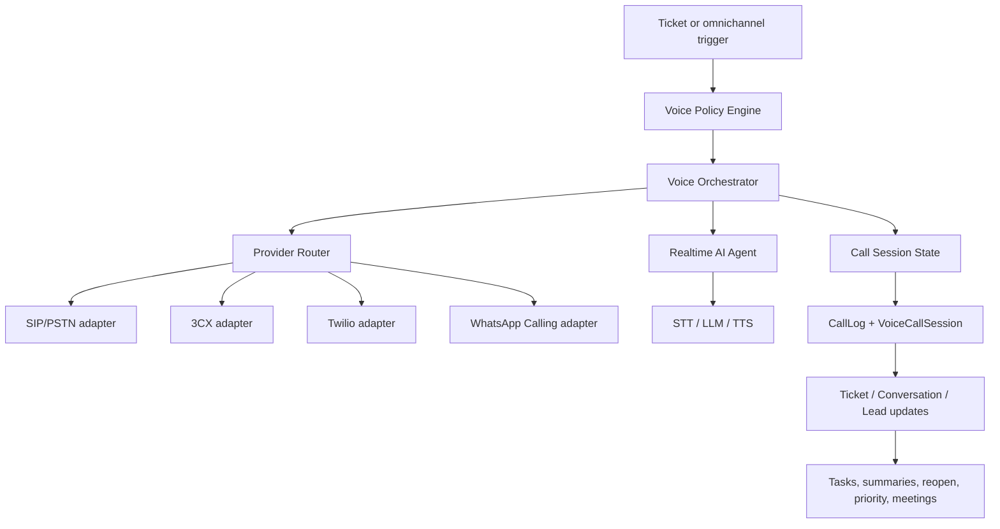

# LeadDrive Voice Core Architecture

Status: draft architecture plan
Owner: LeadDrive CRM
Scope: AI-assisted outbound and inbound voice calls for ticketing and omnichannel workflows.

## Goal

Build one multi-tenant Voice Core that can run AI phone calls across two product models:

1. Ticketing AI Calls: calls around support tickets, SLA risk, complaints, missing details, service quality, callbacks, and reopen prevention.
2. Omnichannel AI Calls: calls after WhatsApp, TikTok, Instagram, Web Chat, SMS, Email, or VoIP conversations where a customer left a phone number or showed clear buying intent.

The transport layer must stay replaceable:

- Short term: SIP/PSTN through CommPeak, local SIP trunks, 3CX, Asterisk/FreeSWITCH, or Twilio.
- Later: WhatsApp Calling API when Meta enables it for the tenant phone number.

Voice Core must not be hard-coupled to Meta, 3CX, Twilio, or CommPeak. Providers are adapters.

## Existing LeadDrive Anchors

The current repo already has useful foundations:

- `CallLog`: persistent call record with tenant, provider, direction, status, duration, recording, transcription, insight, contact, conversation, lead, company, deal, and user links.
- `Ticket`: support workflow with SLA fields, source/sourceMeta, priority, category, reopen count, comments, and satisfaction.
- `ConversationFlow` and `ConversationFlowRun`: omnichannel automation engine for message-driven workflows.
- `TeamQueue` and `BusinessHours`: routing and time-window controls for inbox automation.
- WhatsApp webhook call handling exists, but WhatsApp Calling is blocked until Meta enables the calling API for the phone number.

Voice Core should extend these, not duplicate them.

## High-Level Architecture

## Core Domain Objects

Keep `CallLog` as the public CRM call record, but add dedicated Voice Core objects for orchestration.

Recommended additions:

- `VoiceProviderAccount`
  - `organizationId`
  - `provider`: `commpeak | twilio | threecx | whatsapp | asterisk | freeswitch | custom_sip`
  - `status`: `draft | active | paused | failed`
  - encrypted credentials and provider metadata
  - routing capability flags: `supportsOutbound`, `supportsInbound`, `supportsRecording`, `supportsRealtimeMedia`, `supportsCallerIdVerification`, `supportsWhatsappCalls`

- `VoiceLine`
  - tenant-owned number or caller ID
  - type: `pstn_fixed | pstn_mobile | whatsapp | sip_trunk | verified_external`
  - provider account
  - country, E.164 number, display name, status
  - verification status and compliance notes

- `VoiceScenario`
  - tenant-configurable scenario template
  - model: `ticketing | omnichannel`
  - trigger type, language, script, guardrails, allowed actions
  - escalation rules, max attempts, business hours, consent requirement

- `VoiceCallSession`
  - one runtime execution of a scenario
  - links to `CallLog`, `Ticket`, `SocialConversation`, `Lead`, `Contact`
  - status machine, attempts, current step, transcript chunks, AI summary
  - provider session IDs, media bridge IDs, final outcome

- `VoiceConsent`
  - per contact/phone/channel consent and suppression state
  - `allowed`, `blocked`, `unknown`
  - source channel, timestamp, reason, expiry

- `VoiceCallAttempt`
  - separate attempt record for retries/no-answer/busy
  - preserves attempt-level provider status while `VoiceCallSession` remains the business process.

## Status Model

Use one normalized status model across all providers.

Session statuses:

- `queued`
- `policy_blocked`
- `scheduled`
- `dialing`
- `ringing`
- `answered`
- `in_progress`
- `human_handoff`
- `completed`
- `no_answer`
- `busy`
- `failed`
- `cancelled`
- `suppressed`

Attempt statuses:

- `created`
- `provider_accepted`
- `ringing`
- `answered`
- `completed`
- `busy`
- `no_answer`
- `failed`
- `timeout`

Do not leak provider-specific statuses into product workflows. Store raw provider events in metadata/audit fields.

## Ticketing AI Calls

Primary use cases:

- SLA-risk call: the system calls before or after SLA risk and asks for missing context.
- Data clarification: address, serial number, product name, photo request, preferred time.
- Post-resolution CSAT/NPS: ask whether the problem was solved and capture satisfaction.
- Reopen prevention: if customer is unhappy, reopen the ticket, raise priority, and assign to senior agent.
- Urgent complaint intake: collect facts, mark priority high, add internal summary.
- Visit/callback scheduling: agree on time and create a task.
- Operator fallback: after failed human call attempts, AI makes a softer fallback call and writes the result into the ticket.

Ticketing trigger examples:

- `ticket.created` with missing phone or missing details.
- `ticket.sla_warning`.
- `ticket.sla_breached`.
- `ticket.resolved`.
- `ticket.closed`.
- `operator_call_failed`.

Ticketing outcomes:

- Add `TicketComment` with transcript summary.
- Update `Ticket.priority`, `status`, `category`, `sourceMeta`.
- Reopen ticket when needed.
- Create `Task` for callback/visit/demo.
- Notify assigned agent or queue.
- Add CSAT/NPS fields when scenario is post-resolution.

## Omnichannel AI Calls

Primary use cases:

- Customer wrote "price?" and left a number: AI calls and qualifies the lead.
- Conversation idle after 10-30 minutes: AI asks if the customer wants the next step.
- Need discovery: product, quantity, budget, city, timeline, decision maker.
- Demo/meeting scheduling: offer slots and create a task or meeting.
- Marketing follow-up: only for consented segments, not cold spam.
- Repeat sale: call customers who previously showed interest.
- Missed WhatsApp/VoIP call: AI calls back or sends channel fallback.

Omnichannel trigger examples:

- `conversation.phone_detected`.
- `conversation.high_intent_detected`.
- `conversation.idle`.
- `conversation.missed_call`.
- `lead.created_from_channel`.
- `campaign.segment_ready`.

Omnichannel outcomes:

- Update lead qualification fields.
- Create/update contact and lead.
- Create task/meeting.
- Add conversation note and transcript summary.
- Assign to queue or sales agent.
- Send fallback WhatsApp/SMS message if no answer.

## Multi-Tenant Design

Every Voice Core object must be tenant-scoped by `organizationId`.

Rules:

- No global provider credential can be used for a tenant call unless explicitly mapped through `VoiceProviderAccount`.
- All jobs must carry `organizationId`, `scenarioId`, `targetPhone`, and idempotency key.
- Provider webhooks must resolve tenant by provider account, phone number, or signed tenant-specific callback URL.
- Background workers must run through tenant-scoped database access.
- Rate limits and concurrency limits must be per tenant, per provider, and per line.
- Call recordings/transcripts are tenant data and must obey tenant retention settings.
- Do not let one tenant use another tenant's caller ID, SIP trunk, WhatsApp number, or recording storage.

Recommended tenant limits:

- `maxConcurrentCalls`
- `maxCallsPerMinute`
- `maxCallsPerDay`
- `allowedCountries`
- `allowedScenarios`
- `businessHoursOnly`
- `recordingAllowed`
- `aiAutonomousCallsAllowed`

## Provider Router

Provider selection should be policy-driven:

1. If scenario requires WhatsApp call and tenant WhatsApp Calling is enabled, use WhatsApp adapter.
2. If tenant has verified local mobile DID and SIP account, use SIP/PSTN adapter.
3. If tenant routes through 3CX, use 3CX click-to-call or SIP bridge where appropriate.
4. If no local route exists, use Twilio/alternate international carrier only if cost policy allows it.
5. If all voice routes fail, create fallback channel message and task.

Provider router inputs:

- tenant
- destination country and phone prefix
- desired caller ID
- scenario class
- cost ceiling
- required recording/transcription
- required realtime media
- compliance constraints

Provider router outputs:

- selected provider account
- selected voice line
- normalized dial plan
- expected cost class
- fallback plan

## Realtime AI Media

For serious AI live-call behavior, keep AI media independent of CRM pages.

Recommended POC path:

- Use provider SIP trunk for call termination.
- Use FreeSWITCH or Asterisk as media bridge.
- Stream audio to STT.
- Run LLM scenario policy.
- Return TTS audio to call.
- Persist transcript chunks and final summary.

3CX can remain useful for human operators, queues, extensions, and call control, but should not be the only AI media engine.

## Safety And Compliance

Voice AI must have hard product guardrails:

- Never cold-call without tenant policy and consent/segment rules.
- Always respect blocked/suppressed numbers.
- No calls outside configured business hours unless scenario explicitly allows emergency handling.
- Max retry count and retry spacing per scenario.
- Human handoff for anger, legal, medical, financial, threats, or repeated misunderstanding.
- AI must identify itself according to tenant policy.
- Every AI call creates an auditable record.
- Store exact reason for call: ticket ID, conversation ID, lead ID, or campaign ID.

## Implementation Plan

1. Data model foundation
   - Add `VoiceProviderAccount`, `VoiceLine`, `VoiceScenario`, `VoiceCallSession`, `VoiceCallAttempt`, and `VoiceConsent`.
   - Link sessions to existing `CallLog`, `Ticket`, `SocialConversation`, `Lead`, `Contact`, `Company`, and `Task`.

2. Voice policy engine
   - Implement tenant policy checks: consent, suppression, business hours, country allow-list, max attempts, rate limits, concurrency, cost ceiling.
   - Add idempotency to prevent duplicate calls from repeated webhooks/flows.

3. Provider adapter interface
   - Define normalized methods: `startCall`, `hangup`, `sendDigits`, `transfer`, `getStatus`, `handleWebhook`, `validateConfig`.
   - Implement adapter stubs for SIP/custom, 3CX, Twilio, WhatsApp Calling.
   - Keep CommPeak/local SIP as SIP provider configuration, not a hard-coded product dependency.

4. Call orchestration worker
   - Queue `VoiceCallSession` jobs.
   - Create attempts, call provider, process webhooks, update state, write `CallLog`.
   - Add retry/fallback behavior.

5. Ticketing scenarios
   - Ship first scenarios: SLA-risk, data clarification, post-resolution CSAT, reopen prevention, callback scheduling.
   - Write ticket comments and create tasks from call outcomes.

6. Omnichannel scenarios
   - Add conversation triggers: phone detected, high-intent, idle, missed call.
   - Connect to `ConversationFlow` so flows can enqueue AI call actions.
   - Update lead/contact qualification fields from outcomes.

7. Admin UI and observability
   - Settings: providers, voice lines, caller IDs, limits, business hours, consent policy.
   - Scenario builder: templates, language, prompt, actions, escalation.
   - Monitoring: active calls, failures, cost, provider health, queue depth, transcript review.

## First POC Recommendation

Start with an internal POC that does not depend on WhatsApp Calling:

1. Use CommPeak or another SIP trunk if they activate SIP channels and confirm Azerbaijan caller ID behavior.
2. Use one tenant, one verified line, one outbound scenario.
3. Trigger from a test ticket.
4. AI asks three things: confirm issue, ask preferred callback time, ask whether escalation is needed.
5. Persist transcript, summary, disposition, ticket comment, and task.
6. Only after this works, add omnichannel phone-detected trigger.

This proves the hardest internal architecture without waiting for Meta.

## Non-Goals For The First Slice

- Do not build a full Twilio clone.
- Do not build predictive dialer behavior in the first slice.
- Do not use SIM-box/GSM gateway as production architecture.
- Do not let provider webhooks directly mutate tickets without Voice Core state validation.
- Do not mix WhatsApp message automation with WhatsApp Calling availability.

## Acceptance Criteria

The first production-ready slice is acceptable when:

- A tenant can configure one provider account and one voice line.
- A test ticket can enqueue one AI call.
- Policy engine can block unsafe calls with a clear reason.
- A call attempt creates and updates `VoiceCallSession`, `VoiceCallAttempt`, and `CallLog`.
- Transcript summary is written to the ticket.
- A callback task can be created from the call outcome.
- Provider failure produces a visible fallback result and does not leave the ticket in an ambiguous state.
- All records are tenant-scoped and queryable by organization.
