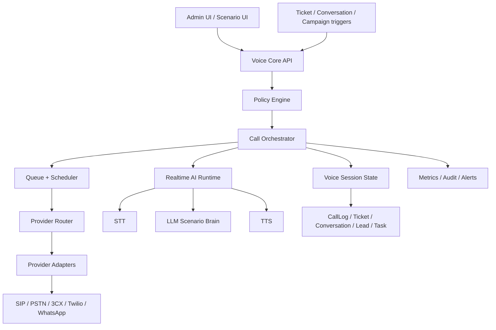

# Voice Core Implementation Plan

Status: draft execution plan
Related architecture: `docs/voice-core-architecture.md`

## Product Target

Build a multi-tenant AI voice platform inside LeadDrive with one shared Voice Core and two business products on top:

1. Ticketing AI Calls: support/SLA/complaint/CSAT/callback calls tied to tickets.
2. Omnichannel AI Calls: sales/marketing follow-up calls tied to conversations, leads, contacts, campaigns, and missed calls.

The system must support many tenants and many concurrent calls without mixing data, credentials, caller IDs, transcripts, billing, or provider callbacks between tenants.

## Non-Negotiable Principles

- Tenant isolation is part of every table, job, webhook, provider config, media session, recording, transcript, and UI query.
- Provider-specific behavior is isolated behind adapters. Business logic never depends on Twilio, 3CX, CommPeak, Meta, Asterisk, or FreeSWITCH internals.
- Calls are state machines, not one-shot API calls.
- Every provider event is idempotent.
- Every autonomous call has a reason, policy decision, audit trail, and fallback.
- AI can suggest and execute only allow-listed actions for the scenario.
- No production cold-spam behavior. Consent, suppression, business hours, and limits are first-class.
- Cost and concurrency are controlled before a call starts.
- Existing LeadDrive `CallLog`, `Ticket`, `ConversationFlow`, `Lead`, `Contact`, and `Task` models remain the CRM surface. Voice Core owns orchestration.

## Architecture Layers



## Phase 0: Current-State Refactor Debt

Before adding scale, remove the assumptions that make voice fragile.

Tasks:

- Keep `CallLog` as CRM-facing record, but stop treating it as the only runtime state.
- Add provider-neutral IDs:
  - `providerAccountId`
  - `providerCallId`
  - `providerAttemptId`
  - unique key: `(organizationId, provider, providerCallId)` instead of relying only on global `callSid`.
- Keep `callSid` as legacy compatibility for Twilio/old code until migration is complete.
- Move provider webhook handling into Voice Core event ingestion instead of directly mutating tickets/conversations.
- Add explicit status normalization. Do not let raw provider statuses drive product logic.
- Ensure settings copy and UI separate WhatsApp messaging from WhatsApp Calling.
- Do not assume 3CX token/click-to-call equals AI media support.
- Do not assume a SIP route means caller ID is valid. Caller ID must have its own verification state.
- Stop making provider-specific UI decisions in inbox cards without Voice Core state.

Risks fixed:

- Duplicate calls after webhook retries.
- Provider A event updating provider B call.
- Tenant A webhook finding tenant B number.
- AI call failing but ticket showing a misleading "failed" card with no reason.
- Scaling calls without limits and creating uncontrolled provider cost.

## Phase 1: Data Model Foundation

Add Voice Core tables. Use Prisma migration only after final schema review.

### `VoiceProviderAccount`

Purpose: tenant-owned provider configuration.

Fields:

- `id`
- `organizationId`
- `provider`: `commpeak | twilio | threecx | whatsapp | asterisk | freeswitch | custom_sip`
- `name`
- `status`: `draft | pending_verification | active | paused | failed | archived`
- `credentialsRef` or encrypted credentials payload
- `webhookSecretRef`
- `capabilities`: JSON
- `limits`: JSON
- `healthStatus`
- `lastHealthCheckAt`
- `createdBy`
- timestamps

Important indexes:

- `(organizationId, provider, status)`
- `(organizationId, status)`

### `VoiceLine`

Purpose: tenant caller ID / DID / WhatsApp number / SIP identity.

Fields:

- `id`
- `organizationId`
- `providerAccountId`
- `type`: `pstn_fixed | pstn_mobile | whatsapp | sip_trunk | verified_external`
- `numberE164`
- `countryCode`
- `displayName`
- `status`: `draft | pending_verification | active | paused | blocked | archived`
- `inboundEnabled`
- `outboundEnabled`
- `callerIdVerified`
- `callerIdVerificationStatus`
- `supportsInboundRouting`
- `supportsRecording`
- `supportsRealtimeMedia`
- `allowedDestinations`: JSON
- `metadata`: JSON

Important constraints:

- Unique active line per `(organizationId, providerAccountId, numberE164)`.
- Never global uniqueness by number alone; one number cannot be used by two tenants unless explicitly modeled as shared and audited.

### `VoiceScenario`

Purpose: tenant scenario template.

Fields:

- `id`
- `organizationId`
- `model`: `ticketing | omnichannel`
- `name`
- `status`: `draft | active | paused | archived`
- `triggerType`
- `language`: default `az`
- `voiceProfile`
- `script`: structured JSON, not only free text
- `allowedActions`: JSON
- `policy`: JSON
- `handoffRules`: JSON
- `maxAttempts`
- `retryPolicy`
- `businessHoursPolicy`
- `createdBy`
- `version`
- timestamps

### `VoiceCallSession`

Purpose: business-level call workflow.

Fields:

- `id`
- `organizationId`
- `scenarioId`
- `providerAccountId`
- `voiceLineId`
- `callLogId`
- `status`
- `direction`: `outbound | inbound`
- `targetPhoneE164`
- `normalizedTarget`
- `contextType`: `ticket | conversation | lead | contact | campaign | manual`
- `contextId`
- direct nullable links: `ticketId`, `conversationId`, `leadId`, `contactId`, `companyId`, `dealId`
- `reason`
- `policyDecision`: JSON
- `aiState`: JSON
- `outcome`
- `summary`
- `disposition`
- `scheduledAt`
- `startedAt`
- `answeredAt`
- `endedAt`
- `createdBy`
- timestamps

Important indexes:

- `(organizationId, status, scheduledAt)`
- `(organizationId, contextType, contextId)`
- `(organizationId, targetPhoneE164, createdAt)`
- `(organizationId, scenarioId, status)`

### `VoiceCallAttempt`

Purpose: provider-level attempt.

Fields:

- `id`
- `organizationId`
- `sessionId`
- `provider`
- `providerAccountId`
- `providerCallId`
- `providerAttemptId`
- `status`
- `rawStatus`
- `failureCode`
- `failureReason`
- `attemptNumber`
- `startedAt`
- `ringingAt`
- `answeredAt`
- `endedAt`
- `rawEvents`: JSON or separate event table

Important constraints:

- Unique `(organizationId, provider, providerCallId)` when providerCallId exists.
- Attempts are append-only except status transitions.

### `VoiceProviderEvent`

Purpose: idempotent webhook/event audit.

Fields:

- `id`
- `organizationId`
- `provider`
- `providerAccountId`
- `eventId`
- `eventType`
- `providerCallId`
- `receivedAt`
- `processedAt`
- `signatureStatus`
- `payloadHash`
- `rawPayload`
- `processingStatus`
- `error`

Important constraints:

- Unique `(providerAccountId, eventId)` if provider sends event IDs.
- Fallback unique `(providerAccountId, payloadHash, eventType, receivedAtMinute)` when no event ID exists.

### `VoiceConsent`

Purpose: call permission and suppression.

Fields:

- `id`
- `organizationId`
- `phoneE164`
- `contactId`
- `source`
- `status`: `allowed | blocked | unknown | expired`
- `scope`: `support | sales | marketing | all`
- `reason`
- `expiresAt`
- timestamps

### `VoiceTenantLimits`

Purpose: tenant-scale controls.

Fields:

- `organizationId`
- `maxConcurrentCalls`
- `maxCallsPerMinute`
- `maxCallsPerHour`
- `maxCallsPerDay`
- `maxAttemptsPerContactPerDay`
- `maxCostPerDay`
- `allowedCountries`
- `blockedPrefixes`
- `recordingEnabled`
- `aiAutonomousCallsEnabled`
- `defaultBusinessHoursOnly`

## Phase 2: Policy Engine

Build `src/lib/voice/policy/*`.

Policy engine answers one question: "May this call start now, with this line, for this reason?"

Checks:

- Tenant feature entitlement.
- Tenant global voice enabled.
- Scenario active.
- Phone normalized to E.164.
- Country allowed.
- Prefix not blocked.
- Contact not suppressed.
- Marketing consent exists for marketing scenario.
- Support scenario has ticket/customer relationship.
- Business hours match tenant/channel/scenario.
- Max attempts not exceeded.
- Duplicate session not already active.
- Tenant concurrency available.
- Provider concurrency available.
- Voice line concurrency available.
- Daily budget and estimated cost within limit.
- Caller ID active and verified.
- AI autonomy allowed for this scenario.
- Recording consent/rule if recording is enabled.

Outputs:

- `allow: true | false`
- `blockReason`
- `selectedFallback`
- `effectiveLimits`
- `auditContext`

Block reasons must be user-visible:

- `outside_business_hours`
- `missing_consent`
- `suppressed_phone`
- `country_not_allowed`
- `tenant_concurrency_limit`
- `provider_concurrency_limit`
- `daily_budget_limit`
- `line_not_verified`
- `scenario_paused`
- `duplicate_active_call`
- `provider_unhealthy`

## Phase 3: Provider Adapter Interface

Build `src/lib/voice/providers/*`.

Common interface:

```ts
interface VoiceProviderAdapter {
  validateConfig(accountId: string): Promise<ProviderHealth>
  startCall(input: StartCallInput): Promise<StartCallResult>
  hangup(input: HangupInput): Promise<void>
  transfer(input: TransferInput): Promise<void>
  sendDigits(input: SendDigitsInput): Promise<void>
  normalizeWebhook(event: unknown): Promise<NormalizedVoiceEvent>
  getCapabilities(accountId: string): Promise<VoiceProviderCapabilities>
}
```

Adapters:

- `custom_sip`: generic SIP trunk through our media bridge.
- `commpeak`: configuration profile for SIP trunk and DID/caller ID rules.
- `threecx`: call control/click-to-call and human operator integration.
- `twilio`: fallback and international route.
- `whatsapp`: future Meta WhatsApp Calling adapter.
- `asterisk` or `freeswitch`: media bridge control.

Provider router must decide:

- Which provider can call the destination.
- Which caller ID is valid.
- Which route is cheapest within quality policy.
- Which route supports realtime media.
- Which route supports inbound callback.
- Which route has available concurrency.

## Phase 4: Queue, Scheduler, And Concurrency

Use a durable queue for calls. Do not start calls synchronously from web requests.

Queues:

- `voice.enqueue`: creates sessions from triggers.
- `voice.dial`: starts attempts.
- `voice.events`: processes provider webhooks.
- `voice.ai`: handles transcript chunks and AI decisions.
- `voice.postprocess`: summaries, insights, ticket/lead updates.
- `voice.retry`: scheduled retries.

Concurrency keys:

- tenant: `voice:org:{organizationId}`
- provider account: `voice:provider:{providerAccountId}`
- line: `voice:line:{voiceLineId}`
- destination phone: `voice:phone:{organizationId}:{phoneE164}`
- scenario: `voice:scenario:{scenarioId}`

High-volume risks:

- A campaign queues thousands of calls and starves ticketing calls.
- One tenant consumes all worker capacity.
- Provider accepts calls but later drops media.
- Webhooks arrive out of order.
- Retry storms after provider outage.
- AI STT/TTS latency grows under load.
- Recording upload delays block session completion.

Controls:

- Per-tenant weighted fair scheduling.
- Priority lane for ticketing/SLA over marketing.
- Circuit breaker per provider.
- Backoff for provider errors.
- Hard cap on calls per phone per day.
- Idempotency key per trigger.
- Worker leases with timeout recovery.
- Stale session sweeper.

## Phase 5: Realtime AI Runtime

Use a scenario-driven AI runtime. It should not be one giant prompt.

Runtime modules:

- Audio input adapter.
- STT stream.
- Turn detector.
- Scenario state machine.
- LLM decision step.
- Action validator.
- TTS output.
- Barge-in handling.
- Silence/no-answer handling.
- Human handoff.
- Transcript chunk writer.

Scenario state:

- Greeting.
- Identity/context confirmation.
- Purpose explanation.
- Required questions.
- Optional follow-up.
- Outcome classification.
- Confirmation.
- Close.

Allowed actions:

- `add_ticket_comment`
- `update_ticket_priority`
- `reopen_ticket`
- `create_task`
- `create_meeting`
- `update_lead_qualification`
- `assign_to_queue`
- `send_fallback_message`
- `handoff_to_agent`

AI must not directly write arbitrary CRM data. It proposes structured actions, then Voice Core validates and executes them.

Language:

- Default Azerbaijani for Azerbaijan tenants.
- Keep prompts language-specific.
- Test STT/TTS quality for Azerbaijani before claiming production quality.
- Store language and voice profile per scenario.

## Phase 6: Ticketing Scenarios

Build first because the business context is clear and less spam-sensitive than marketing calls.

### SLA Risk

Trigger:

- `ticket.sla_warning`
- no recent outbound call
- phone exists

Goal:

- Inform customer that request is being handled.
- Clarify missing details.
- Create internal ticket comment.

Actions:

- Add ticket comment.
- Raise priority if the customer reports high impact.
- Create callback task if requested.

### Data Clarification

Trigger:

- ticket category requires fields missing from `sourceMeta`.

Questions:

- address
- product/service
- serial/order number
- photo request
- preferred time

Actions:

- Add structured `sourceMeta`.
- Add ticket comment.
- Assign to queue if enough details collected.

### Post-Resolution CSAT

Trigger:

- ticket resolved for configured delay.

Questions:

- problem solved?
- satisfaction rating
- comment

Actions:

- Update `satisfactionRating` and `satisfactionComment`.
- Reopen if not solved.
- Notify senior agent if low score.

### Reopen Prevention

Trigger:

- resolved ticket with negative reply or low CSAT.

Actions:

- Reopen ticket.
- Set priority high.
- Create manager callback task.

### Operator Fallback

Trigger:

- human call failed/no answer and scenario allows AI fallback.

Actions:

- AI call or fallback message.
- Write outcome into ticket.

## Phase 7: Omnichannel Scenarios

Connect to `ConversationFlow` after ticketing POC works.

### Phone Detected + Intent

Trigger:

- inbound conversation contains phone number.
- high intent detected: price, availability, demo, order, delivery, callback.

Policy:

- support/sales consent depends on channel and tenant policy.
- marketing calls require explicit consent or configured lawful basis.

Actions:

- Create/merge contact.
- Create/update lead.
- Enqueue qualification call.

### Idle Follow-Up

Trigger:

- conversation idle 10-30 minutes after high-intent exchange.

Actions:

- AI call if allowed.
- Otherwise WhatsApp/SMS fallback.
- Create task for sales if no answer.

### Missed Call

Trigger:

- missed WhatsApp/VoIP/PSTN call.

Actions:

- Return call through best available provider.
- If unavailable, send fallback message.

### Campaign Segment

Trigger:

- tenant-approved segment.

Strict controls:

- opt-in or valid consent.
- max daily calls.
- unsubscribe/suppress handling.
- no repeated calls after rejection.

## Phase 8: Admin UI

Settings pages:

- Voice Overview.
- Providers.
- Voice Lines / Caller IDs.
- Scenarios.
- Limits and Compliance.
- Call Logs.
- Active Calls.
- Provider Health.

Provider settings:

- provider type
- credentials status
- test connection
- webhook URL
- allowed countries
- max concurrency
- line mapping

Voice line UI:

- number
- type
- provider
- status
- caller ID verification status
- inbound/outbound support
- route priority
- test call button

Scenario UI:

- product model: ticketing or omnichannel
- trigger
- language
- script sections
- questions to ask
- allowed actions
- handoff conditions
- retry policy
- business hours
- enabled channels

Monitoring UI:

- queued calls
- live calls
- failed calls
- provider errors
- cost today
- call attempts per scenario
- transcript review
- blocked calls and reasons

## Phase 9: APIs

Internal APIs:

- `POST /api/v1/voice/sessions`
- `GET /api/v1/voice/sessions`
- `GET /api/v1/voice/sessions/:id`
- `POST /api/v1/voice/sessions/:id/cancel`
- `POST /api/v1/voice/sessions/:id/retry`
- `POST /api/v1/voice/test-call`
- `GET /api/v1/voice/providers`
- `POST /api/v1/voice/providers`
- `POST /api/v1/voice/providers/:id/test`
- `GET /api/v1/voice/lines`
- `POST /api/v1/voice/lines`
- `GET /api/v1/voice/scenarios`
- `POST /api/v1/voice/scenarios`
- `POST /api/v1/voice/webhooks/:provider/:accountId`

All APIs:

- require auth or provider signature.
- must resolve `organizationId`.
- must not accept client-provided `organizationId` without auth validation.
- must use tenant-scoped queries.

## Phase 10: Observability And Audit

Metrics:

- active calls per tenant
- queued calls per tenant
- provider start-call latency
- answer rate
- average duration
- no-answer rate
- failure rate by provider
- AI latency per turn
- STT/TTS latency
- cost estimate per tenant/day
- blocked calls by reason
- webhook duplicate rate
- out-of-order event count

Logs:

- structured logs with `organizationId`, `sessionId`, `attemptId`, `providerAccountId`.
- never log credentials, full tokens, raw personal data beyond masked phone.

Audit:

- who enabled a scenario
- who changed provider credentials
- who changed caller ID
- why a call was started
- what policy allowed/blocked the call
- what AI actions executed

Alerts:

- provider unhealthy
- high failed-call rate
- tenant budget reached
- queue backlog too high
- stuck in-progress sessions
- webhook signature failures
- AI action validation failures

## Phase 11: Security And Privacy

Requirements:

- Encrypt provider credentials.
- Sign provider webhook URLs or verify provider signatures.
- Store recordings/transcripts with tenant-scoped access.
- Add retention settings for recordings/transcripts.
- Add permission gates for listening to recordings.
- Mask phone numbers in logs and non-privileged UI.
- Do not expose transcript to unrelated users.
- Add RBAC:
  - `voice.providers.manage`
  - `voice.lines.manage`
  - `voice.scenarios.manage`
  - `voice.calls.start`
  - `voice.calls.view`
  - `voice.calls.listen`
  - `voice.transcripts.view`

## Phase 12: Testing Strategy

Unit tests:

- phone normalization
- policy block reasons
- provider router selection
- status transition validation
- idempotency key generation
- retry policy
- action validation

Integration tests:

- create session from ticket
- blocked session outside business hours
- provider webhook updates attempt and session
- duplicate webhook ignored
- out-of-order webhook handled
- transcript summary writes ticket comment
- no-answer creates fallback task/message
- tenant A cannot read tenant B session

Load tests:

- 100 queued calls across one tenant.
- 100 queued calls across 10 tenants.
- provider outage retry storm.
- 1,000 duplicate webhooks.
- slow STT/TTS.
- worker crash during active call.

Manual smoke:

- one test ticket -> one AI call -> ticket comment + call log.
- one WhatsApp conversation with phone -> queued call -> lead qualification.
- provider disabled -> fallback message.

## Phase 13: Rollout Plan

### Slice 1: Readiness Foundation

- Add data models.
- Add policy engine.
- Add provider adapter interface.
- Add fake provider for tests.
- No real calls yet.

### Slice 2: Ticketing POC With Fake Provider

- Create a test ticket scenario.
- Enqueue fake call.
- Persist session/attempt/call log.
- Write summary to ticket.

### Slice 3: SIP/CommPeak Or Custom SIP Provider

- Add generic SIP provider config.
- Add outbound call start.
- Add provider event ingestion.
- One tenant, one line, one call at a time.

### Slice 4: Realtime AI POC

- Add media bridge.
- Add STT/TTS/LLM loop.
- Run limited Azerbaijani scripted call.
- Store transcript and summary.

### Slice 5: Ticketing Production Beta

- Enable SLA-risk and post-resolution CSAT.
- Add UI controls and monitoring.
- Add fallback tasks.
- Add tenant limits.

### Slice 6: Omnichannel Beta

- Add `ConversationFlow` action: `start_voice_call`.
- Add phone-detected/high-intent trigger.
- Add lead qualification outcomes.

### Slice 7: WhatsApp Calling Adapter

- Add only after Meta enables calling API.
- Same Voice Core session model.
- Same policy and scenario engine.
- Different provider adapter.

## Known Failure Modes And Required Handling

Provider accepts call but never sends final event:

- stale session sweeper marks attempt timeout and schedules retry/fallback.

Webhook arrives before session exists:

- event inbox stores raw event and retries resolution.

Webhook duplicates:

- `VoiceProviderEvent` idempotency prevents double status transitions.

Provider sends out-of-order status:

- status machine ignores invalid regression but stores raw event.

Tenant changes provider config during live calls:

- active sessions keep provider account snapshot/ref; new config applies only to new sessions.

Caller ID rejected by carrier:

- mark line degraded, block future calls with that line, notify admin.

High AI latency:

- use fallback phrase, transfer/handoff, or end politely.

Customer asks for human:

- immediate handoff or task, no further AI persuasion.

Customer says stop calling:

- write `VoiceConsent(status=blocked)` and stop future marketing/sales calls.

Same phone appears in multiple contacts:

- use deterministic matching, create ambiguity note, avoid destructive merge.

Many tenants call at once:

- weighted fair queue, per-tenant limits, provider circuit breaker.

## Production Go/No-Go Checklist

Go only if:

- Tenant isolation tests pass.
- Duplicate webhook tests pass.
- Rate/concurrency limits work.
- Provider failure fallback works.
- CallLog and VoiceCallSession stay consistent.
- Ticket comment/action writes are idempotent.
- Recording/transcript permissions are enforced.
- Admin can see blocked reason and failure reason.
- Cost cap blocks calls before provider charge.
- One real SIP call has passed end-to-end in a non-production tenant.

No-go if:

- Caller ID behavior is not confirmed.
- Provider webhooks cannot be verified.
- AI can perform unvalidated arbitrary CRM writes.
- Calls can start synchronously from a public request.
- One tenant can query another tenant's calls.
- There is no kill switch.

## Immediate Next Tasks

1. Finalize Prisma model names and relations.
2. Add schema migration for Voice Core tables.
3. Implement fake provider and status machine tests.
4. Implement policy engine with block reasons.
5. Implement session enqueue and worker skeleton.
6. Build first ticketing scenario: manual test ticket call.
7. Add Settings -> Voice Core provider/line/scenario admin UI.
8. Add CommPeak/SIP provider adapter only after CommPeak confirms SIP channels and caller ID behavior.
9. Add realtime AI media POC after one reliable provider route exists.
10. Add omnichannel `ConversationFlow` voice-call action after ticketing POC is stable.
